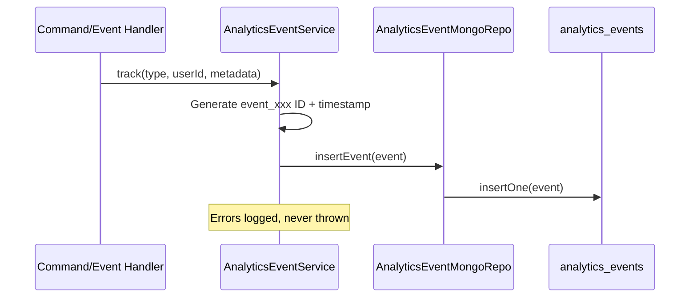
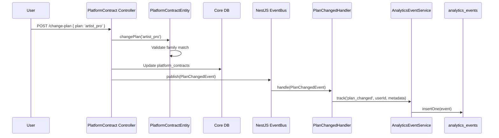
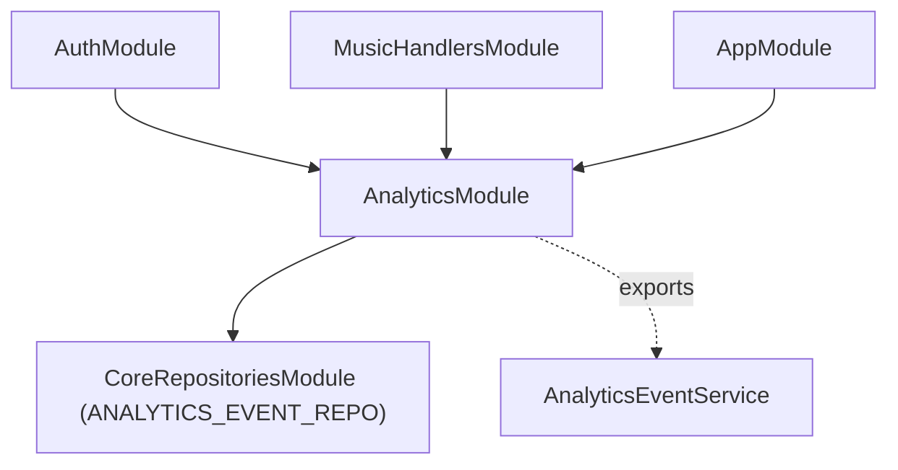

# Analytics Event Store

> **Module** : `analytics/`  
> **Collection** : `analytics_events`  
> **Pattern** : Append-only event log  

---

## Overview

The analytics event store is an **append-only** MongoDB collection that records business events for audit trails, usage analytics, and future dashboard aggregations. It is decoupled from the core state DB — events are a side effect, never the source of truth for current state.

### Key design decisions

- **Same MongoDB instance** — zero network latency, single deployment. Will migrate to a dedicated store (TimescaleDB/ClickHouse) when volume justifies (>1M events/month).
- **Fire-and-forget** — `AnalyticsEventService.track()` swallows insertion errors to avoid breaking the primary flow. Analytics is a side effect, not a critical path.
- **Interface-backed** — `IAnalyticsEventRepository` abstracts the storage layer for transparent swap.
- **No update/delete** — events are immutable once written.

---

## Architecture



### Module structure

```
analytics/
  AnalyticsEventService.ts       — track() + trackBatch() helper
  analytics.module.ts            — NestJS module (exports AnalyticsEventService)
  api/
    analytics.controller.ts      — GET /analytics/events (query endpoint)
  application/
    events/
      PlanChangedEvent.ts        — Domain event emitted on plan changes
      PlanChangedHandler.ts      — Persists plan_changed to analytics_events
  infra/
    AnalyticsEventMongoRepo.ts   — Insert-only MongoDB repository
  __tests__/
    AnalyticsEventService.spec.ts
    PlanChangedHandler.spec.ts
```

---

## Event types

All tracked event types are defined in `@sh3pherd/shared-types` as `TAnalyticsEventType`:

| Category | Event Type | Metadata example |
|----------|-----------|------------------|
| **Auth** | `user_registered` | `{ email, first_name, last_name }` |
| **Auth** | `user_login` | `{ ip?, user_agent? }` |
| **Auth** | `user_login_failed` | `{ email, reason }` |
| **Auth** | `user_deactivated` | `{}` |
| **Plan** | `plan_changed` | `{ from, to, billing_cycle }` |
| **Plan** | `billing_cycle_changed` | `{ plan, from, to }` |
| **Credits** | `credit_pack_purchased` | `{ pack_id, resource, amount, price }` |
| **Credits** | `credit_used` | `{ resource, amount }` |
| **Music** | `track_uploaded` | `{ track_id, version_id, file_name, file_size_bytes, duration_seconds, format }` |
| **Music** | `track_analysed` | `{ track_id, version_id, bpm, key, key_scale, duration_seconds, sample_rate, integrated_lufs, loudness_range, true_peak_dbtp, snr_db, clipping_ratio }` |
| **Music** | `track_mastered` | `{ track_id, version_id, target_lufs, target_tp }` |
| **Music** | `track_ai_mastered` | `{ track_id, version_id, reference_track_id, target_lufs }` |
| **Music** | `track_pitch_shifted` | `{ track_id, version_id, semitones, original_key }` |
| **Music** | `repertoire_entry_created` | `{ entry_id, reference_id }` |
| **Quota** | `quota_exceeded` | `{ resource, current, limit, plan }` |
| **Quota** | `quota_warning_80pct` | `{ resource, current, limit }` |

---

## Data model

```typescript
// packages/shared-types/src/analytics-event.types.ts

type TAnalyticsEventDomainModel = {
  id: string;                   // event_xxx (UUID)
  type: TAnalyticsEventType;
  user_id: TUserId;
  timestamp: Date;
  metadata: Record<string, unknown>;
};
```

---

## Usage

### Recording events (from any handler)

```typescript
import { AnalyticsEventService } from '../analytics/AnalyticsEventService.js';

@Injectable()
export class SomeHandler {
  constructor(private readonly analytics: AnalyticsEventService) {}

  async handle(event: SomeEvent): Promise<void> {
    // ... domain logic ...
    await this.analytics.track('track_uploaded', event.userId, {
      track_id: event.trackId,
      version_id: event.versionId,
    });
  }
}
```

### Querying events (admin API)

```
GET /protected/analytics/events?type=plan_changed&from=2026-04-01&to=2026-04-30&limit=20

Response:
{
  "data": {
    "events": [...],
    "total": 42,
    "limit": 20,
    "offset": 0
  }
}
```

Query parameters:
- `type` — filter by event type
- `user_id` — filter by user
- `from` / `to` — date range (ISO 8601)
- `limit` — max results (1-500, default 50)
- `offset` — pagination offset (default 0)

---

## Event flow — Plan change example



---

## Currently active event handlers

| Domain Event | Handler | Persists to analytics? |
|---|---|---|
| `UserRegisteredEvent` | `UserRegisteredHandler` (auth module) | Yes — `user_registered` |
| `PlanChangedEvent` | `PlanChangedHandler` (analytics module) | Yes — `plan_changed` |
| `TrackUploadedEvent` | `TrackUploadedHandler` (music module) | Yes — `track_uploaded` + `track_analysed` |
| — | `CreateRepertoireEntryHandler` (music module) | Yes — `repertoire_entry_created` |
| — | `UploadTrackHandler` (music module) | Yes — `track_uploaded` |
| — | `MasterTrackHandler` (music module) | Yes — `track_mastered` |
| — | `AiMasterTrackHandler` (music module) | Yes — `track_ai_mastered` |
| — | `PitchShiftVersionHandler` (music module) | Yes — `track_pitch_shifted` |

---

## Planned indexes

```javascript
// Recommended compound indexes (to be created via migration or ensureIndex)
db.analytics_events.createIndex({ type: 1, timestamp: -1 });
db.analytics_events.createIndex({ user_id: 1, timestamp: -1 });
```

---

## Module dependencies



The `AnalyticsModule` exports `AnalyticsEventService` so any module that imports it can call `track()`. The `ANALYTICS_EVENT_REPO` is provided globally by `CoreRepositoriesModule`.
