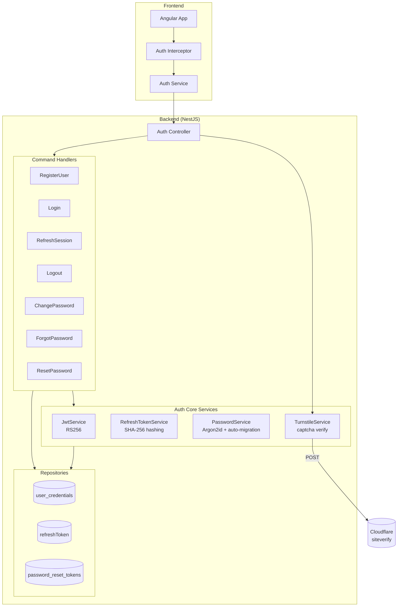
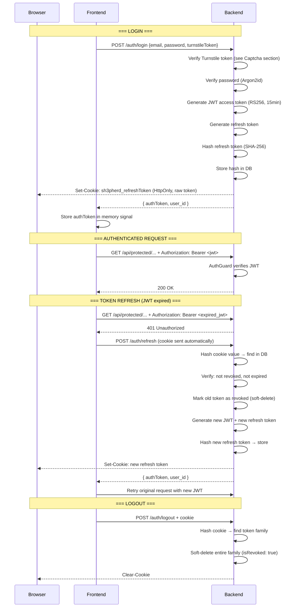
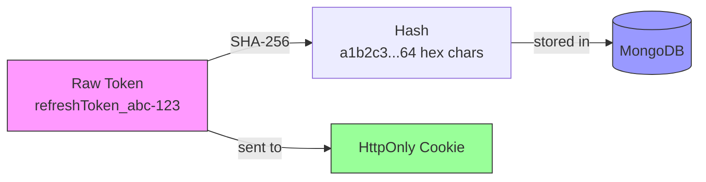
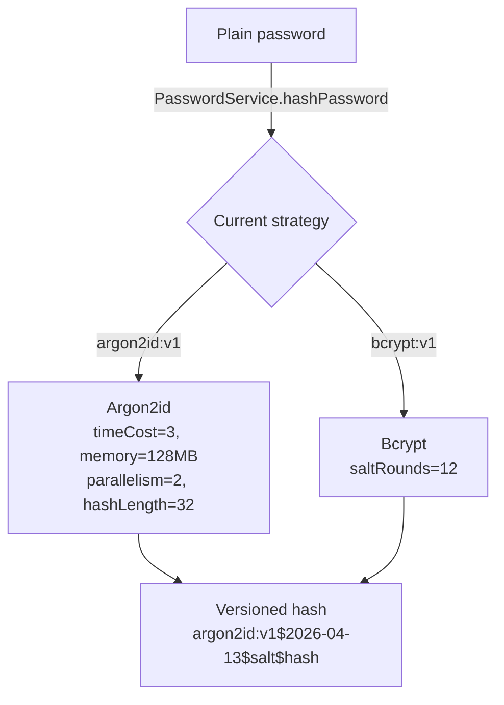
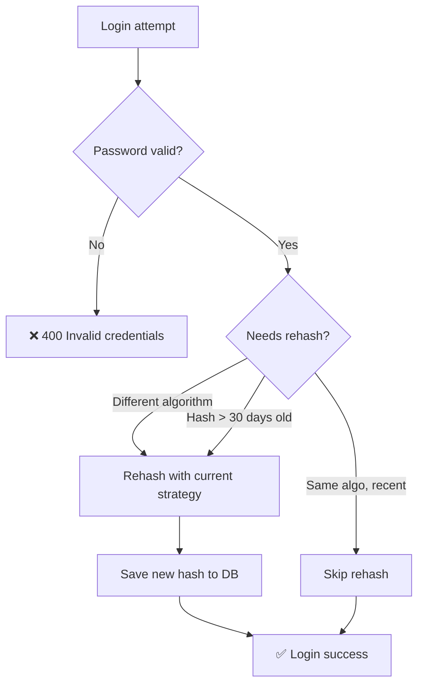
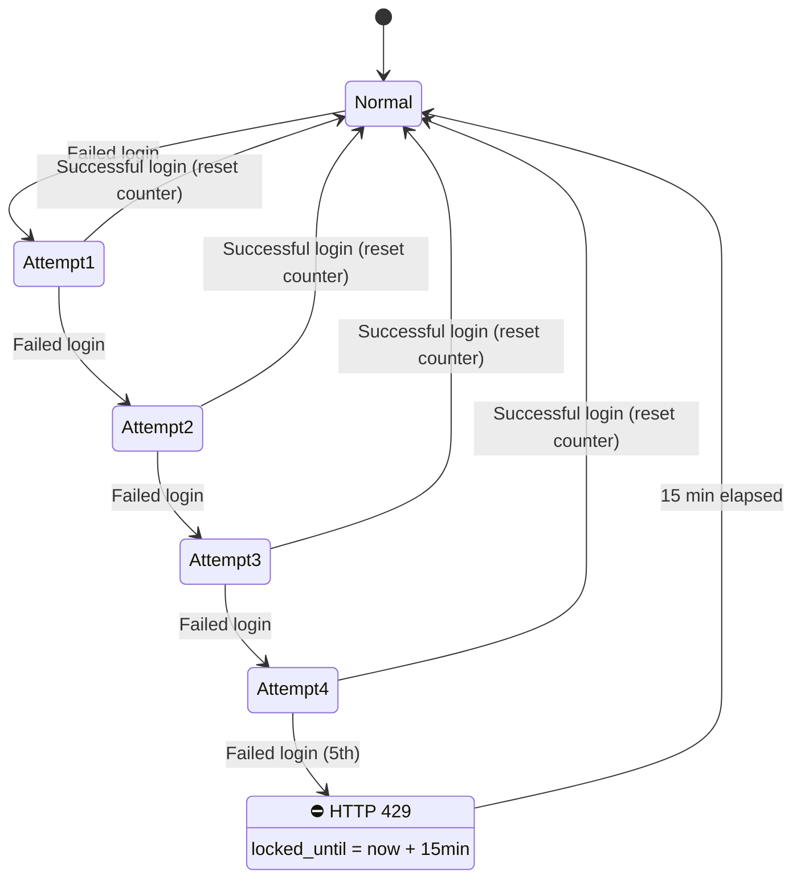
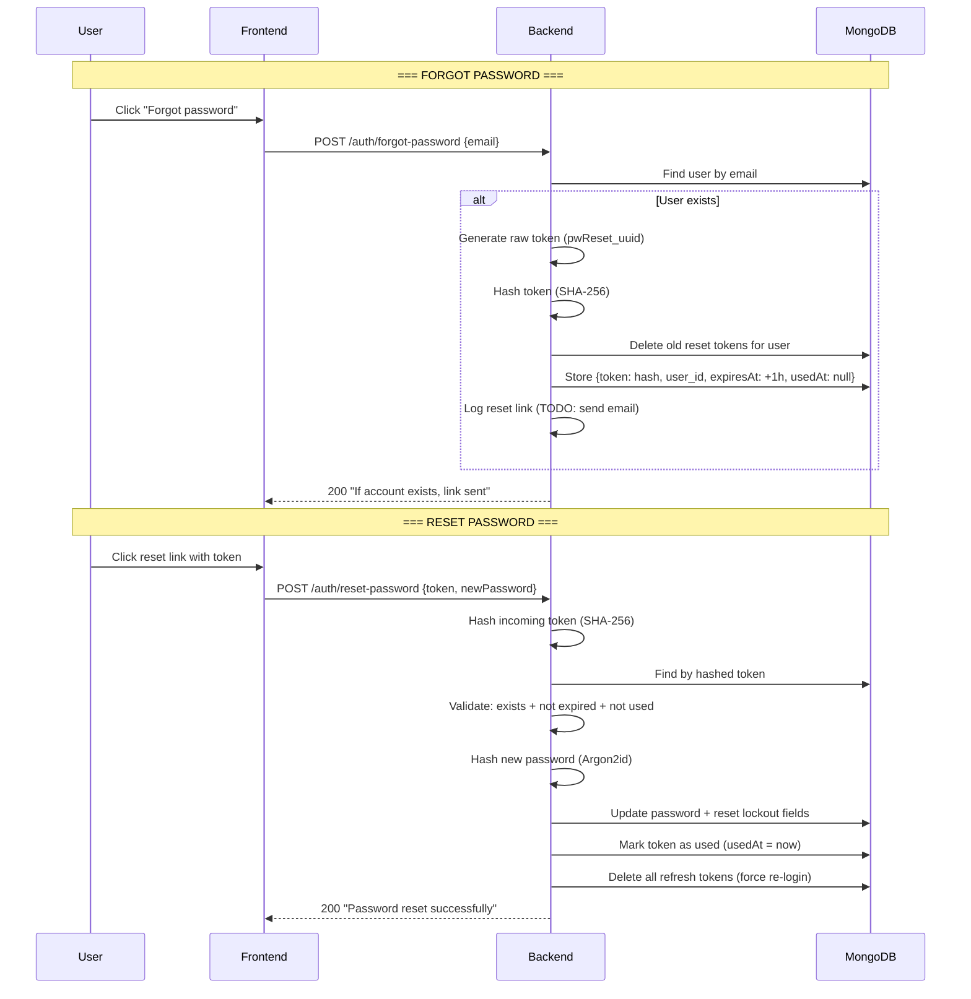
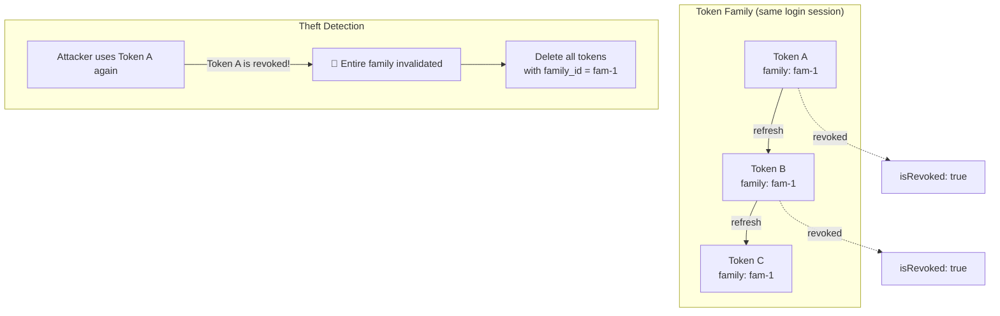
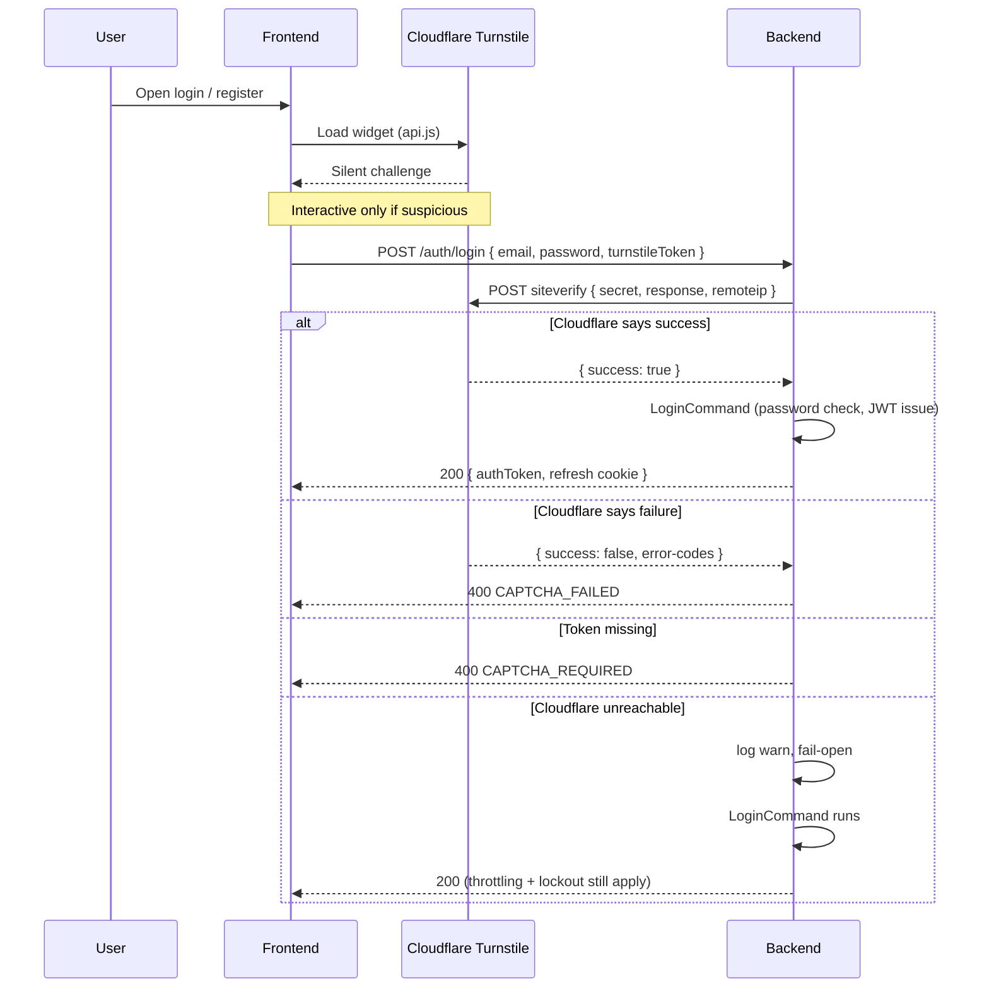

# SH3PHERD — Authentication System

Complete technical documentation for the authentication system: registration, login, token lifecycle, password management, and security hardening.

> For the request pipeline (guards, contract context, permissions), see [sh3-auth-and-context.md](sh3-auth-and-context.md).

---

## Architecture Overview



---

## Token Architecture



---

## Token Storage Security

| Token                    | Where stored             | How stored                            | Lifetime   |
| ------------------------ | ------------------------ | ------------------------------------- | ---------- |
| **Access token (JWT)**   | Frontend memory (signal) | Raw — not persisted to disk           | 15 minutes |
| **Refresh token**        | Browser HttpOnly cookie  | Raw in cookie, **SHA-256 hash** in DB | 7 days     |
| **Password reset token** | Email/console            | Raw in link, **SHA-256 hash** in DB   | 1 hour     |

### Why hash refresh tokens?

A database breach exposes all stored tokens. If tokens are stored in plain text, an attacker can immediately hijack all active sessions. With SHA-256 hashing, the stored hash is useless without the raw token (which only exists in the user's HttpOnly cookie).



---

## Password Security

### Hashing Strategy



**Auto-migration on login:**



### Account Lockout



**Fields on `UserCredential`:**

- `failed_login_count` — incremented on each wrong password, reset to 0 on success
- `locked_until` — set to `now + 15min` when `failed_login_count >= 5`

---

## Password Reset Flow



---

## Refresh Token Rotation & Theft Detection



**How it works:**

1. Each login creates a new **token family** (random UUID)
2. Each refresh **rotates** the token: old token soft-deleted (`isRevoked: true`), new token created in same family
3. If a **revoked token is reused** → entire family is invalidated (attacker + legitimate user both lose access)
4. Legitimate user must re-login — better than allowing an attacker to maintain access

---

## Cookie Configuration

| Property   | Dev              | Production                 |
| ---------- | ---------------- | -------------------------- |
| `httpOnly` | `true` (default) | **Always `true`** (forced) |
| `secure`   | `false`          | `true`                     |
| `sameSite` | `lax`            | `strict`                   |
| `path`     | `/api/auth`      | `/api/auth`                |
| `maxAge`   | 7 days           | 7 days                     |

**File:** `src/appBootstrap/config/secureCookieConfig.ts`

The cookie path `/api/auth` covers all auth endpoints (refresh, logout, change-password). Previously was `/api/auth/refresh` which prevented the cookie from being sent on logout.

---

## API Endpoints

| Method | Path                    | Auth            | Throttle | Description                               |
| ------ | ----------------------- | --------------- | -------- | ----------------------------------------- |
| `POST` | `/auth/register`        | Public          | 10/min   | Create account (email + password + name)  |
| `POST` | `/auth/login`           | Public          | 20/min   | Authenticate → JWT + refresh cookie       |
| `POST` | `/auth/refresh`         | Public (cookie) | 10/min   | Rotate tokens via HttpOnly cookie         |
| `POST` | `/auth/logout`          | Bearer          | 30/min   | Revoke token family + clear cookie        |
| `POST` | `/auth/change-password` | Bearer          | 3/min    | Change password + invalidate all sessions |
| `POST` | `/auth/forgot-password` | Public          | 3/min    | Request password reset link               |
| `POST` | `/auth/reset-password`  | Public          | 3/min    | Reset password with token                 |
| `GET`  | `/auth/ping`            | Public          | None     | Health check                              |

---

## Module Structure

```
auth/
├── api/
│   ├── auth.controller.ts              # All auth endpoints
│   ├── auth.guard.ts                   # Global JWT verification guard
│   └── __tests__/
├── application/commands/
│   ├── RegisterUserCommand.ts          # Register → credentials + profile + platform contract
│   ├── LoginCommand.ts                 # Login → lockout check + password verify + session
│   ├── RefreshSessionCommand.ts        # Refresh → hash lookup + rotation + theft detection
│   ├── LogoutCommand.ts                # Logout → soft-delete token family
│   ├── ChangePasswordCommand.ts        # Change password → verify old + wipe sessions
│   ├── ForgotPasswordCommand.ts        # Forgot → generate hashed token + log link
│   ├── ResetPasswordCommand.ts         # Reset → validate token + set password + wipe sessions
│   └── __tests__/                      # Colocated command tests
├── core/
│   ├── auth.service.ts                 # AuthService — orchestrates JWT + refresh creation
│   ├── auth-core.module.ts             # DI wiring for core services
│   ├── TokenFunctions.module.ts        # Exposes verify functions for AuthGuard
│   ├── __tests__/
│   ├── password-manager/
│   │   ├── PasswordService.ts          # Hash + compare + auto-migration
│   │   ├── hasherRegistry/             # Strategy registry (argon2id, bcrypt)
│   │   ├── strategies/                 # Argon2Hasher, BcryptHasher, BaseHasherStrategy
│   │   ├── utils/                      # HashParser, isRehashDue
│   │   └── types/
│   └── token-manager/
│       ├── JwtService.ts               # RS256 JWT sign + verify
│       ├── RefreshTokenService.ts      # Generate, verify, revoke refresh tokens
│       ├── hashToken.ts                # SHA-256 token hashing utility
│       └── __tests__/
├── repositories/
│   ├── RefreshTokenMongoRepository.ts
│   └── PasswordResetTokenMongoRepo.ts
├── types/
│   ├── auth.core.contracts.ts          # Function type signatures
│   ├── auth.domain.config.ts           # TAuthConfig (keys, TTL)
│   └── auth.domain.tokens.ts           # TAuthTokenPayload, TSecureCookieConfig, etc.
├── __tests__/
│   ├── test-helpers.ts                 # Shared mocks and factories
│   └── E2E/                            # End-to-end auth tests
├── auth.module.ts                      # NestJS module (controller + handlers)
├── auth.constants.ts                   # Cookie name + path
└── auth.tokens.ts                      # DI symbols (PASSWORD_SERVICE, etc.)
```

---

## Collections

| Collection              | Purpose            | Key fields                                                                            |
| ----------------------- | ------------------ | ------------------------------------------------------------------------------------- |
| `user_credentials`      | User accounts      | `id`, `email`, `password` (hashed), `active`, `failed_login_count`, `locked_until`    |
| `refreshToken`          | Active sessions    | `id`, `refreshToken` (SHA-256 hash), `user_id`, `family_id`, `isRevoked`, `expiresAt` |
| `password_reset_tokens` | Reset requests     | `id`, `token` (SHA-256 hash), `user_id`, `expiresAt`, `usedAt`                        |
| `platform_contracts`    | SaaS subscriptions | `id`, `user_id`, `plan`, `status`                                                     |

---

## Security Summary

| Measure                                                  | Status                       |
| -------------------------------------------------------- | ---------------------------- |
| JWT RS256 asymmetric signing                             | ✅                           |
| Refresh tokens hashed (SHA-256) before storage           | ✅                           |
| Token family rotation with reuse detection               | ✅                           |
| HttpOnly + Secure + SameSite cookies                     | ✅                           |
| Argon2id password hashing with auto-migration            | ✅                           |
| Account lockout (5 attempts → 15 min)                    | ✅                           |
| Auth failure logging                                     | ✅                           |
| CORS from environment variable                           | ✅                           |
| Password change invalidates all sessions                 | ✅                           |
| Password reset with single-use tokens                    | ✅                           |
| Rate limiting per endpoint                               | ✅                           |
| Cloudflare Turnstile captcha on `/login` and `/register` | ✅                           |
| Email verification                                       | ❌ (blocked by mailer setup) |
| 2FA/MFA                                                  | ❌ (v2)                      |

---

## Captcha (Cloudflare Turnstile)

`/auth/login` and `/auth/register` are protected by [Cloudflare Turnstile].
The widget is progressive by design — most human traffic clears it invisibly,
bots get an interactive challenge. We delegate all bot scoring to Cloudflare
and keep zero local state.

[Cloudflare Turnstile]: https://developers.cloudflare.com/turnstile/

### Flow



### Config

| Env var                | Required  | Default                                                     | Purpose                                                       |
| ---------------------- | --------- | ----------------------------------------------------------- | ------------------------------------------------------------- |
| `TURNSTILE_SECRET_KEY` | prod only | —                                                           | Cloudflare server-side secret. Absent = bypass mode (dev/CI). |
| `TURNSTILE_VERIFY_URL` | no        | `https://challenges.cloudflare.com/turnstile/v0/siteverify` | Override for testing / self-hosted proxy.                     |

### Failure mode: fail-open on Cloudflare outage

If the siteverify call fails (network error, 5xx, parse failure) the
service logs a warn and lets the request through. Cloudflare outages
are rare and short; blocking 100% of logins during one would be a
worse incident than a brief window of less-protected traffic.

Three defenses remain active during a fail-open window:

- `@Throttle({ limit: 20, ttl: 60_000 })` on `/login` — 20 attempts/min/IP
- `@Throttle({ limit: 10, ttl: 60_000 })` on `/register` — 10 attempts/min/IP
- Account lockout after 5 failed passwords → 15 min

### Why a 20/min throttle isn't the primary defence

The login/register throttles are intentionally loose. They exist as a
**DDoS floor** (stop a single IP from flooding thousands of requests
per minute), not as the fine-grained brute-force gate. The real gates
are:

- **Captcha (Turnstile)** — tokens are single-use and ~5 min TTL, so
  each request needs a freshly-solved challenge. Legitimate humans get
  this silently (managed mode); bots have to burn a challenge per
  attempt, which Cloudflare scores and progressively blocks.
- **Account lockout** — 5 failed passwords per account → 15 min
  cooldown. Targets credential stuffing directly (per-email, not per-IP).

A tight 5/min throttle would false-positive on legitimate users with
typos, shared NAT (office, campus, mobile carrier), or password manager
replays. The 20/min limit gives humans room to breathe while still
catching the extreme abuse patterns the throttle is actually designed
to stop.

### Error codes

| HTTP | Code               | When                                                                                 |
| ---- | ------------------ | ------------------------------------------------------------------------------------ |
| 400  | `CAPTCHA_REQUIRED` | Captcha enabled, token missing or empty                                              |
| 400  | `CAPTCHA_FAILED`   | Cloudflare returned `success: false` (reused/expired token, hostname mismatch, etc.) |

### Why Turnstile

- **No fingerprinting** — no third-party cookies, GDPR-friendly.
- **Free tier** — 1 M siteverify calls/month.
- **Progressive** — managed mode auto-decides invisible vs interactive.
- **No local state** — captcha logic is entirely offloaded to Cloudflare,
  so we don't need the audit-event infrastructure (see roadmap) to get
  bot protection shipped.

### Implementation

- Service: `src/auth/turnstile/TurnstileService.ts` — verify + fail-open
- Module: `src/auth/turnstile/turnstile.module.ts` — DI wiring under `TURNSTILE_SERVICE`
- Config: `src/auth/turnstile/getTurnstileConfig.ts` — reads env vars
- Wiring: `src/auth/api/auth.controller.ts` — called before the command bus on both endpoints
- Shared-types: `SLoginRequestDTO`, `SRegisterUserRequestDTO` carry the optional `turnstileToken`

---

## CORS Configuration

**File:** `src/main.ts`

```
Origin:         process.env['CORS_ORIGIN'] ?? 'http://localhost:4200'
Credentials:    true
Allowed Headers: Content-Type, Authorization, X-Feature, X-Contract-Id,
                 X-Print-Token, X-Skip-Auth, X-Retry
```

CSRF protection is provided by the combination of:

1. **SameSite cookies** — `strict` in prod, `lax` in dev
2. **Bearer token in Authorization header** — cannot be forged by cross-origin requests
3. **CORS strict origin** — only the configured origin can make credentialed requests
