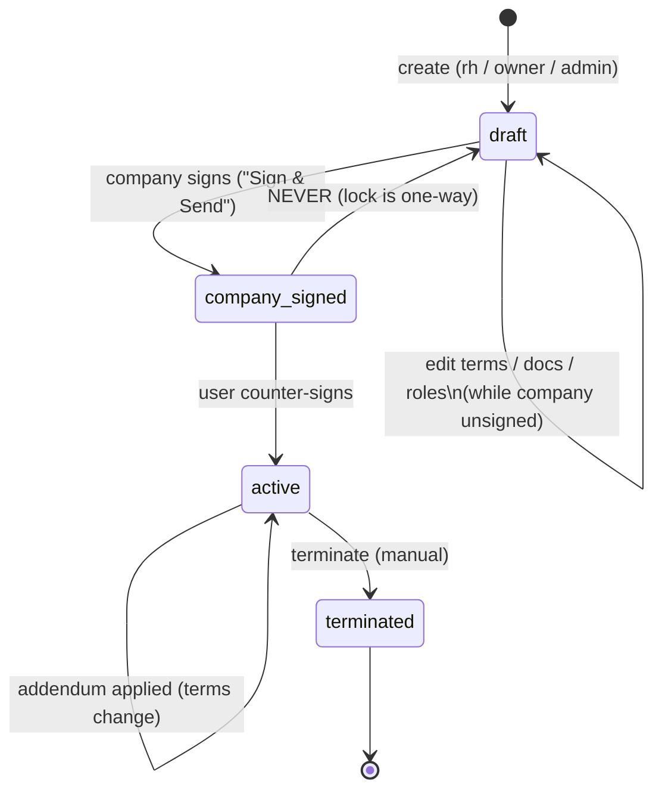
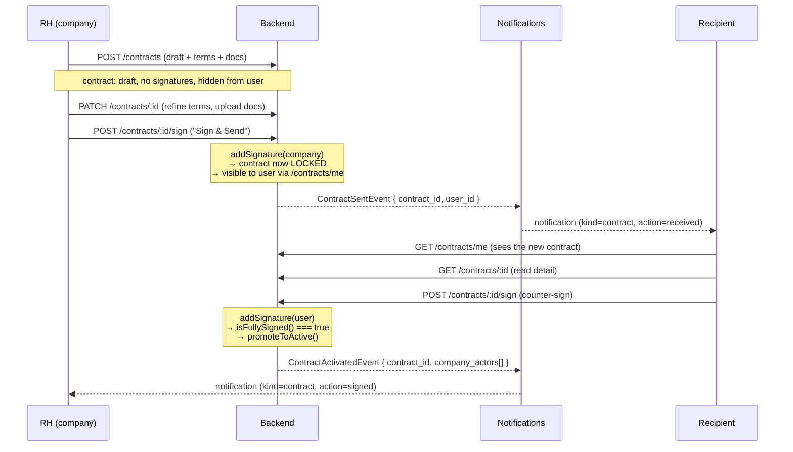
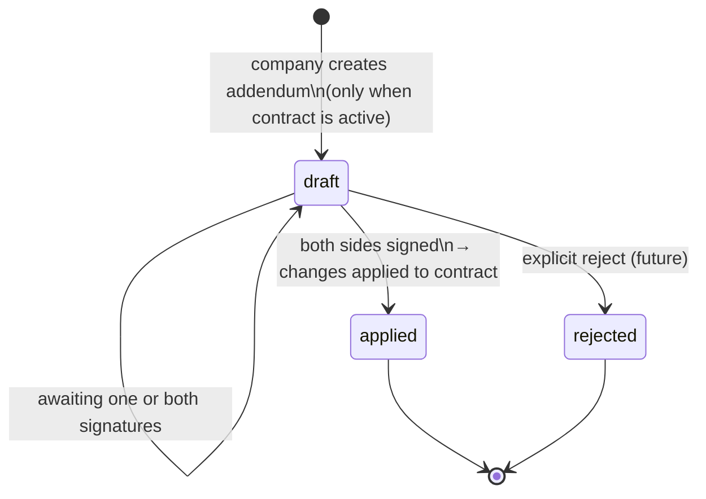

# Contracts — Flow & Invariants

A contract binds a **user** (the recipient — typically an artist) to a
**company**. It carries roles, terms, signed documents, and a history
of addenda. The flow is **company-first**: the company drafts and
signs, then the contract is presented to the user, who reviews and
counter-signs.

This document is the source of truth for the contract lifecycle.
Anything here that diverges from the code is a bug.

## State machine



`company_signed` is **not a distinct status value** in storage — it is
the substate where `status === 'draft'` AND `signatures.company` is
present. Promotion to `'active'` happens automatically when both
signatures are recorded (`isFullySigned()`).

## Roles & permissions

| Action                  | Required permission      | Side    | Notes                                             |
| ----------------------- | ------------------------ | ------- | ------------------------------------------------- |
| Create contract         | `Company.Members.Invite` | company | Carrier: rh / owner / admin                       |
| Edit terms / dates      | `Company.Members.Write`  | company | Rejected once contract is **locked** (see below)  |
| Upload / patch document | `Company.Members.Write`  | company | Rejected once locked → addendum required          |
| Assign / remove role    | `Company.Members.Write`  | company | Rejected once locked                              |
| Sign contract           | `Company.Members.Read`   | both    | Side resolved server-side from actor roles        |
| Sign document           | `Company.Members.Read`   | both    | Per-document dual-sign (when `requiresSignature`) |
| Create addendum         | `Company.Members.Write`  | company | Only when contract is `active`                    |
| Sign addendum           | `Company.Members.Read`   | both    |                                                   |
| List own contracts      | (authenticated)          | user    | `GET /contracts/me` — see visibility rule         |

Side resolution: `ContractEntity.resolveSignerRole(roles)` returns
`'company'` if any of the actor's contract roles is in
`CONTRACT_COMPANY_ROLES` (owner / admin / rh), else `'user'`.

## Visibility — what the user sees

The recipient does **not** see a contract until the company has signed
it. Concretely, `GET /contracts/me` returns only contracts where:

- `signatures.company` is present (the company has sent it), **OR**
- `status === 'active'` (already fully signed)

Drafts that have never been sent stay invisible to the user, even
though their `roles` already include them. This prevents premature
notifications and accidental partial signing.

## Lock rules

The contract becomes **locked** the moment the company signs, not when
it goes `active`. Once locked, the only way to change anything is via
an **addendum** — direct mutations are rejected with `BusinessError`.

`ContractEntity.isLocked()` returns true when `signatures.company`
exists. The following endpoints check this invariant:

- `PATCH /contracts/:id` — terms, dates, status
- `POST /contracts/:id/roles` — assign role
- `DELETE /contracts/:id/roles/:role` — remove role
- `POST /contracts/:id/documents` — upload
- `PATCH /contracts/:id/documents/:docId` — patch (e.g. `requiresSignature`)

Signing actions (`/sign`, `/documents/:docId/sign`,
`/addenda/:id/sign`) are **not** subject to the lock — they are how
the contract progresses past it.

## Sign flow — happy path



## Document signing

Documents attached to a contract carry an optional
`requiresSignature: boolean` flag. Signed documents store dual
signatures (`signatures.user` / `signatures.company`) using the same
`TContractSignature` shape as the contract itself.

Endpoint: `POST /contracts/:contractId/documents/:documentId/sign`.

Domain invariants (`ContractEntity.signDocument`):

- The document must exist on the contract.
- It must have `requiresSignature === true` (otherwise
  `CONTRACT_DOCUMENT_NOT_SIGNABLE`).
- The signing side must not already have signed it (otherwise
  `CONTRACT_DOCUMENT_ALREADY_SIGNED`).

A document being unsigned does **not** block contract activation —
the contract-level signature is what gates `'active'`. Per-document
signatures are independent acknowledgements (e.g. a confidentiality
addendum the company also wants the user to sign).

## Addenda — extending an active contract

Once a contract is `active`, terms cannot be edited directly. Any
change goes through an **addendum** — a structured, signable change
request that becomes part of the contract once both sides sign it.

Three templates are supported:

| Template              | Changes carried                         | Use case                 |
| --------------------- | --------------------------------------- | ------------------------ |
| `change_remuneration` | `compensation` (amount/currency/period) | Annual review, raise     |
| `extend_period`       | `endDate`                               | Extend a CDD / freelance |
| `extend_trial`        | `trial_period_days`                     | Extend trial period      |



When an addendum reaches `applied`, the change is applied to the
parent contract via `applyChangesToContract()`. A new document upload
on a locked contract is also modelled as an addendum (the document is
attached to the addendum, not directly to the contract).

## Endpoints — quick reference

```
POST   /contracts                                       # create (company)
GET    /contracts/me                                    # user's visible contracts
GET    /contracts/company/:companyId                    # company's contracts
GET    /contracts/:contractId                           # detail (both sides)
PATCH  /contracts/:contractId                           # edit terms (company, pre-lock)

POST   /contracts/:id/sign                              # sign contract (both sides)
POST   /contracts/:id/roles                             # assign role (company, pre-lock)
DELETE /contracts/:id/roles/:role                       # remove role (company, pre-lock)

POST   /contracts/:id/documents                         # upload (company, pre-lock)
PATCH  /contracts/:id/documents/:docId                  # patch (company, pre-lock)
GET    /contracts/:id/documents/:docId/download         # signed URL (both sides)
POST   /contracts/:id/documents/:docId/sign             # sign document (both sides)

GET    /contracts/:id/addenda                           # list addenda
POST   /contracts/:id/addenda                           # create addendum (company, contract active)
POST   /contracts/:id/addenda/:addendumId/sign          # sign addendum (both sides)
```

All endpoints (except `GET /contracts/me`) are `@ContractScoped()` —
the request must carry `X-Contract-Id` matching the URL parameter.

## Notifications

Notification kind: `contract`. Discriminated union member
`TContractNotification` (see
[`packages/shared-types/src/notifications.types.ts`](../../../packages/shared-types/src/notifications.types.ts)).

| Trigger                                        | Action     | Recipient          | Status                                                        |
| ---------------------------------------------- | ---------- | ------------------ | ------------------------------------------------------------- |
| Company signs (contract becomes locked & sent) | `received` | User (recipient)   | implemented (`ContractSentEvent`)                             |
| User counter-signs (contract becomes active)   | `signed`   | The company signer | implemented (`ContractActivatedEvent`)                        |
| Addendum signed by both → applied              | `signed`   | The other party    | TODO — `SignAddendumCommand` does not publish events yet      |
| Addendum rejected                              | `declined` | The other party    | TODO — no decline command exists; the action enum value alone |
| Contract end date reached                      | `expired`  | Both parties       | TODO — no scheduled job exists; the action enum value alone   |

Events are dispatched from `SignContractCommand` via `EventBus.publish()`
and consumed by `@EventsHandler` listeners in
`apps/backend/src/contracts/application/events/`. The TODO rows
above are listed for design completeness — wire them when the
addendum signature flow, the decline flow and the end-date scheduler
land.

## Domain & code map

| Concern               | File                                                                                                     |
| --------------------- | -------------------------------------------------------------------------------------------------------- |
| Entity & invariants   | [`ContractEntity.ts`](../src/contracts/domain/ContractEntity.ts)                                         |
| Domain types          | [`contracts.domain.types.ts`](../../../packages/shared-types/src/contracts.domain.types.ts)              |
| View models           | [`contract.viewModel.types.ts`](../../../packages/shared-types/src/contract.viewModel.types.ts)          |
| Sign command          | [`SignContractCommand.ts`](../src/contracts/application/commands/SignContractCommand.ts)                 |
| Sign document command | [`SignContractDocumentCommand.ts`](../src/contracts/application/commands/SignContractDocumentCommand.ts) |
| Sign addendum command | [`SignAddendumCommand.ts`](../src/contracts/application/commands/SignAddendumCommand.ts)                 |
| Controller            | [`contract.controller.ts`](../src/contracts/api/contract.controller.ts)                                  |
| User-side controller  | [`my-contracts.controller.ts`](../src/contracts/api/my-contracts.controller.ts)                          |
