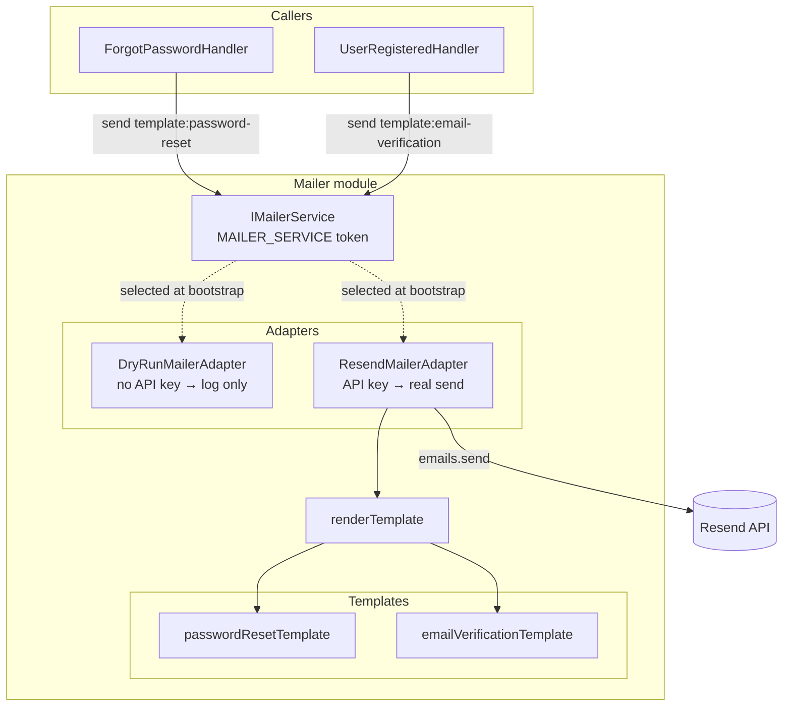
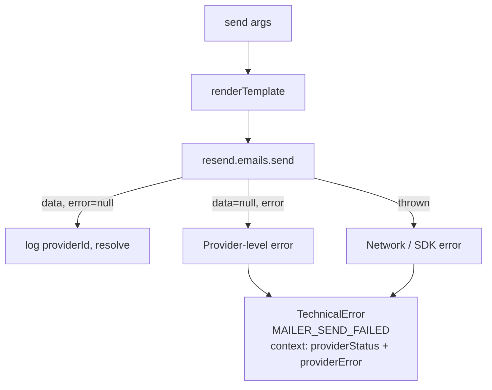

# SH3PHERD — Mailer

Provider-agnostic transactional email. Callers pick a template, the module renders HTML server-side and dispatches via a pluggable adapter (Resend today).

> For env vars and first-time provider setup, see [`SECRETS.md`](../../../documentation/SECRETS.md).

---

## Architecture



The factory in [`mailer.module.ts`](../src/mailer/mailer.module.ts) picks an adapter once at bootstrap from [`getMailerConfig`](../src/mailer/getMailerConfig.ts):

- `RESEND_API_KEY` unset or blank → `DryRunMailerAdapter` (logs a parsable line, resolves).
- `RESEND_API_KEY` present → `ResendMailerAdapter` (renders + dispatches).

Callers inject `MAILER_SERVICE` — they never see the adapter class. Swapping Resend for SES or SendGrid is a single-file change here.

---

## Public API

```ts
interface IMailerService {
  send(args: TSendMailArgs): Promise<void>;
  readonly enabled: boolean;
}
```

`TSendMailArgs` is a discriminated union on `template`:

| Template             | Data                                  | Used by                 |
| -------------------- | ------------------------------------- | ----------------------- |
| `password-reset`     | `{ firstName, resetUrl, expiresAt }`  | `ForgotPasswordHandler` |
| `email-verification` | `{ firstName, verifyUrl, expiresAt }` | `UserRegisteredHandler` |

There is **no low-level API** — callers cannot pass raw HTML or subjects. Adding a template means:

1. Add a variant to `TMailPayload` in [`types.ts`](../src/mailer/types.ts).
2. Add a renderer file in `src/mailer/templates/`.
3. Add the new case in [`renderTemplate.ts`](../src/mailer/templates/renderTemplate.ts) — the exhaustive switch produces a compile error until you do.

---

## Dry-run mode

Active whenever `RESEND_API_KEY` is unset. The adapter logs a parsable line to the `Mailer` NestJS logger:

```
[DryRun] template=password-reset to=user@example.test data={"firstName":"Ada",...}
```

Used by:

- Local dev without a Resend account.
- CI — the test suite never touches the network.
- Any environment where outbound email would be noise.

Dry-run never throws and never blocks the calling handler.

---

## Error handling (Resend adapter)



Both failure shapes map to [`TechnicalError`](../src/utils/errorManagement/TechnicalError.ts) with code `MAILER_SEND_FAILED`. The `GlobalExceptionFilter` surfaces a generic 500 to clients; server logs keep the full provider details.

Callers decide whether a send failure should fail the parent operation:

- `ForgotPasswordCommand` — email failure **must not leak** whether the account exists. Log and swallow.
- `UserRegisteredHandler` — email failure must not roll back registration. Log and swallow; the user can request a resend.

---

## Security notes

- **HTML escaping** — `firstName` is user-supplied and interpolated into the template. [`htmlEscape`](../src/mailer/templates/htmlEscape.ts) runs on every field (even URLs, since they land in `href` attributes).
- **No external resources** — templates use inline CSS and system fonts. No images, no web fonts, no tracking pixels. Keeps the spam score low and doesn't leak the open event to a third party.
- **`From:` is server-only** — callers cannot override `MAILER_FROM_ADDRESS`. Prevents header injection via the public API.

---

## Module structure

```
src/mailer/
├── DryRunMailerAdapter.ts          # No-op adapter (logs)
├── ResendMailerAdapter.ts          # Real adapter + factory
├── getMailerConfig.ts              # Env var reading + trimming
├── mailer.module.ts                # DI wiring (chooses adapter)
├── types.ts                        # IMailerService + payload union
├── templates/
│   ├── htmlEscape.ts               # Text-node safe escape
│   ├── passwordResetTemplate.ts    # Subject + HTML
│   ├── emailVerificationTemplate.ts
│   └── renderTemplate.ts           # Discriminated-union dispatcher
└── __tests__/                      # Colocated (30 specs across 5 suites)
```

---

## Config

| Env var               | Required  | Default                | Purpose                                   |
| --------------------- | --------- | ---------------------- | ----------------------------------------- |
| `RESEND_API_KEY`      | prod only | —                      | Resend secret. Absent = dry-run (dev/CI). |
| `MAILER_FROM_ADDRESS` | no        | `noreply@sh3pherd.com` | `From:` header.                           |
| `MAILER_REPLY_TO`     | no        | —                      | `Reply-To:` header. Unset = no header.    |

All three are documented in [`SECRETS.md`](../../../documentation/SECRETS.md). First-time Resend setup (domain, SPF/DKIM/DMARC, key rotation) lives there too.
