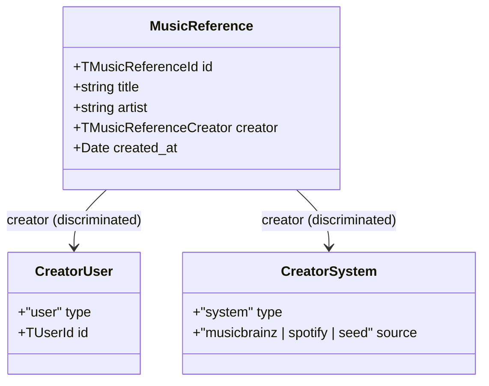
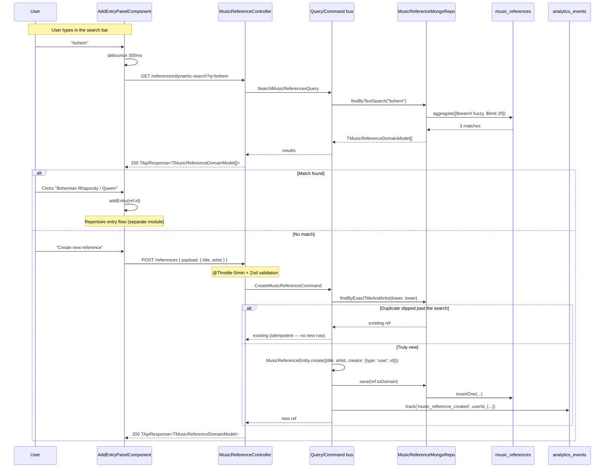

# SH3PHERD — Music References

> Canonical song catalogue — shared across the entire user base.
> Last refreshed 2026-04-21.

The music reference feature owns the canonical `title + artist` catalogue.
One row per song, globally deduplicated, contributed by the community.
Every user's repertoire points at the same reference row, which is why
references are **immutable on the user-facing API** and can only be
curated by admin / cron / AI operations.

This doc is the entry point if you need to: add a field to the canonical
model, wire a new consumer, understand why the POST is rate-limited, or
ship an admin curation op.

---

## TL;DR — the 3 invariants

1. **One row per song.** Dedup is case-insensitive on `title + artist`
   (trimmed + lowercased at write time). `CreateMusicReferenceCommand`
   returns the existing row on a match and never creates a duplicate.
2. **No ownership, community contribution.** `creator` is a marker for
   the contribution leaderboard, **not** an access-control field. Every
   user can read every reference; no user can mutate any reference.
3. **Immutable end-user side.** The entity has no `rename()` or any
   mutator. Cleanup, merge, metadata enrichment happen via **dedicated
   admin events** (see §TODO — admin ops) — never via an `updated_at`
   bumped on the happy path.

If a change to this module breaks any of these three, it needs a design
review before merging.

---

## Domain model



**Field semantics:**

| Field        | Type                                           | Why it's there                                                                                                                       |
| ------------ | ---------------------------------------------- | ------------------------------------------------------------------------------------------------------------------------------------ |
| `id`         | `TMusicReferenceId` (`musicRef_${uuid}`)       | Prefixed ID generated by `Entity<T>` base class.                                                                                     |
| `title`      | `string` (non-empty, lowercased, trimmed)      | Canonical song title. Lowercasing = case-insensitive dedup.                                                                          |
| `artist`     | `string` (non-empty, lowercased, trimmed)      | Canonical performing artist. Same rule.                                                                                              |
| `creator`    | `TMusicReferenceCreator` (discriminated union) | Contribution marker. `user` for human contribs, `system` for crawler/seed imports (`musicbrainz`, `spotify`, `seed`).                |
| `created_at` | `Date`                                         | Community timeline (first contribution date). No `updated_at` — the ref is immutable user-side. Admin curation emits events instead. |

The `creator` union is **discriminated on `type`** — TypeScript and Zod
both narrow it correctly (`z.discriminatedUnion('type', [...])`). Never
cast it to a flat `{ userId?: string; source?: string }` — that shape
defeats the purpose and opens both fields to inconsistent values.

---

## The expected flow — "search first, create on miss"

The UX is intentional: a user should almost never create a reference.
They should search, find a match, and add the existing reference to
their repertoire. Creation is the exception, not the rule.



### Why the POST is tightly throttled (5/min/user)

Per the invariants above, creation is meant to be rare. A well-behaved
client searches first, and only posts when the search legitimately
returns nothing. A client that hits 5 POSTs per minute is almost
certainly either buggy (not searching) or malicious (bot spam with
title variations to defeat dedup: `"song"`, `"song "`, `"song (live)"`,
`"song (remix)"`, …). The 429 response **forces** the right UX.

This is intentionally tighter than the register endpoint (10/min) —
creating a reference is cheaper than creating an account so we expect
bot surface to be similar or worse.

---

## Endpoints

### `GET /api/protected/music/references/dynamic-search?q=...`

| Attribute  | Value                                                                                                                                                                                                                                                                                         |
| ---------- | --------------------------------------------------------------------------------------------------------------------------------------------------------------------------------------------------------------------------------------------------------------------------------------------- |
| Scope      | `@PlatformScoped()`                                                                                                                                                                                                                                                                           |
| Permission | `P.Music.Library.Read`                                                                                                                                                                                                                                                                        |
| Validation | Trimmed + lowercased in the handler; empty query returns `[]` without hitting Mongo.                                                                                                                                                                                                          |
| Throttle   | Global (inherits `ThrottlerModule` defaults — 30/min dev, 10 000/min test).                                                                                                                                                                                                                   |
| Flow       | [`music-reference.controller.ts:44`](../src/music/api/music-reference.controller.ts#L44) → `SearchMusicReferencesQuery` → [`MusicReferenceMongoRepository.findByTextSearch`](../src/music/repositories/MusicReferenceRepository.ts#L38) → Atlas `$search` fuzzy, `maxEdits: 2`, `$limit: 20`. |

Response: `TApiResponse<TMusicReferenceDomainModel[]>` coded
`MUSIC_REFERENCES_SEARCHED`.

### `POST /api/protected/music/references`

| Attribute  | Value                                                                                                                                                                                                                                                           |
| ---------- | --------------------------------------------------------------------------------------------------------------------------------------------------------------------------------------------------------------------------------------------------------------- |
| Scope      | `@PlatformScoped()`                                                                                                                                                                                                                                             |
| Permission | `P.Music.Library.Write`                                                                                                                                                                                                                                         |
| Validation | `ZodValidationPipe(SCreateMusicReferencePayload)` on `body.payload`.                                                                                                                                                                                            |
| Throttle   | `@Throttle({ default: { limit: 5, ttl: 60_000 } })` — see rationale above.                                                                                                                                                                                      |
| Body       | `{ payload: { title: string; artist: string } }` — documented via `CreateMusicReferenceRequestDTO` Zod-derived DTO.                                                                                                                                             |
| Flow       | [`music-reference.controller.ts:70`](../src/music/api/music-reference.controller.ts#L70) → `CreateMusicReferenceCommand` → dedup lookup → `MusicReferenceEntity.create({...})` → repo save → fire-and-forget `analytics.track('music_reference_created', ...)`. |

Response: `TApiResponse<TMusicReferenceDomainModel>` coded
`MUSIC_REFERENCE_CREATED`. **Idempotent** — a duplicate title+artist
returns the existing row with the same success code.

Errors:

- `400` — Zod validation failed or domain invariant violated
  (`MUSIC_REFERENCE_TITLE_REQUIRED`, `MUSIC_REFERENCE_ARTIST_REQUIRED`).
- `429` — throttle exceeded. Expected when a client skips the search.
- `500` — `TechnicalError` with code `MUSIC_REFERENCE_CREATION_FAILED`
  if the repo write fails. The client sees the generic "An internal
  error occurred" message; full context is logged server-side
  (`actor_id`, `title`, `artist`, `operation`).

---

## Entity + invariants

[`MusicReferenceEntity`](../src/music/domain/entities/MusicReferenceEntity.ts)
extends `Entity<TMusicReferenceDomainModel>` (ID prefix `musicRef`).

```
constructor(props)            ← used to rehydrate from DB (idempotent invariants re-apply)
static create({title, artist, creator})
                              ← public factory: stamps created_at = new Date()
get title / artist / creator / createdAt
                              ← read-only accessors; no setter on purpose
toDomain                      ← snapshot for persistence / API responses
```

**No `rename()`, no `isOwnedBy()`, no `changeCreator()`.** That is
deliberate. If you feel like adding a user-facing mutator, you are
breaking an invariant — it belongs on an admin command path instead
(see §TODO).

### Domain invariants (throw `DomainError`, map to HTTP 400)

| Rule                                                                                                                | Error code                        |
| ------------------------------------------------------------------------------------------------------------------- | --------------------------------- |
| `title` non-empty (after trim)                                                                                      | `MUSIC_REFERENCE_TITLE_REQUIRED`  |
| `artist` non-empty (after trim)                                                                                     | `MUSIC_REFERENCE_ARTIST_REQUIRED` |
| `creator` matches the discriminated-union shape (enforced at the Zod boundary on read, at the TS compiler on write) | —                                 |

Both invariants re-run on construct, including when the repo rehydrates
a document. A corrupted row (e.g. empty title after a bad migration)
will throw on read — this is by design, we want the failure to surface.

---

## Repository

[`MusicReferenceMongoRepository`](../src/music/repositories/MusicReferenceRepository.ts)
extends `BaseMongoRepository<TMusicReferenceDomainModel>`.
All four methods return the domain model directly; the cast-free
typing is the rule (no `as Promise<T[]>` shenanigans).

| Method                                     | Backing                                                     | Notes                                                                                                                                                     |
| ------------------------------------------ | ----------------------------------------------------------- | --------------------------------------------------------------------------------------------------------------------------------------------------------- |
| `findAll()`                                | `BaseMongoRepository.findMany({ filter: {} })`              | Strips `_id` via base mapper.                                                                                                                             |
| `findByExactTitleAndArtist(title, artist)` | `BaseMongoRepository.findOne({ filter })`                   | Called by `CreateMusicReferenceHandler` for dedup. Inputs are already lowercased at the call site.                                                        |
| `findByIds(ids)`                           | `BaseMongoRepository.findMany({ filter: { id: { $in } } })` | Short-circuits on `ids.length === 0`.                                                                                                                     |
| `findByTextSearch(q)`                      | `collection.aggregate<TMusicReferenceDomainModel>([...])`   | Atlas `$search`, fuzzy `maxEdits=2`, prefixLength=1, maxExpansions=50, `$limit=20`. Requires the Atlas Search index named `default` on `[title, artist]`. |

Errors from the text search surface as a `TechnicalError` **in the
query handler**, not via a repo-level decorator. We intentionally do
not wrap the repo in `@technicalFailThrows500` — the handler owns the
operational flow and produces the richer error context (`searchValue`,
`operation`).

### Persistence shape (`music_references` collection)

```json
{
  "_id": "…objectId…",
  "id": "musicRef_3f7c-…",
  "title": "bohemian rhapsody",
  "artist": "queen",
  "creator": { "type": "user", "id": "userCredential_8ce4-…" },
  "created_at": "2026-04-21T10:16:11.000Z"
}
```

Required indexes:

```javascript
// Dedup lookup (findByExactTitleAndArtist) — hot path on every POST.
db.music_references.createIndex({ title: 1, artist: 1 }, { unique: true });

// Fuzzy search — Atlas Search, defined in the Atlas UI or via
// the search index JSON.
{
  "name": "default",
  "mappings": {
    "dynamic": false,
    "fields": {
      "title":  { "type": "string", "analyzer": "lucene.standard" },
      "artist": { "type": "string", "analyzer": "lucene.standard" }
    }
  }
}

// Contribution leaderboard — "references contributed by user X".
db.music_references.createIndex({ "creator.type": 1, "creator.id": 1 });

// Community timeline — "latest references added this week".
db.music_references.createIndex({ created_at: -1 });
```

The `unique` constraint on `{ title, artist }` is the persistence-level
safety net for the dedup logic. Even under a race between two concurrent
POSTs, one insert will succeed and the other will throw a duplicate-key
error that the handler can catch and turn back into "return the existing
row" (currently we rely on the `findByExactTitleAndArtist` pre-check —
tightening to a duplicate-key-catch is a known follow-up).

---

## Analytics integration

On successful creation, the handler fires an analytics event:

```ts
analytics.track('music_reference_created', actorId, {
  reference_id,
  title,
  artist,
});
```

Fire-and-forget (swallowed errors) — see
[`sh3-analytics-events.md`](sh3-analytics-events.md). The dashboard and
onboarding funnel rely on this event, **not** on querying
`music_references.created_at`, because:

- `created_at` only captures the first contribution (idempotent POSTs
  don't re-fire it).
- Analytics carries richer metadata (IP, user agent, plan at time of
  contribution) that the domain model intentionally does not store.

Converse reasoning: `creator` on the doc is the source of truth for
"who contributed" (indexable, transactional), while the analytics
event is the source of truth for "what happened when".

---

## Quota stance

**No quota on creation** — intentional. The product goal is to grow
the canonical catalogue, and contributions are social good. The
protections that still apply:

- **Dedup** (lowercased title+artist) prevents trivial duplicates.
- **Throttle 5/min** makes bot contributions impractical.
- **Admin curation** (see §TODO) will eventually merge bogus rows.

If abuse patterns emerge (spam with title variations to defeat dedup),
the escalation path is: tighten the throttle → quota per plan →
MusicBrainz match required before insert. Do not add a quota
preemptively.

---

## TODO — Admin curation ops

The end-user path is locked down; the admin path is still to build.
Principles:

1. **Event-first.** Every admin mutation emits a dedicated domain
   event, never bumps an `updated_at` on the happy path. Downstream
   listeners (search reindex, cache invalidation, activity feed) wire
   on the events, not on the document shape.
2. **Audit trail in `analytics_events`.** Each admin op tracks who did
   what and why (`reason` field) so misuse is traceable.
3. **No user-facing mutator.** Admin ops go through a separate
   controller with its own permission (`P.Music.Admin.*`, to be added).

### Planned ops

| Op                              | Event                                                                                        | Purpose                                                             |
| ------------------------------- | -------------------------------------------------------------------------------------------- | ------------------------------------------------------------------- |
| `music_reference_merged`        | Merge two rows A + B → keep A, redirect every repertoire entry pointing at B to A, delete B. | Cleanup of dedup leaks (misspellings, feat. variants).              |
| `music_reference_enriched`      | Attach external IDs (`musicBrainzId`, `isrc`, cover art URL) to an existing row.             | Metadata enrichment via cron (MusicBrainz / Spotify crawler).       |
| `music_reference_rematched`     | Change the artist or title after a dedup discovery (e.g. canonical spelling).                | Rare; requires admin approval — triggers a repertoire-side refresh. |
| `music_reference_seed_imported` | Creator is `{ type: 'system', source }` — bulk-imported from an external catalogue.          | Seeding flow (rollout, new market).                                 |

### Endpoint shapes (not built yet)

```
POST   /api/admin/music/references/merge          { targetId, duplicateId, reason }
PATCH  /api/admin/music/references/:id/metadata   { musicBrainzId?, isrc?, coverArtUrl? }
PATCH  /api/admin/music/references/:id/retitle    { title?, artist?, reason }
POST   /api/admin/music/references/seed           { source: 'musicbrainz' | 'spotify' | 'seed', rows: [...] }
```

All four need `@RequirePermission(P.Music.Admin.Curate)` (permission
to be added to the `P` object) and should emit their respective
event on success. The event handlers go in a new `music-admin`
module, not in the user-facing music module.

### Open design questions

- **Merge conflict resolution**: if both rows have different
  `musicBrainzId` after enrichment, which one wins? Most recent
  enrichment timestamp probably, but tricky with user-corrected ones.
- **Soft delete vs hard delete on merge**: for the repertoire entries,
  we probably want a soft-redirect (keep the merged-out row as a
  tombstone with a `redirects_to` field) to support future "undo
  merge". Cost: one extra field on the domain model — worth it.
- **Cron vs on-demand enrichment**: the MusicBrainz API has quotas
  (1 req/s). A batch cron is the only sane path at scale. For
  on-demand enrichment triggered by a user marking a reference as
  "incomplete", we need a queue.

---

## Migration history

| Date       | Script                                                                                           | Purpose                                                                                                                                                                                             |
| ---------- | ------------------------------------------------------------------------------------------------ | --------------------------------------------------------------------------------------------------------------------------------------------------------------------------------------------------- |
| 2026-04-21 | [`reshape-music-references-creator.mjs`](../src/migrations/reshape-music-references-creator.mjs) | Reshape legacy docs: `owner_id: TUserId` → `creator: { type: 'user', id }` + add `created_at` (sourced from `analytics_events` if available, else fallback `2026-04-21`). Idempotent + `--dry-run`. |

Future migrations — `musicBrainzId`, `coverArtUrl`, `isrc` — will be
additive. The schema is expected to grow only with optional fields
(dropping a required field breaks downstream consumers).

---

## Frontend touchpoints

| Concern      | File                                                                                                                                                                                                |
| ------------ | --------------------------------------------------------------------------------------------------------------------------------------------------------------------------------------------------- |
| HTTP service | [`music-reference-api.service.ts`](../../frontend-webapp/src/app/features/musicLibrary/services/music-reference-api.service.ts) — `search(q)` + `create(payload)`.                                  |
| UI           | [`add-entry-panel.component.ts`](../../frontend-webapp/src/app/features/musicLibrary/components/add-entry-panel/add-entry-panel.component.ts) — search input (debounced 300ms) + "create new" form. |
| Display rule | DB stores lowercase; the template applies `text-transform: capitalize`. Keep the normalization server-side, never try to mix cases.                                                                 |

When the backend DTO changes, the frontend gets it via
`@sh3pherd/shared-types` — there is no separate frontend-side view
model for this endpoint because it is a 1:1 return of the domain model.

---

## Onboarding — reading order

If you have 10 minutes to understand the module, read in this order:

1. [`music-references.types.ts`](../../../packages/shared-types/src/music-references.types.ts) — the domain model + Zod schema, single source of truth.
2. [`MusicReferenceEntity.ts`](../src/music/domain/entities/MusicReferenceEntity.ts) — the invariants live here.
3. [`CreateMusicReferenceCommand.ts`](../src/music/application/commands/CreateMusicReferenceCommand.ts) — the 6-step handler flow, including the dedup branch.
4. [`music-reference.controller.ts`](../src/music/api/music-reference.controller.ts) — the public surface (scope, permission, throttle, DTOs).
5. This doc's §TODO — so you know what's coming and don't reinvent
   it as a side effect of a user-facing feature.

If you have 30 minutes and want to make a change, also read:

- [`sh3-writing-a-controller.md`](sh3-writing-a-controller.md) — controller conventions.
- [`sh3-error-handling.md`](sh3-error-handling.md) — when to throw which error.
- [`sh3-analytics-events.md`](sh3-analytics-events.md) — if your change touches the `music_reference_created` event or adds new ones.
- [`sh3-music-library.md`](sh3-music-library.md) — where the reference fits in the wider music roadmap.

---

## Related docs

- [`sh3-music-library.md`](sh3-music-library.md) — full music library roadmap; references are feature 0 in the DDD foundation block.
- [`sh3-auth-and-context.md`](sh3-auth-and-context.md) — why `@PlatformScoped()` is the right scope here.
- [`sh3-swagger-usage.md`](sh3-swagger-usage.md) — DTO pattern used in `music.dto.ts`.
- [`sh3-e2e-tests.md`](sh3-e2e-tests.md) — E2E infrastructure; E2E coverage for this module is a known gap (see `TODO-music-features.md`).
