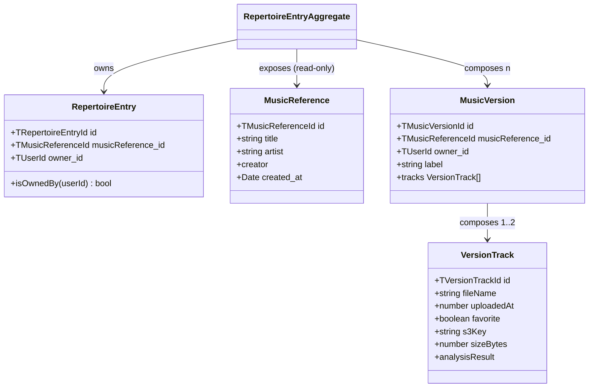
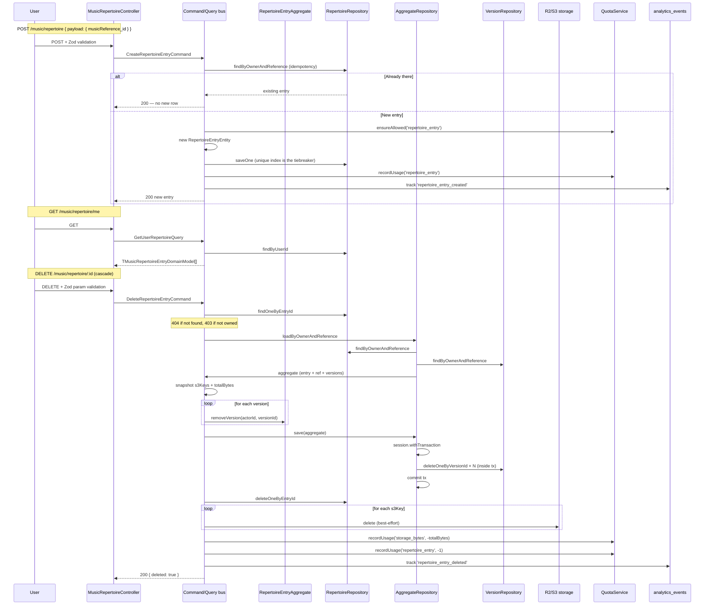

# SH3PHERD — Music Repertoire

> A user's personal catalogue: the link from a user to canonical music references, plus their versions (covers, remixes, derived tracks). Last refreshed 2026-04-21.

The repertoire is where the user's library lives. Each **entry** binds one user to one canonical reference (title + artist). The entry is then the umbrella for every **version** the user owns (original, cover, remix, pitch-shifted derivations…), and every version carries its own **tracks** (audio files, master, AI master…).

If `music-reference` is _"what songs exist in the world"_, music-repertoire is _"what songs are mine, and how do I perform them"_.

---

## TL;DR — the 3 invariants

1. **At most one entry per (user, reference).** Enforced at two layers: the command handler does an idempotency check, and a **unique compound index** on `{ owner_id, musicReference_id }` is the authoritative safety net for concurrent writes.
2. **Deleting an entry cascades.** The cleanup removes every version the user owns for that reference, deletes every track's S3 object (best-effort), and credits the `storage_bytes` and `repertoire_entry` quotas back. There is no orphaned-version leak path.
3. **All mutations go through the aggregate.** `RepertoireEntryAggregate` owns entry + reference + versions in one cohesive unit. Policy checks (ownership, limits) fire inside the aggregate — no handler bypasses them.

Break any of the three and you'll leak data, orphan tracks, or duplicate user state.

---

## Domain model



**Field semantics (entry):**

| Field               | Type                                      | Why it's there                                                                                                                               |
| ------------------- | ----------------------------------------- | -------------------------------------------------------------------------------------------------------------------------------------------- |
| `id`                | `TRepertoireEntryId` (`repEntry_${uuid}`) | Prefixed ID generated by `Entity<T>` base class.                                                                                             |
| `musicReference_id` | `TMusicReferenceId`                       | Points at the canonical song — a reference contributed by anyone.                                                                            |
| `owner_id`          | `TUserId` (runtime `userCredential_…`)    | Who owns this entry. **True ownership** here (unlike `creator` on a reference) — the handler refuses any mutation by a non-owner with a 403. |

No `created_at` on the entry itself — the aggregate doesn't carry a timeline for the link. If that becomes useful (e.g. "songs added this month"), add it later without breaking anything.

---

## Expected flow — add, list, delete



### Why the delete is a 2-step transaction (and why it's safe)

Mongo transactions can span collections, but they can't span **a DB write and an S3 delete + a quota bump**. So the cascade is:

- **Inside a transaction:** aggregate save (every `music_versions` delete commits atomically). Either all N versions are gone, or none is.
- **Outside any transaction:** the `music_repertoire` entry row delete, plus the S3 + quota cleanup.

If the process crashes between the aggregate save and the entry delete, the state is `0 versions, entry still there`. A **retry of DELETE is idempotent**: the aggregate loads with zero versions, nothing to remove, the handler proceeds to delete the entry. Nobody observes a corrupt state for long.

S3 cleanup and quota credits are intentionally best-effort — a stale R2 object or a 10-byte skew in the storage counter is cheaper than refusing the user's delete. The quota counter is monotonic on creates, so a missed decrement bounds the error.

---

## Endpoints

### `GET /api/protected/music/repertoire/me`

| Attribute  | Value                                                                                                                                                                                                                     |
| ---------- | ------------------------------------------------------------------------------------------------------------------------------------------------------------------------------------------------------------------------- |
| Scope      | `@PlatformScoped()`                                                                                                                                                                                                       |
| Permission | `P.Music.Library.Read`                                                                                                                                                                                                    |
| Pagination | None yet — returns the full list. Fine up to a few hundred entries per user.                                                                                                                                              |
| Flow       | [`musicRepertoire.controller.ts:53`](../src/music/api/musicRepertoire.controller.ts#L53) → `GetUserRepertoireQuery` → [`MusicRepertoireRepository.findByUserId`](../src/music/repositories/MusicRepertoireRepository.ts). |

Response: `TApiResponse<TMusicRepertoireEntryDomainModel[]>` coded `REPERTOIRE_ENTRIES_FETCHED`.

### `GET /api/protected/music/library/me`

Related but separate — lives in [`music-library.controller.ts`](../src/music/api/music-library.controller.ts). Uses `GetUserMusicLibraryQuery` which **joins entries + references + versions in 3 parallel fetches**, builds lookup maps client-side, strips `owner_id` / `musicReference_id` from versions via `toVersionView()`. Zero N+1; zero pagination (same pragmatic limit as above).

### `POST /api/protected/music/repertoire`

| Attribute   | Value                                                                                                                                                                                                                                              |
| ----------- | -------------------------------------------------------------------------------------------------------------------------------------------------------------------------------------------------------------------------------------------------- |
| Scope       | `@PlatformScoped()`                                                                                                                                                                                                                                |
| Permission  | `P.Music.Library.Write`                                                                                                                                                                                                                            |
| Throttle    | `@Throttle({ default: { limit: 30, ttl: 60_000 } })` — 30/min. Looser than music-reference POST (5/min) because adding a song to your own library is a common, legitimate action; the tight one is for the community-facing create-reference path. |
| Body        | `{ payload: { musicReference_id } }` — documented via `CreateRepertoireEntryRequestDTO` Zod-derived.                                                                                                                                               |
| Idempotency | Repeat POSTs with the same `musicReference_id` return the same entry. No quota consumed on the second call.                                                                                                                                        |
| Flow        | [`musicRepertoire.controller.ts:78`](../src/music/api/musicRepertoire.controller.ts#L78) → `CreateRepertoireEntryCommand`.                                                                                                                         |

Response: `TApiResponse<TMusicRepertoireEntryDomainModel>` coded `REPERTOIRE_ENTRY_CREATED`.

Error codes:

- `400` — Zod validation, or `REPERTOIRE_ENTRY_REFERENCE_REQUIRED` / `REPERTOIRE_ENTRY_OWNER_REQUIRED` from the entity invariants (`DomainError`).
- `402` — `QUOTA_EXCEEDED` on `repertoire_entry`.
- `429` — throttle.
- `500` — `TechnicalError` code `REPERTOIRE_ENTRY_CREATION_FAILED` if the repo write fails; full context logged server-side.

### `DELETE /api/protected/music/repertoire/:id`

| Attribute  | Value                                                                                                                        |
| ---------- | ---------------------------------------------------------------------------------------------------------------------------- |
| Scope      | `@PlatformScoped()`                                                                                                          |
| Permission | `P.Music.Library.Write`                                                                                                      |
| Path param | Validated by `ZodValidationPipe(SRepertoireEntryId)` → 400 on a malformed ID, no database round-trip wasted.                 |
| Cascade    | Versions → tracks → S3 objects → quota credits. See the sequence diagram above.                                              |
| Flow       | [`musicRepertoire.controller.ts:109`](../src/music/api/musicRepertoire.controller.ts#L109) → `DeleteRepertoireEntryCommand`. |

Response: `TApiResponse<boolean>` coded `REPERTOIRE_ENTRY_DELETED` (payload shape documented by `RepertoireEntryDeletedPayload`).

Error codes:

- `400` — malformed entry ID.
- `403` — `REPERTOIRE_ENTRY_NOT_OWNED` (`BusinessError`).
- `404` — `REPERTOIRE_ENTRY_NOT_FOUND` (`BusinessError`).
- `500` — `REPERTOIRE_AGGREGATE_SAVE_FAILED` if the cascading transaction rolls back. Full context (entry_id, owner_id, counts) logged server-side.

---

## Entity + aggregate + policy

### `RepertoireEntryEntity`

Thin entity, no mutable state, no mutator methods on purpose. Two construction invariants (both `DomainError` with a machine-readable code):

| Rule                        | Error code                            |
| --------------------------- | ------------------------------------- |
| `musicReference_id` present | `REPERTOIRE_ENTRY_REFERENCE_REQUIRED` |
| `owner_id` present          | `REPERTOIRE_ENTRY_OWNER_REQUIRED`     |

The uniqueness `(owner_id, musicReference_id)` is **not** enforced by the entity — that's a persistence concern, handled by the Mongo unique index.

### `RepertoireEntryAggregate`

[RepertoireEntryAggregate.ts](../src/music/domain/RepertoireEntryAggregate.ts) — an `AggregateRoot` (NestJS CQRS) that composes:

- the entry itself,
- the reference (read-only from the aggregate's viewpoint — references are global),
- the user's versions of that reference (with their tracks).

Dirty tracking is explicit: `newVersions` / `removedVersions` / `existingVersions`. The repo save reads those three pools to know what to insert, delete, and update-if-changed. The base `Entity.getDiffProps()` feeds the update branch so we only persist actually-changed fields.

### `MusicPolicy`

[MusicPolicy.ts](../src/music/domain/MusicPolicy.ts) — all structural limits + ownership checks in one place. Every method raises a `DomainError` with a code + context if the rule fails:

| Rule                                | Code                                                              | Limit |
| ----------------------------------- | ----------------------------------------------------------------- | ----- |
| Max tracks per version              | `MAX_TRACKS_REACHED`                                              | 2     |
| Max masters per version             | `MAX_MASTERS_REACHED`                                             | 1     |
| Max derivations per source          | `MAX_DERIVATIONS_PER_SOURCE_REACHED`                              | 3     |
| Max versions per reference per user | `MAX_VERSIONS_PER_REFERENCE_REACHED`                              | 10    |
| Track analysis + S3 present         | `TRACK_NOT_ANALYZED` / `TRACK_NOT_IN_STORAGE` / `TRACK_NOT_FOUND` | —     |
| Ownership                           | `MUSIC_VERSION_NOT_OWNED` / `REPERTOIRE_ENTRY_NOT_OWNED`          | —     |

Handlers never re-check these rules; they call into the aggregate which calls the policy. **Single source of enforcement.**

---

## Repositories

### `MusicRepertoireMongoRepository`

Simple entity repo — [file](../src/music/repositories/MusicRepertoireRepository.ts). Delegates read paths to the base repo's typed helpers (`findOne` / `findMany`) so there are no casts. `saveOne` and `deleteOneByEntryId` both accept an optional `ClientSession` so they can participate in a caller-orchestrated transaction.

### `RepertoireEntryAggregateRepository`

[file](../src/music/repositories/RepertoireEntryAggregateRepository.ts) — composes the three sub-repos (repertoire, version, reference) to load and save the aggregate.

Key guarantees:

- **`save()` is transactional.** If the caller passes a `ClientSession`, we use it; otherwise we open our own via `versionRepo.startSession()` and wrap all three loops (new / removed / updated) in `withTransaction`. The transaction boundary is what prevents the "2 out of 3 deletes" failure mode that used to be possible before this refactor.
- **Errors are surfaced as `TechnicalError`** with the aggregate counts in context — easier to correlate with logs than an opaque Mongo stack.
- **`loadByVersionId` / `loadByOwnerAndReference`** throw `BusinessError` 404 on miss, not generic `Error`. Handlers catch the right status.

### Persistence shape

```json
// music_repertoire
{
  "_id": "…",
  "id": "repEntry_abc-…",
  "musicReference_id": "musicRef_xyz-…",
  "owner_id": "userCredential_8ce4-…"
}

// music_versions (composed, not a sub-doc)
{
  "_id": "…",
  "id": "musicVer_def-…",
  "musicReference_id": "musicRef_xyz-…",
  "owner_id": "userCredential_8ce4-…",
  "label": "Acoustic cover",
  "tracks": [ { "id": "track_…", "s3Key": "…", "sizeBytes": 5324211, … } ]
}
```

### Required indexes

```javascript
// music_repertoire — unique compound, covers findByOwnerAndReference + findByUserId (prefix match).
db.music_repertoire.createIndex(
  { owner_id: 1, musicReference_id: 1 },
  { unique: true, name: 'owner_id_1_musicReference_id_1' },
);

// music_versions — hot path is findByOwnerAndReference (for aggregate load) and findByOwnerId (library view).
db.music_versions.createIndex({ owner_id: 1, musicReference_id: 1 });
db.music_versions.createIndex({ owner_id: 1 });
```

The first one is shipped by [`add-music-repertoire-indexes.mjs`](../src/migrations/add-music-repertoire-indexes.mjs). The version indexes aren't in a migration yet — they're a known follow-up.

---

## Quota integration

Two counters move with repertoire operations:

| Operation              | Counter                             | Delta               |
| ---------------------- | ----------------------------------- | ------------------- |
| Create entry           | `repertoire_entry`                  | +1                  |
| Upload track           | `track_upload`, `storage_bytes`     | +1, +filesize       |
| Master track           | `master_standard` or `master_ai`    | +1                  |
| Pitch-shift            | `pitch_shift`                       | +1                  |
| Delete track           | `storage_bytes`                     | −track.sizeBytes    |
| Delete version         | `storage_bytes`                     | −Σ tracks.sizeBytes |
| Delete entry (cascade) | `storage_bytes`, `repertoire_entry` | −Σ, −1              |

Legacy tracks without a `sizeBytes` field (ingested before the field was added) are treated as 0 on delete — a small credit gap, bounded and acceptable. The forward path (upload / master / pitch-shift) always writes the field.

All credits are called via `QuotaService.recordUsage(..., negative amount)`. The service already handles clamping against the plan limit.

---

## Analytics integration

Events emitted on the happy path:

| Operation      | Event                      | Metadata                                                                 |
| -------------- | -------------------------- | ------------------------------------------------------------------------ |
| Create entry   | `repertoire_entry_created` | `entry_id`, `reference_id`                                               |
| Delete entry   | `repertoire_entry_deleted` | `entry_id`, `reference_id`, `version_count`, `total_size_bytes`          |
| Delete version | `music_version_deleted`    | `version_id`, `reference_id`, `label`, `track_count`, `total_size_bytes` |
| Delete track   | `track_deleted`            | `version_id`, `track_id`, `file_name`, `processing_type`, `size_bytes`   |

All fire-and-forget — an analytics outage never breaks the user action. See [sh3-analytics-events.md](sh3-analytics-events.md) for the event store architecture.

---

## Frontend touchpoints

| Concern      | File                                                                                                                          |
| ------------ | ----------------------------------------------------------------------------------------------------------------------------- |
| HTTP service | `apps/frontend-webapp/src/app/features/musicLibrary/services/music-reference-api.service.ts` + `music-library.service.ts`     |
| UI           | `apps/frontend-webapp/src/app/features/musicLibrary/components/add-entry-panel/` (create) + the library table (list + delete) |

The frontend reads the domain model as-is. If the response shape changes, bump `packages/shared-types` and the types propagate.

---

## Onboarding — reading order

10 minutes:

1. [`music-repertoire.types.ts`](../../../packages/shared-types/src/music-repertoire.types.ts) — the domain model + Zod schema.
2. [`RepertoireEntryEntity.ts`](../src/music/domain/entities/RepertoireEntryEntity.ts) — thin, immutable, two invariants.
3. [`RepertoireEntryAggregate.ts`](../src/music/domain/RepertoireEntryAggregate.ts) — the coordination surface.
4. [`MusicPolicy.ts`](../src/music/domain/MusicPolicy.ts) — all the limits.
5. [`DeleteRepertoireEntryCommand.ts`](../src/music/application/commands/DeleteRepertoireEntryCommand.ts) — the cascade, end-to-end.

30 minutes, add:

- [`RepertoireEntryAggregateRepository.ts`](../src/music/repositories/RepertoireEntryAggregateRepository.ts) — the transactional save + dirty tracking wiring.
- [`GetUserMusicLibraryQuery.ts`](../src/music/application/queries/GetUserMusicLibraryQuery.ts) — the read side, 3-fetch parallel join.
- [sh3-music-reference-api.md](sh3-music-reference-api.md) — where the canonical reference lives, and why this doc is only ever "one level up".
- [sh3-quota-service.md](sh3-quota-service.md) + [sh3-analytics-events.md](sh3-analytics-events.md) — the cross-cutting concerns this module touches.

---

## Known gaps / follow-ups

- **Pagination on `GET /library/me`.** Today returns everything; fine up to a few hundred entries per user, will start hurting past ~500 versions with media-heavy payloads. Add `limit` / `offset` (or a cursor) before the scale catches up.
- **Version-repo indexes.** The migration only creates the `music_repertoire` compound index. `music_versions` has the same hot-path pattern (`findByOwnerAndReference`, `findByOwnerId`) and will benefit from the same index set — extend the migration when you run it.
- **`MusicVersionEntity` invariants still use `throw new Error(CODE)`.** Not in scope here, but worth migrating to `DomainError` for consistency with the rest of the module next time we touch music-version.
- **Admin curation — none yet.** Same story as for music-reference: merges, re-matches, enrichments have to run against the live entries (updating `musicReference_id` when two references are merged, for instance). Will need its own command + dedicated event (`repertoire_entry_rebased` or similar).

---

## Related docs

- [`sh3-music-reference-api.md`](sh3-music-reference-api.md) — canonical references (the `musicReference_id` target).
- [`sh3-music-library.md`](sh3-music-library.md) — full music roadmap.
- [`sh3-music-audio-player.md`](sh3-music-audio-player.md) — how tracks are played back once they're in a version.
- [`sh3-music-mastering.md`](sh3-music-mastering.md) — the master/AI-master paths that write tracks into versions.
- [`sh3-error-handling.md`](sh3-error-handling.md) — the `DomainError` / `BusinessError` / `TechnicalError` taxonomy used throughout.
- [`sh3-quota-service.md`](sh3-quota-service.md) + [`sh3-analytics-events.md`](sh3-analytics-events.md) — cross-cutting infra.
