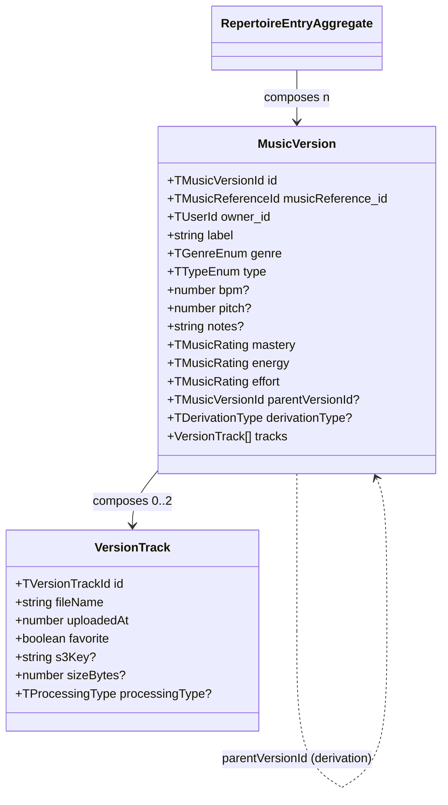
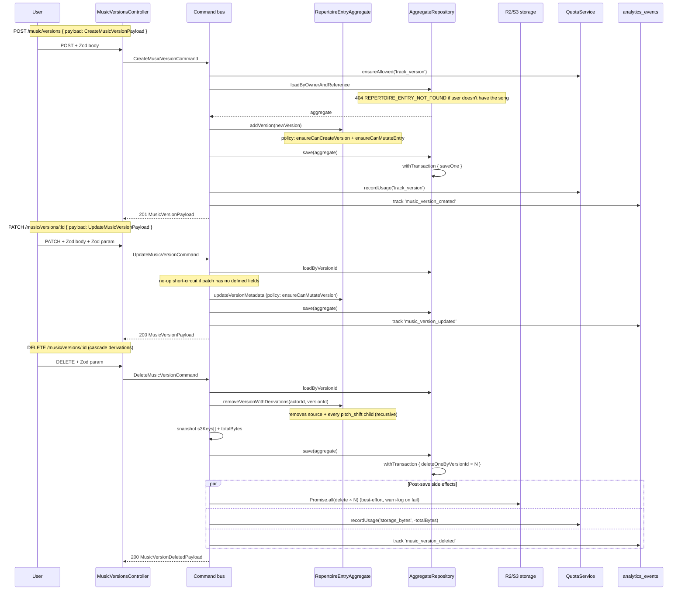

# SH3PHERD — Music Version API

> A user's rendition of a canonical music reference: cover, acoustic, remix, pitch-shift. Last refreshed 2026-04-21.

A **version** is owned by a single user and always lives under a repertoire entry (`(owner_id, musicReference_id)`). Versions carry 0–2 **tracks** (the uploaded audio + an optional mastered or pitch-shifted derivation). Mutations go through `RepertoireEntryAggregate` so ownership + derivation limits are enforced consistently.

If `music-repertoire` is _"what songs are mine"_, `music-version` is _"how I perform each of them"_.

---

## TL;DR — the 4 invariants

1. **A version only exists inside a repertoire entry.** `CreateMusicVersionCommand` rejects a reference the user hasn't added yet (REPERTOIRE_ENTRY_NOT_FOUND). The aggregate is loaded by `(owner, reference)` and the version is appended through it.
2. **Ownership is checked at the aggregate layer, not in the controller.** `MusicPolicy.ensureCanMutateVersion` is the single gate; any handler that mutates a version goes through the aggregate and therefore through the policy.
3. **Delete cascades to derivations.** `DeleteMusicVersionCommand` removes the source version AND every version whose `parentVersionId` points at it (or transitively at one of its children) in one transactional save. No dangling `parentVersionId` pointers.
4. **Side effects run AFTER the DB save.** DB is the source of truth; S3 + quota + analytics are post-save effects whose failures are logged but never undo the save (sweeper-reconciled).

---

## Domain model

**Field semantics (version):**

| Field                           | Type                                   | Why it's there                                                                                                                      |
| ------------------------------- | -------------------------------------- | ----------------------------------------------------------------------------------------------------------------------------------- |
| `id`                            | `TMusicVersionId` (`musicVer_${uuid}`) | Prefixed ID generated by `Entity<T>` base class.                                                                                    |
| `owner_id`                      | `TUserId`                              | True ownership. `MusicPolicy.ensureCanMutateVersion` throws `MUSIC_VERSION_NOT_OWNED` (DomainError, 400) when the actor mismatches. |
| `label`                         | non-empty string                       | Trimmed on construct and on every `updateMetadata`. Empty label ⇒ `MUSIC_VERSION_LABEL_REQUIRED`.                                   |
| `genre`, `type`                 | Zod enums                              | Constrained at the shared-types schema (`SMusicVersionDomainModel`).                                                                |
| `mastery` / `energy` / `effort` | `TMusicRating` (1..4)                  | User-entered proficiency / vibe / difficulty indicators, surfaced in the library views.                                             |
| `parentVersionId`               | optional `TMusicVersionId`             | Set when the version was produced by a derivation (pitch-shift today; future derivations will reuse the same pointer).              |
| `derivationType`                | optional `'pitch_shift'`               | Tags the kind of derivation so the UI can label it and the aggregate can enforce `MAX_DERIVATIONS_PER_SOURCE`.                      |
| `tracks`                        | 0..`MAX_TRACKS_PER_VERSION` (=2)       | Adding a third track throws `MAX_TRACKS_REACHED` (DomainError). A mastered derivation consumes the second slot.                     |

---

## Expected flow — create, update, delete

---

## Endpoints

All routes are `@PlatformScoped` + `@RequirePermission(P.Music.Library.Write)` (the Read permission is not required — only authors mutate their own versions). Prefix: `/api/protected/music/versions`.

| Method | Path   | Body                           | Result                       | Notable statuses                           |
| ------ | ------ | ------------------------------ | ---------------------------- | ------------------------------------------ |
| POST   | `/`    | `CreateMusicVersionRequestDTO` | `MusicVersionPayload` (201)  | 400, 402 (quota), 404 (no entry), 409, 429 |
| PATCH  | `/:id` | `UpdateMusicVersionRequestDTO` | `MusicVersionPayload` (200)  | 400, 403 (not owner), 404                  |
| DELETE | `/:id` | —                              | `MusicVersionDeletedPayload` | 403 (not owner), 404                       |

POST is throttled (`30/min/user`) to match the repertoire controller's shape — versions are a write-amplified resource (creation often followed by a track upload + master).

### Zod validation

| Input        | Schema                       |
| ------------ | ---------------------------- |
| Path `:id`   | `SMusicVersionId`            |
| Body (POST)  | `SCreateMusicVersionPayload` |
| Body (PATCH) | `SUpdateMusicVersionPayload` |

Path validation catches malformed IDs at the pipe, before the command runs — spares the aggregate repo a pointless DB round-trip.

---

## Quota & analytics

| Action | Quota resource  | Direction | Analytics event         | Notable metadata                                                               |
| ------ | --------------- | --------- | ----------------------- | ------------------------------------------------------------------------------ |
| Create | `track_version` | +1        | `music_version_created` | `reference_id`, `label`, `type`, `genre`                                       |
| Update | —               | —         | `music_version_updated` | `reference_id`, `updated_fields[]`, `changes`                                  |
| Delete | `storage_bytes` | −Σ sizes  | `music_version_deleted` | `reference_id`, `label`, `track_count`, `derivation_count`, `total_size_bytes` |

`track_version` is **not credited back** on delete — it meters "versions you've created", not "versions you currently keep". The comment on `QuotaLimits.ts` states this explicitly.

`master_standard`, `master_ai`, `pitch_shift` are also not credited back — those meter service invocations (per period), not kept artefacts.

---

## Error taxonomy

| Error                                | Thrown from                                         | Class          | HTTP |
| ------------------------------------ | --------------------------------------------------- | -------------- | ---- |
| `MUSIC_VERSION_NOT_FOUND`            | `AggregateRepository.loadByVersionId`               | BusinessError  | 404  |
| `REPERTOIRE_ENTRY_NOT_FOUND`         | `AggregateRepository.loadByOwnerAndReference`       | BusinessError  | 404  |
| `MUSIC_REFERENCE_NOT_FOUND`          | `AggregateRepository.loadByOwnerAndReference`       | BusinessError  | 404  |
| `MUSIC_VERSION_NOT_OWNED`            | `MusicPolicy.ensureCanMutateVersion`                | DomainError    | 400  |
| `REPERTOIRE_ENTRY_NOT_OWNED`         | `MusicPolicy.ensureCanMutateEntry`                  | DomainError    | 400  |
| `MAX_VERSIONS_PER_REFERENCE_REACHED` | `MusicPolicy.ensureCanCreateVersion`                | DomainError    | 400  |
| `MAX_DERIVATIONS_PER_SOURCE_REACHED` | `MusicPolicy.ensureCanDeriveVersion`                | DomainError    | 400  |
| `MUSIC_VERSION_LABEL_REQUIRED`       | `MusicVersionEntity` constructor / `updateMetadata` | DomainError    | 400  |
| `REPERTOIRE_AGGREGATE_SAVE_FAILED`   | `RepertoireEntryAggregateRepository.save`           | TechnicalError | 500  |

---

## Code locations

| What                     | Where                                                                                      |
| ------------------------ | ------------------------------------------------------------------------------------------ |
| Controller               | `apps/backend/src/music/api/music-versions.controller.ts`                                  |
| Commands                 | `apps/backend/src/music/application/commands/{Create,Update,Delete}MusicVersionCommand.ts` |
| Handler tests            | `apps/backend/src/music/application/commands/__tests__/*Handler.spec.ts`                   |
| Aggregate + policy       | `apps/backend/src/music/domain/{RepertoireEntryAggregate,MusicPolicy}.ts`                  |
| Entity + invariants      | `apps/backend/src/music/domain/entities/MusicVersionEntity.ts`                             |
| Aggregate repo (tx save) | `apps/backend/src/music/repositories/RepertoireEntryAggregateRepository.ts`                |
| Version repo (Mongo ops) | `apps/backend/src/music/repositories/MusicVersionRepository.ts`                            |
| DTOs (Zod-derived)       | `apps/backend/src/music/dto/music.dto.ts`                                                  |
| API codes                | `apps/backend/src/music/codes.ts`                                                          |
| Quota limits             | `apps/backend/src/quota/domain/QuotaLimits.ts`                                             |

---

## Recent hardening (2026-04-21)

Scoped pass — alignment with the `music-reference` / `music-repertoire` baselines. See [`sh3-music-version-audit.md`](sh3-music-version-audit.md) for the detailed before/after scoring.

- Controller Swagger parity: `@ApiBody(apiRequestDTO(...))`, Zod-pipe on `:id`, 400/402/403/404/409/429 declared, `apiSuccessDTO` on DELETE, Zod-derived request DTOs (`CreateMusicVersionRequestDTO` / `UpdateMusicVersionRequestDTO`).
- Write throttle on POST (30/min/user).
- Update handler: no-op short-circuit on empty / all-undefined patch, dead `findVersion` branch removed, JSDoc with typed `@throws`.
- Delete handler: S3 deletes parallelised (`Promise.all`) with `Logger.warn` on failure (no more silent swallow), DB-save-before-S3 ordering made explicit in comments.
- Dead code `MUSIC_VERSION_CREATION_UC_FAIL` removed from `codes.ts`.
- QuotaLimits comment clarified (`// per user lifetime — not credited back on version delete`).
- 19 new handler unit tests covering happy paths, quota gate, analytics emission, ownership, S3 ordering, storage_bytes restitution, and persistence-failure rollback semantics.
