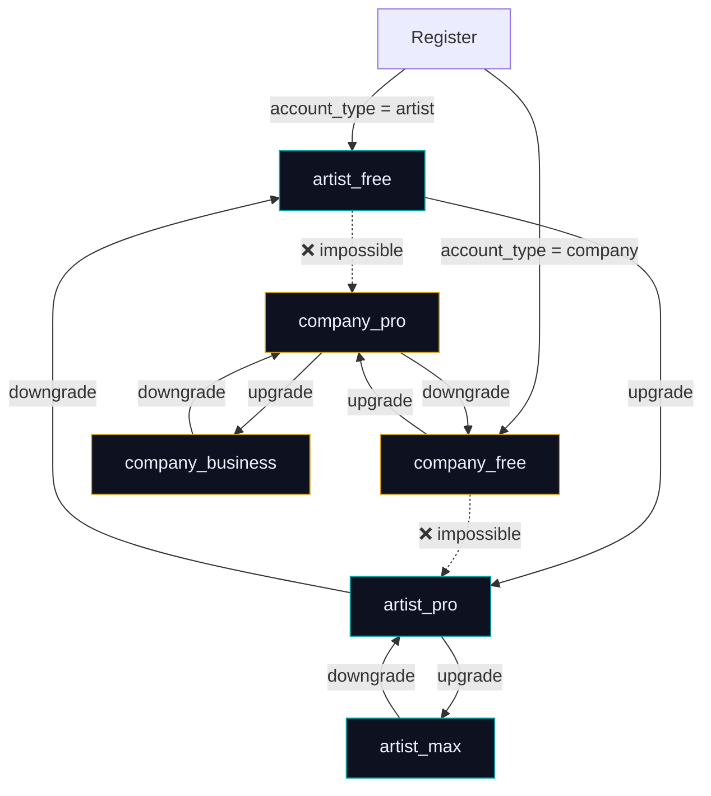
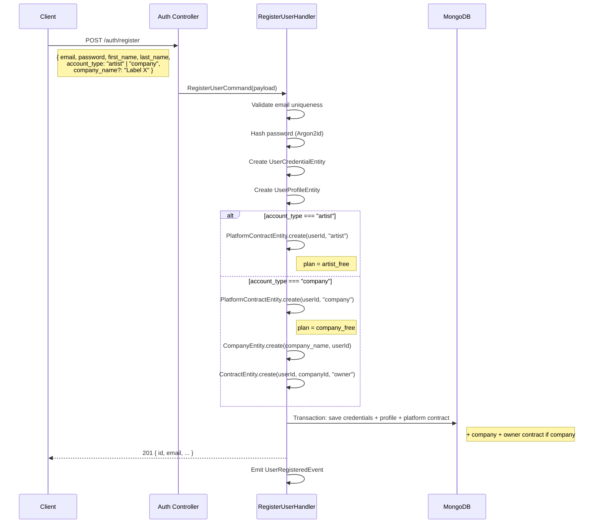
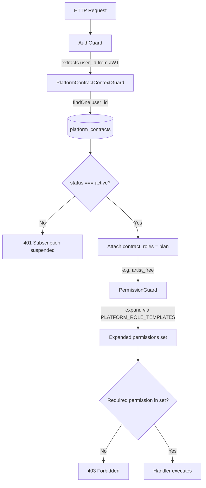
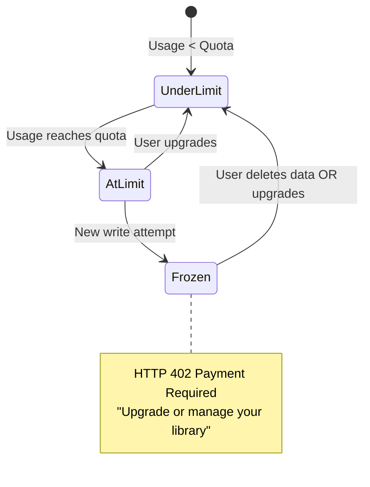

# SH3PHERD — Platform Contract

Architecture documentation for the platform contract system — the SaaS
subscription model that controls access to features independently from
company employment contracts.

---

## Concept

SH3PHERD has **two types of contracts**:

| | Platform Contract | Company Contract |
|---|---|---|
| **Represents** | SaaS subscription | Employment relationship with a company |
| **Scope** | Personal features (music library, playlists) | Company features (orgchart, contracts, settings) |
| **Created when** | User registers (one per user, automatic) | Company is created or user is hired |
| **How many per user** | Exactly 1 | 0 to N (one per company) |
| **Resolved via** | `user_id` lookup (no header needed) | `X-Contract-Id` header or DB preferences |
| **Decorator** | `@PlatformScoped()` | `@ContractScoped()` |
| **Guard** | `PlatformContractContextGuard` | `ContractContextGuard` |
| **Entity** | `PlatformContractEntity` | `ContractEntity` |
| **Collection** | `platform_contracts` | `contracts` |
| **Roles** | `TPlatformRole` (artist_free, company_pro, ...) | `TContractRole` (owner, admin, artist, viewer) |
| **Role templates** | `PLATFORM_ROLE_TEMPLATES` | `ROLE_TEMPLATES` |

A user can have **both**: a platform contract (personal access)
AND one or more company contracts (company management access). The two
are completely independent.

Example — a manager at a label:
```
Hugo (user)
  ├── Platform Contract: company_business  → full company access
  ├── Company Contract (Label X): owner    → manage Label X
  └── Company Contract (Studio Y): admin   → manage Studio Y
```

---

## Account types and plan families

The `account_type` is chosen at registration and **never changes**.
It locks the plan family — an artist upgrades within artist plans,
a company within company plans.



### Plan types

```ts
type TArtistPlan  = 'artist_free'  | 'artist_pro'  | 'artist_max';
type TCompanyPlan = 'company_free' | 'company_pro'  | 'company_business';
type TPlatformRole = TArtistPlan | TCompanyPlan;
```

### Registration flow



---

## Architecture

### Entity

```
apps/backend/src/platform-contract/
├── domain/
│   └── PlatformContractEntity.ts    — entity with account_type + plan + status
├── infra/
│   └── PlatformContractMongoRepo.ts — findByUserId() + base CRUD
├── api/
│   └── platform-contract-context.guard.ts — resolves from user_id
└── platform-contract.module.ts      — NestJS module
```

**`PlatformContractEntity`** extends `Entity<TPlatformContractDomainModel>`:
- `account_type: TAccountType` — `'artist'` or `'company'`, set at registration, immutable
- `plan: TPlatformRole` — the subscription tier (must match account_type family)
- `status: 'active' | 'suspended'`
- `startDate: Date`
- `user_id: TUserId`
- Methods: `changePlan()` (validates family match), `suspend()`, `reactivate()`
- Factory: `PlatformContractEntity.create(userId, accountType, plan?)`
- ID prefix: `platformContract_`

**`TPlatformContractDomainModel`** (in `packages/shared-types`):
```ts
interface TPlatformContractDomainModel {
  id: string;
  user_id: TUserId;
  account_type: TAccountType;
  plan: TPlatformRole;
  status: 'active' | 'suspended';
  startDate: Date;
}
```

### Plan invariants

The entity enforces:
- `account_type` must be `'artist'` or `'company'`
- `plan` must belong to the same family as `account_type`
- `changePlan()` rejects cross-family upgrades (e.g. artist → company_pro)

```ts
// ✅ Valid
entity.changePlan('artist_pro');    // artist → artist_pro

// ❌ Throws PLATFORM_CONTRACT_PLAN_MISMATCH
entity.changePlan('company_pro');   // artist → company_pro
```

### Artist plan permissions

| Feature | artist_free | artist_pro | artist_max |
|---------|:---:|:---:|:---:|
| Music Library (Read+Write) | ✅ | ✅ | ✅ |
| Tracks (Read+Write+Delete) | ✅ | ✅ | ✅ |
| Playlists (Read+Write+Delete+Own) | ✅ | ✅ | ✅ |
| Setlists | — | `music:*` | `music:*` |
| Events | — | — | `event:*` |

Note: artist_free has full CRUD on playlists — quantity limits (3 max)
are enforced by quotas, not permissions.

### Company plan permissions

| Feature | company_free | company_pro | company_business |
|---------|:---:|:---:|:---:|
| Company Settings (R+W) | ✅ | `company:*` | `*` |
| Members (R+W+Invite) | ✅ | `company:*` | `*` |
| OrgChart (R+W) | ✅ | `company:*` | `*` |
| Events | — | `event:*` | `*` |
| Music (Read) | — | ✅ | `*` |
| Music Playlists (W+D+Own) | — | ✅ | `*` |

### Guard resolution flow



Key difference from company contracts: **no header needed**. The guard
queries the platform contract by `user_id` directly.

---

## Downgrade policy — Freeze, never delete

When a user downgrades (or loses a company-sponsored tier), their data
is **frozen, never deleted**. Read-only access is preserved; writes are
blocked until usage falls below the new plan's limits.



The `QuotaService.ensureAllowed()` handles this automatically —
no deletion logic, no cron, no migration needed.

---

## Usage in controllers

### Music controllers (platform-scoped)

```ts
@PlatformScoped()       // ← resolves platform contract from user_id
@Controller('library')
export class MusicLibraryController {

  @RequirePermission(P.Music.Library.Read)
  @Get('me')
  async getMyLibrary(@ActorId() actorId: TUserId) { ... }
}
```

### Company controllers (contract-scoped, unchanged)

```ts
@ContractScoped()       // ← resolves company contract from X-Contract-Id header
@Controller()
export class OrgChartViewsController {

  @RequirePermission(P.Company.OrgChart.Read)
  @Get(':id/orgchart')
  async getOrgChart(@Param('id') id: TCompanyId) { ... }
}
```

### When to use which

| Feature | Decorator | Why |
|---------|-----------|-----|
| Music library | `@PlatformScoped()` | Personal feature, user-owned data |
| Playlists | `@PlatformScoped()` | Personal feature |
| Orgchart | `@ContractScoped()` | Company feature, shared data |
| Contracts | `@ContractScoped()` | Company feature |
| Company settings | `@ContractScoped()` | Company feature |
| User profile | Neither (just `@ActorId()`) | User's own profile, no scope needed |
| Auth | `@Public()` | No auth at all |

---

## Lifecycle

### Creation

Platform contracts are created in `RegisterUserHandler` inside
the same MongoDB transaction as credentials + profile:

```ts
const platformContract = PlatformContractEntity.create(
  credentials.id,
  cmd.payload.account_type,  // 'artist' or 'company'
);
// → defaults to artist_free or company_free
```

### Upgrade / downgrade

```ts
const contract = await platformContractRepo.findByUserId(userId);
const entity = PlatformContractEntity.fromRecord(contract);
entity.changePlan('artist_pro');  // validates family match
await platformContractRepo.save(entity.toDomain);
```

### Suspension

```ts
entity.suspend();
// → any @PlatformScoped() route returns 401 "Platform subscription is suspended"

entity.reactivate();
// → routes work again
```

---

## E2E testing

The `seedUser()` factory automatically creates a platform contract
with `plan: 'artist_free'`:

```ts
const seed = await seedWorkspace(db, { companyName: 'Studio X' });
// seed has:
// - A user with credentials + profile + preferences
// - A platform contract (artist_free, account_type: 'artist')
// - A company + owner contract
```

---

## Migration

For existing users registered before the account_type split:

```bash
node apps/backend/src/migrations/add-platform-contracts.mjs
```

Idempotent: skips users who already have a platform contract. Creates
one with `account_type: 'artist'` and `plan: 'artist_free'`.

For migrating old plan names:
```javascript
db.platform_contracts.updateMany(
  { plan: 'plan_free' },
  { $set: { plan: 'artist_free', account_type: 'artist' } }
);
db.platform_contracts.updateMany(
  { plan: 'plan_pro' },
  { $set: { plan: 'artist_pro', account_type: 'artist' } }
);
```

---

## File map

| File | Role |
|------|------|
| `packages/shared-types/src/permissions.types.ts` | TPlatformRole, TArtistPlan, TCompanyPlan, TAccountType, PLATFORM_ROLE_TEMPLATES |
| `packages/shared-types/src/platform-contract.types.ts` | TPlatformContractDomainModel |
| `packages/shared-types/src/auth.dto.types.ts` | TRegisterUserRequestDTO (with account_type) |
| `apps/backend/src/platform-contract/domain/PlatformContractEntity.ts` | Entity (validates family match) |
| `apps/backend/src/platform-contract/infra/PlatformContractMongoRepo.ts` | Repository |
| `apps/backend/src/platform-contract/api/platform-contract-context.guard.ts` | Guard |
| `apps/backend/src/quota/domain/QuotaLimits.ts` | PLAN_QUOTAS per plan |
| `apps/backend/src/quota/QuotaService.ts` | ensureAllowed() / recordUsage() |
| `apps/backend/src/auth/application/commands/RegisterUserCommand.ts` | Creates platform contract at registration |
| `apps/backend/src/migrations/add-platform-contracts.mjs` | Backfill migration |

---

## Related docs

- `sh3-writing-a-controller.md` — controller patterns
- `sh3-quota-service.md` — quota enforcement per plan
- `sh3-e2e-tests.md` — how factories create platform contracts
- `sh3-music-library.md` — music features gated by artist plans
- `documentation/todos/TODO-plans-artist-company.md` — full feature matrix & pricing
