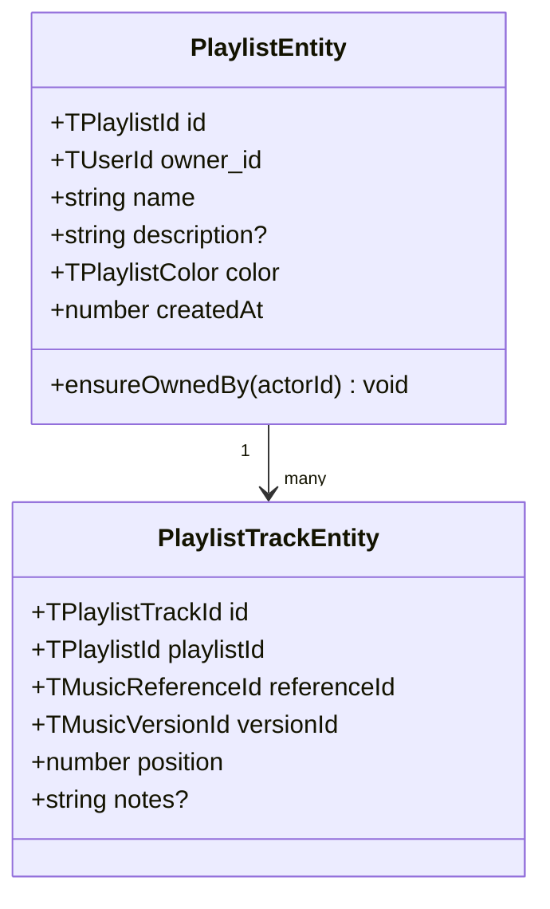
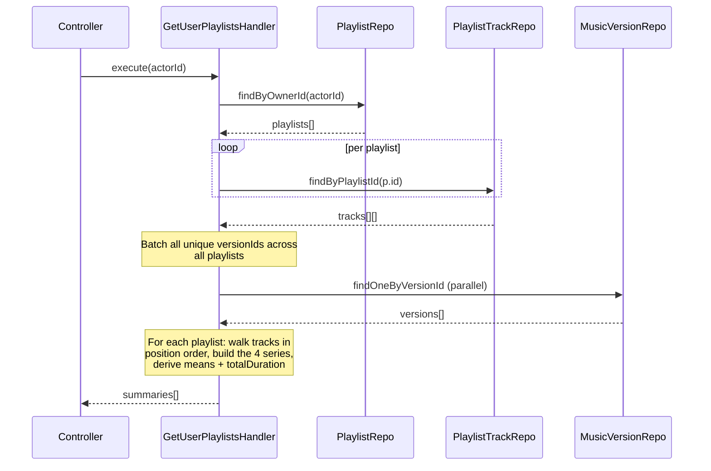
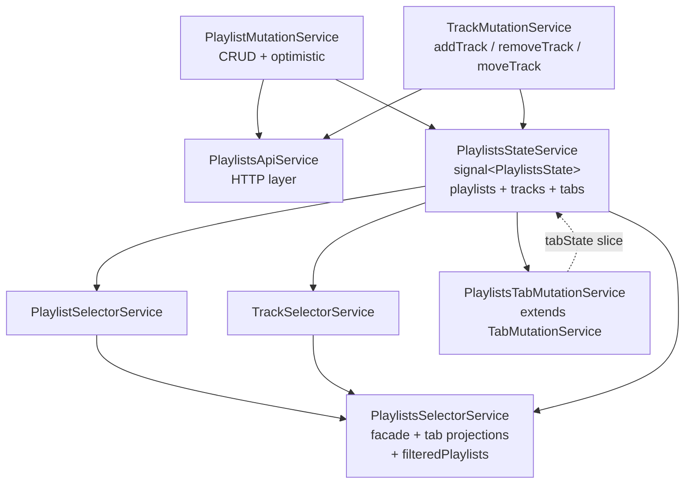
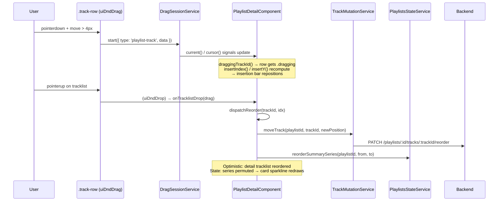

# SH3PHERD — Playlists

Personal ordered lists of music versions — each user curates their own.
Same layout grammar as the music library (filter panel on the left, tab
bar + cards on the right), plus a dockable right-side detail panel so
the user can browse the library with a playlist staged for drag-and-drop.

---

## At a glance

| Surface        | Where                                                                                                                          |
| -------------- | ------------------------------------------------------------------------------------------------------------------------------ |
| Backend module | `apps/backend/src/playlists-v2/`                                                                                               |
| Shared types   | `packages/shared-types/src/playlists.ts`                                                                                       |
| Frontend root  | `apps/frontend-webapp/src/app/features/playlists/`                                                                             |
| Route          | `/app/playlistManager` → `PlaylistsPageComponent`                                                                              |
| Related DnD    | [`apps/frontend-webapp/src/app/core/drag-and-drop/`](../../apps/frontend-webapp/src/app/core/drag-and-drop/)                   |
| Tab bar        | [`apps/frontend-webapp/src/app/shared/configurable-tab-bar/`](../../apps/frontend-webapp/src/app/shared/configurable-tab-bar/) |

---

## Backend

### Domain model

Two entities, both user-owned:



A playlist track is a triple `(playlistId, referenceId, versionId)` + an
explicit `position` integer. The playlist itself has no tracks array —
tracks live in their own collection keyed by `playlistId` + sorted by
`position`.

`TPlaylistColor` is one of `indigo | emerald | rose | amber | sky |
violet`. Used for the left accent strip on cards, detail-view header
tint, and the sparkline accent colour.

### CQRS

- **Commands** (6): `CreatePlaylist`, `UpdatePlaylist`, `DeletePlaylist`,
  `AddPlaylistTrack`, `RemovePlaylistTrack`, `ReorderPlaylistTrack`.
- **Queries** (2): `GetUserPlaylists`, `GetPlaylistDetail`.

All wired via CQRS buses the same way as the music module — see
`sh3-writing-a-controller.md` for the controller / handler patterns.

### Controllers + endpoints

Two controllers in `apps/backend/src/playlists-v2/api/`:

| Endpoint                                        | Controller               | Command / Query             | Permission              |
| ----------------------------------------------- | ------------------------ | --------------------------- | ----------------------- |
| `GET    /playlists/me`                          | PlaylistController       | GetUserPlaylistsQuery       | `P.Music.Playlist.Read` |
| `GET    /playlists/:id`                         | PlaylistController       | GetPlaylistDetailQuery      | `P.Music.Playlist.Read` |
| `POST   /playlists`                             | PlaylistController       | CreatePlaylistCommand       | `P.Music.Playlist.Own`  |
| `PATCH  /playlists/:id`                         | PlaylistController       | UpdatePlaylistCommand       | `P.Music.Playlist.Own`  |
| `DELETE /playlists/:id`                         | PlaylistController       | DeletePlaylistCommand       | `P.Music.Playlist.Own`  |
| `POST   /playlists/:id/tracks`                  | PlaylistTracksController | AddPlaylistTrackCommand     | `P.Music.Playlist.Own`  |
| `DELETE /playlists/:id/tracks/:trackId`         | PlaylistTracksController | RemovePlaylistTrackCommand  | `P.Music.Playlist.Own`  |
| `PATCH  /playlists/:id/tracks/:trackId/reorder` | PlaylistTracksController | ReorderPlaylistTrackCommand | `P.Music.Playlist.Own`  |

Both controllers are `@PlatformScoped()` — playlists are a per-user
resource resolved from the JWT's `user_id`, not a company/contract one.
All write endpoints bind the body via `@Body('payload', …)` with
`ZodValidationPipe` — the frontend wraps mutation payloads in
`{ payload }` accordingly.

### Summary view model + aggregates

`GetUserPlaylistsQuery` returns `TPlaylistSummaryViewModel[]` — one per
playlist, enriched with aggregates computed server-side so the list view
doesn't need to hit `getPlaylistDetail` for every card:

```ts
interface TPlaylistSummaryViewModel {
  id: TPlaylistId;
  name: string;
  description?: string;
  color: TPlaylistColor;
  createdAt: number;
  trackCount: number;
  totalDurationSeconds: number;
  meanMastery: number | null;
  meanEnergy: number | null;
  meanEffort: number | null;
  meanQuality: number | null;
  masterySeries: (number | null)[];
  energySeries: (number | null)[];
  effortSeries: (number | null)[];
  qualitySeries: (number | null)[];
}
```

- `*Series` fields carry **one value per playlist track in position
  order**. Tracks whose version can't be resolved are skipped from both
  the means and the series, so `series.length ≤ trackCount` and every
  axis has the same length. Quality can be `null` where the favorite
  track has no analysis snapshot yet; the other three are never null
  because they live on the version itself.
- The four `mean*` values are the arithmetic mean of the corresponding
  series with nulls filtered out. `null` when the series has zero
  non-null values (empty playlist, no data on that axis).

Handler flow:



The version lookup is batched across every playlist the user owns, so
the handler stays O(total_tracks + unique_versions) round-trips rather
than O(playlists × tracks).

### Platform scope + permissions

Playlists are `@PlatformScoped()` (per-user), not `@ContractScoped()`.
This was fixed in [`feat: platform-scope playlist controllers`](../../apps/backend/src/playlists-v2/api/playlist.controller.ts)
after the initial scaffold misrouted them as company-scoped — the
frontend never sends `X-Contract-Id` for personal features, so every
write would have 400'd under the old scope.

Permission keys used:

- `P.Music.Playlist.Read` — list / detail
- `P.Music.Playlist.Own` — all writes (create, update, delete, track CRUD, reorder)

### Analytics

Not yet wired. Playlist mutations will emit analytics events in a
follow-up (pattern: see `sh3-analytics-events.md` for the music
commands — 9 event types already defined there).

### Quota

`playlist_count` is **not yet** in `PLAN_QUOTAS`. The frontend
`PlaylistsTabMutationService` intentionally does not override
`addDefaultTab` / `saveTabConfig` for quota gating — the hooks are
ready, waiting on the quota keys to land.

---

## Frontend

### Layout

```
┌───────────────┬─────────────────────────────────────┐  ┌──────────────┐
│ side panel    │ tab bar  (search / playlist /       │  │ right-side   │
│ (filters,     │           compare) + [search input] │  │ detail panel │
│  stats)       ├─────────────────────────────────────┤  │ (420px, docks│
│               │ toolbar  results count + actions    │  │  on click    │
│               ├─────────────────────────────────────┤  │  → persists  │
│               │ content area — switches on active   │  │  across      │
│               │ tab mode                            │  │  routes)     │
│               │  • search  → card grid              │  │              │
│               │  • compare → matrix + cards         │  │ header +     │
│               │                                     │  │ tracklist +  │
│               │                                     │  │ DnD zones    │
└───────────────┴─────────────────────────────────────┘  └──────────────┘
```

**Playlist detail moved from "tab mode" to "right-side panel".** The
side panel is managed by `LayoutService.setRightPanel`, which is
route-agnostic — opening a playlist, navigating to `/app/musicLibrary`,
then dragging a version onto the panel's tracklist is the canonical
add-track flow.

### State architecture

Services live in `apps/frontend-webapp/src/app/features/playlists/services/`:



`PlaylistsState` has three slices in one signal:

- **CRUD data** — `playlists: TPlaylistSummaryViewModel[]`, `tracks: TPlaylistTrackDomainModel[]` (the flat tracks slice; currently unused, kept for future consumers).
- **Selection** — `selectedPlaylistId` (legacy, kept for back-compat; the right-panel path is preferred now).
- **Tab state** — `tabs / activeTabId / activeConfigId / savedTabConfigs`. Exposed via a `tabState` signal adapter (read + update) in the shape `TabStateSignal<TPlaylistTabConfig>` expects.

### Tab model — three modes

`TPlaylistTabConfig` is a discriminated union:

```ts
type TPlaylistTabConfig =
  | { mode: 'search'; searchQuery: string; filters: TPlaylistFilters }
  | { mode: 'playlist'; playlistId: TPlaylistId | null }
  | { mode: 'compare'; playlistIds: TPlaylistId[] };
```

- **search** (default) — renders the filtered playlist grid. `filters`
  covers color, trackCount range, duration range, minMastery /
  minEnergy / minEffort / minQuality (1-4 floors). Side panel writes
  straight into this field via `PlaylistsTabMutationService.patchFilters`.
- **playlist** — legacy tab mode. The right-side panel replaced it as
  the primary "view a playlist" UX; the mode stays in the union for
  forward-compat but nothing switches to it today.
- **compare** — 2-3 playlist ids rendered side-by-side. Reached via the
  toolbar "Compare" button in search mode (picks the first 2-3 filtered
  entries as a default; finer multi-select is backlog).

`PlaylistsTabMutationService extends TabMutationService<TPlaylistTabConfig>`
— mode-aware mutations (`setSearchQuery`, `patchFilters`,
`openPlaylistTab`, `openCompareTab`, `addToCompare`, `removeFromCompare`,
`resetFilters`). Tab state is session-local — `scheduleTabSave()` is a
no-op until the backend endpoint for playlist tab configs lands.

### UI components

| Component                          | Role                                                                                         |
| ---------------------------------- | -------------------------------------------------------------------------------------------- |
| `PlaylistsPageComponent`           | Page orchestrator — imports tab bar, side panel, compare, card; routes card click to layout. |
| `PlaylistsSidePanelComponent`      | Filter panel — color chips, min-tracks / min-duration inputs, 1-4 rating pills, reset.       |
| `PlaylistCardComponent`            | Card with name, description, duration, trackCount, 4 rating groups (mean + sparkline).       |
| `RatingSparklineComponent`         | Smooth SVG sparkline with Catmull-Rom smoothing + area fill at 0.5 opacity.                  |
| `PlaylistCompareComponent`         | Side-by-side compare matrix — 6 rows × 2-3 cols with leader-per-row highlight.               |
| `PlaylistDetailComponent`          | Detail view — header + tracklist + reorder DnD + music-track drop zone.                      |
| `PlaylistDetailSidePanelComponent` | Right-panel wrapper for detail — reads `{playlistId}` via `INJECTION_DATA`.                  |
| `MusicTrackDragPreviewComponent`   | Compact floating chip shown under the cursor during a drag.                                  |

Retired: `playlist-short-infos` + `favorite-dynamic-icon` + `mock-playlists-data` (orphan stubs from an earlier scaffold).

### Sparkline (the shape-of-the-playlist chart)

Each card axis (MST / NRG / EFF / QTY) renders:

- The label + numeric mean (one decimal, `—` on null).
- An SVG sparkline with one dot per track joined by a smoothed curve,
  and a tinted area underneath at 0.5 opacity.

Drawing:

- **Smoothing** — Catmull-Rom → cubic Bézier conversion, tension = 1/6
  (classic cardinal-spline weight). Each segment emits a C-command with
  control points derived from the neighbours; the curve tangentially
  passes through every data point without overshoot.
- **Area fill** — separate path closed to the baseline (`rating = 1`).
  Dropped under the stroke so the line stays crisp on top.
- **Null handling** — contiguous non-null runs are each smoothed
  independently. Null entries break the line AND the area; the null dot
  renders as a hollow stroke at the Y midline rather than a misleading
  zero. Single-point runs stroke as a short horizontal tick (filling a
  4-pixel area reads as noise).

The series on `TPlaylistSummaryViewModel` are kept in sync with the
track order after a reorder via
`PlaylistsStateService.reorderSummarySeries(playlistId, from, to)` —
same splice semantics as the backend `ReorderPlaylistTrackCommand`.

### Drag & drop

**Two payload types** in `DragPayloadMap` (see `core/drag-and-drop/drag.types.ts`):

```ts
type MusicTrackDragPayload = { referenceId; versionId; title; artist };
type PlaylistTrackDragPayload = { playlistTrackId; title; artist };
```

**Drag sources**:

- `music-reference-card` — each `.version-block` inside the music
  library card is a `uiDndDrag` source of type `music-track`. The
  per-version `dragPayload(version)` helper builds the payload without
  re-joining state at the drop site.
- `playlist-detail` rows — each `.track-row` is a `uiDndDrag` source of
  type `playlist-track`. The `dragHandle` restricts drag initiation to
  the three-dots handle + position + title/artist zones, so the × button
  still clicks-through for removal.

**Drop zone** — `playlist-detail` tracklist accepts both types. The
`onTracklistDrop` handler dispatches:

- `music-track` → `dispatchAdd` (append + refresh the detail)
- `playlist-track` → `dispatchReorder` (compute new position, call
  `moveTrack`, permute the summary series, optimistic local detail update)

**Insertion bar** — computed from `DragSessionService.cursor()` + the
tracklist's per-row bounding rects. When the cursor is over the
tracklist during a drag, `insertIndex` returns the slot (0 = before
first, N = after last), `insertY` returns the pixel offset, and the
template renders a horizontal accent bar with end caps + a soft pulse
animation.

**Drag preview** — `MusicTrackDragPreviewComponent` (compact chip with
title + artist + indigo glow + 2° rotation) is registered by
`PlaylistsDndInitService` for both payload types. The service is
`providedIn: 'root'` + injected via constructor side-effect into
`MusicReferenceCardComponent` so the registration runs before the first
drag can start.

**Reorder sequence**:



---

## File map

### Backend

```
apps/backend/src/playlists-v2/
├── api/
│   ├── playlist.controller.ts           ← CRUD + list + detail, @PlatformScoped
│   └── playlist-tracks.controller.ts    ← track CRUD + reorder, @PlatformScoped
├── application/
│   ├── commands/
│   │   ├── CreatePlaylistHandler.ts
│   │   ├── UpdatePlaylistHandler.ts
│   │   ├── DeletePlaylistHandler.ts
│   │   ├── AddPlaylistTrackHandler.ts
│   │   ├── RemovePlaylistTrackHandler.ts
│   │   └── ReorderPlaylistTrackHandler.ts
│   └── queries/
│       ├── GetUserPlaylistsHandler.ts   ← batched version lookup + series/means
│       └── GetPlaylistDetailHandler.ts  ← resolved tracks view-model
├── domain/
│   ├── PlaylistEntity.ts
│   └── PlaylistTrackEntity.ts
├── dto/
│   └── playlist.dto.ts                  ← Swagger DTOs (summary + detail + track)
├── repositories/
│   ├── PlaylistRepository.ts
│   └── PlaylistTrackRepository.ts
├── codes.ts                              ← API codes
├── playlist-handlers.module.ts
└── playlist.module.ts
```

### Frontend

```
apps/frontend-webapp/src/app/features/playlists/
├── playlist-types.ts                     ← re-exports + TPlaylistTabConfig + TPlaylistFilters
├── playlists-page/
│   ├── playlists-page.component.{ts,html,scss}
├── components/
│   ├── playlist-card/                    ← grid card with aggregates + sparkline
│   ├── playlists-side-panel/             ← filter panel
│   ├── rating-sparkline/                 ← smooth SVG chart + area fill
│   ├── playlist-detail/                  ← tracklist + reorder DnD
│   ├── playlist-detail-side-panel/       ← right-panel wrapper
│   ├── playlist-compare/                 ← side-by-side matrix
│   └── music-track-drag-preview/         ← floating drag chip
└── services/
    ├── playlists-api.service.ts          ← HTTP, { payload: T } body shape
    ├── playlists-state.service.ts        ← signal state + reorderSummarySeries
    ├── playlists-dnd-init.service.ts     ← registers drag previews
    ├── selector-layer/
    │   ├── playlist-selector.service.ts
    │   ├── track-selector.service.ts
    │   └── playlists-selector.service.ts ← facade + tab projections
    └── mutations-layer/
        ├── playlist-mutation.service.ts
        ├── track-mutation.service.ts
        └── playlists-tab-mutation.service.ts
```

---

## Known gaps + follow-ups

Tracked in `documentation/todos/TODO-music-features.md`:

- **Quota keys** — `playlist_count` (and `playlist_search_tab` if the
  tab bar gets its own quota) aren't in `PLAN_QUOTAS` yet. Tab mutation
  hooks are ready; add the keys and override `addDefaultTab` /
  `saveTabConfig`.
- **Add-at-position for music-track drops** — currently `addTrack`
  appends, so dropping a library version at mid-list requires a
  follow-up reorder by the user. Either (a) extend
  `AddPlaylistTrackCommand` with an optional `position`, or (b) chain
  `addTrack` + `moveTrack` once `addTrack` returns an observable.
- **Tab config persistence** — `scheduleTabSave()` is a no-op; tabs
  reset on reload. Mirror the music library's tab-configs endpoint.
- **Analytics events** — wire `playlist_created` / `playlist_deleted`
  / `playlist_track_added` / `playlist_track_removed` /
  `playlist_track_reordered` into the analytics event store.
- **Add-playlist popover** — current "+ New playlist" auto-names
  `Playlist N` with indigo color. Needs a popover with name + color +
  optional description fields.
- **Multi-select for Compare** — the toolbar button currently picks
  the first 2-3 filtered playlists. Add per-card checkbox selection
  - a Compare CTA when ≥ 2 are selected.

---

## Related docs

- [`sh3-music-library.md`](./sh3-music-library.md) — the parent feature
  and architectural model this page mirrors.
- [`sh3-writing-a-controller.md`](./sh3-writing-a-controller.md) —
  scope / permission / CQRS / Swagger patterns the playlist controllers
  follow.
- [`sh3-platform-contract.md`](./sh3-platform-contract.md) — why
  playlists are `@PlatformScoped` and how the platform contract
  resolves.
- [`configurable-tab-bar/README.md`](../../apps/frontend-webapp/src/app/shared/configurable-tab-bar/README.md)
  — the generic tab bar the playlists page is the second consumer of.
- [`documentation/todos/TODO-music-features.md`](../../documentation/todos/TODO-music-features.md)
  — cross-cutting music roadmap + playlist follow-ups.
