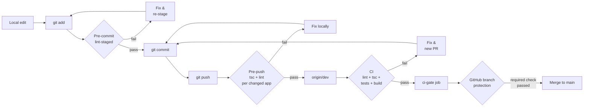
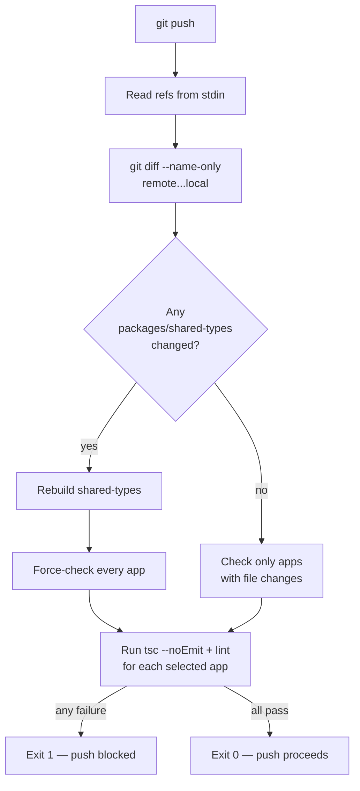
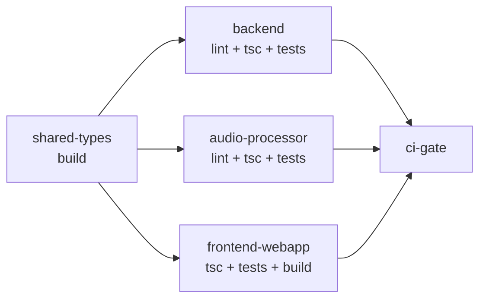

# Quality Gates

Three enforcement tiers sit between a local edit and a merged change. Each
tier is tighter than the one before it, and the cost of failure grows at
every step — a pre-commit catch is free, a CI catch costs a rerun, a
post-merge catch costs a revert.

This doc explains what each tier runs, how they're wired, how to extend
them, and how to debug the common failure modes.

## The flow at a glance



Horizontal line: fast → slow, local → remote, formatting → correctness.

## Tier 1 — Pre-commit (formatting, fast, local)

Runs `.githooks/pre-commit`, which just invokes **lint-staged** against
the files you staged.

| What runs      | Where                           | Blocking?                          |
| -------------- | ------------------------------- | ---------------------------------- |
| ESLint `--fix` | Backend + audio-processor `.ts` | Yes, on lint errors                |
| Prettier       | Every supported extension       | Yes, but rewrites — rarely "fails" |

Config in [.lintstagedrc.mjs](../../../.lintstagedrc.mjs). The hook does
**not** run `tsc` — typechecking a single file across a project with
cross-package imports is unreliable, and the latency kills developer flow.
That belongs in Tier 2.

**Debugging:** if a commit aborts with an ESLint error you can't reproduce
with `pnpm --filter @sh3pherd/backend lint`, lint-staged uses a slightly
different invocation path. Run it against the specific file:

```bash
pnpm exec eslint --config apps/backend/eslint.config.mjs --fix <file>
```

## Tier 2 — Pre-push (correctness, local, fast enough)

Runs `.githooks/pre-push`, a shell script that inspects what's about to be
pushed and, for each app that changed, runs `tsc --noEmit` + `eslint`.

### Detection logic



Key properties:

- **Targeted.** A frontend-only change doesn't retypecheck the backend.
- **shared-types propagates.** A type change in `packages/shared-types`
  forces every consumer (backend + frontend + audio-processor) to be
  rechecked, because their tsc caches don't catch upstream type changes
  until rebuild.
- **Tests are not run.** Backend tests spin up MongoMemoryServer and take
  ~25s; pre-push running them would be ~2 min on a multi-app change.
  Devs would reach for `--no-verify` within a week. Tests stay in CI.
- **Idempotent on a re-push.** If the remote already has your commits and
  you re-push, the diff is empty and the hook exits 0 immediately.

### Bypass

```bash
git push --no-verify
```

Keep this for genuine emergencies (build server down, need to push a
partial WIP to a shared feature branch). GitHub branch protection on
`dev`/`main` will still block the merge — local bypass is local only.

### Debugging a blocked push

The hook output names the app and the tool that failed. To reproduce
exactly what the hook ran, replay from the repo root:

```bash
pnpm --filter @sh3pherd/backend exec tsc --noEmit
pnpm --filter @sh3pherd/backend lint
# frontend
( cd apps/frontend-webapp && npx tsc --noEmit )
```

### Auto-activation

The hook file lives in `.githooks/pre-push`, but git uses it only if
`core.hooksPath` points at that directory. That config is **per-clone**,
so the root `package.json` wires it up in two places:

```json
"prepare":      "git config core.hooksPath .githooks 2>/dev/null || true",
"predev:watch": "pnpm run setup:hooks"
```

- `prepare` runs after every `pnpm install` (the same lifecycle hook
  Husky uses). A fresh clone is compliant after one install.
- `predev:watch` is a belt-and-suspenders fallback — if someone ran
  `pnpm install --ignore-scripts`, starting the dev loop still wires the
  hook up.
- Manual fallback: `pnpm run setup:hooks`.

## Tier 3 — CI (authoritative, remote, required for merge)

[`.github/workflows/ci.yml`](../../../.github/workflows/ci.yml) runs on
every push to `dev` and every PR into `dev` or `main`.

### Job graph



`shared-types` builds first because every downstream app imports from it.
The three app jobs fan out in parallel. `ci-gate` is a terminal
zero-work job whose only purpose is to aggregate the others — it's the
**single required status check** to pin in GitHub branch protection, so
adding a new app job later doesn't require touching the protection rule.

### Why the pipeline looks this way

- **Frontend gets `tsc --noEmit` explicitly** in addition to `ng build`.
  The Angular compiler is laxer than standalone `tsc` on some test/tooling
  files; running both catches drift.
- **Audio-processor gets `tsc --noEmit`** for parity with the other apps.
- **Backend runs tests in the same job** as lint + tsc because the boot
  cost (pnpm install + shared-types build) dominates — a dedicated test
  job would double the CI latency.
- **`concurrency: ci-${{ github.ref }}` with `cancel-in-progress: true`**
  means a second push to the same branch cancels the previous run, so
  back-to-back force-pushes or quick fix commits don't queue up.

## GitHub branch protection (the unbypassable gate)

Local hooks can be shunted with `--no-verify`. Only branch protection on
GitHub is truly unbypassable. Configure on
`github.com/<owner>/<repo>/settings/branches` for both `dev` and `main`:

- Require a pull request before merging (optional on `dev` if you commit
  directly; **required on `main`**).
- Require status checks to pass before merging → add **`CI gate`** as the
  required check.
- Require branches to be up to date before merging.
- On `main`: include administrators (so you can't bypass your own rules).

Claude cannot configure this automatically — it's a settings change that
requires repo-admin confirmation via the GitHub UI.

## Adding a new app to the gates

Checklist when a new app (e.g. a worker, a CLI) joins the monorepo:

1. **Give it a `tsc --noEmit`-clean tsconfig.** The pre-push hook assumes
   `pnpm --filter @sh3pherd/<app> exec tsc --noEmit` works.
2. **Add an ESLint config** if you want lint coverage. Without one, the
   hook skips lint for that app (mirrors frontend-webapp, which has no
   ESLint config today).
3. **Extend `.githooks/pre-push`:** add a `matches '^apps/<app>/'` branch
   and the corresponding `tsc` / `lint` invocations. If the app consumes
   `shared-types`, add it to the `rebuild_shared` fan-out too.
4. **Extend `.github/workflows/ci.yml`:** copy one of the existing app
   jobs and add its name to the `ci-gate.needs` array.
5. **Smoke-test locally:** touch a file in the new app and run
   `git push` with the hook active — confirm the right checks fire.
6. **Update this doc** with the new app's role in the pipeline.

## Troubleshooting

### "Push blocked: backend type errors" but `tsc` passes locally

The hook runs with the tests included (default `apps/backend/tsconfig.json`,
which has no `__tests__` exclusion). If you only ran `tsc -p tsconfig.build.json`
locally, you skipped test typechecking. Re-run:

```bash
pnpm --filter @sh3pherd/backend exec tsc --noEmit
```

### CI job fails but `ci-gate` shows green

Impossible by construction — `ci-gate` depends on every app job. If you
see this, check whether the branch protection is pointing at a stale job
name (e.g. `frontend-build` from before the rename). Required checks are
matched by exact job name string.

### Hook didn't fire at all

`core.hooksPath` isn't set. Run `git config core.hooksPath` — if empty,
run `pnpm install` (or `pnpm run setup:hooks`) to activate.

### `pnpm install --ignore-scripts` in CI or a specific setup

The `prepare` script is skipped. For CI this is fine — the hook isn't
used there anyway. For local setup, call `pnpm run setup:hooks` manually.

## Design trade-offs worth preserving

- **No tests in pre-push.** Debated, rejected. The rule "local gates
  must be fast enough that no one bypasses them" overrides "catch
  everything as early as possible." CI covers tests.
- **Targeted checks, not full-repo checks.** A 2-minute pre-push for a
  one-line frontend typo change would be universally hated. The
  shared-types override catches the cross-package case that would
  otherwise slip through.
- **One `ci-gate` job, not per-job required checks.** Keeps branch
  protection config stable when CI evolves.
- **Manual `setup:hooks` kept alongside auto-activation.** Debugging,
  scripted environments, and the `--ignore-scripts` escape hatch all
  benefit from having an explicit command.
