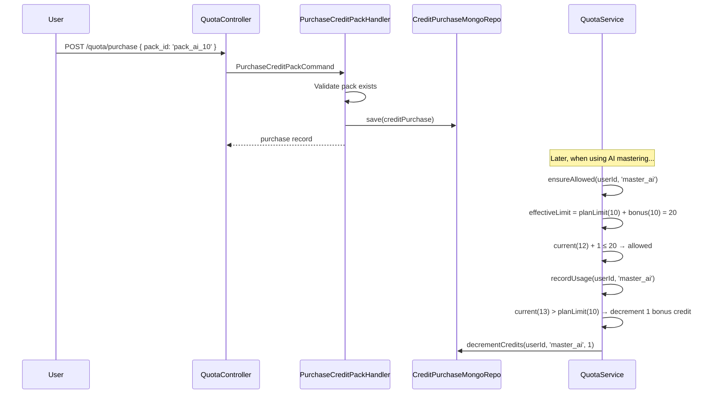
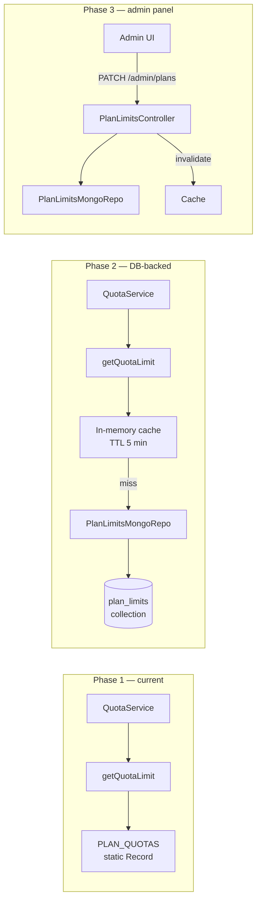

# SH3PHERD — Quota Service

Architecture documentation for the quota enforcement layer — controls
how much a user can do based on their SaaS subscription plan, separate
from permission checks (which control _whether_ they can do it at all).

---

## The two layers of access control

```
"Can this user upload a track?"

  1. Permission check (PlatformScoped + RequirePermission)
     → Does artist_free include P.Music.Track.Write?
     → YES → continue
     → NO  → 403 Forbidden

  2. Quota check (QuotaService)
     → Has this user uploaded < 50 tracks this lifetime?
     → YES → continue
     → NO  → 402 Payment Required ("upgrade to Pro")
```

**Permissions** = binary (yes/no per action type, based on the plan).
**Quotas** = quantitative (how many times, based on the plan + usage).

Both are checked in the command handler, but they serve different
purposes and return different HTTP status codes.

---

## Why NOT in MusicPolicy

`MusicPolicy` enforces **structural domain invariants** that are true
regardless of plan:

```
MAX_TRACKS_PER_VERSION = 2       ← a version can't have 3 tracks, period
MAX_VERSIONS_PER_REFERENCE = 10  ← 10 covers of one song is the structural max
MAX_MASTERS_PER_VERSION = 1      ← one master per version
```

These never change with the subscription plan. A Business user still
can't have 3 tracks per version — the data model doesn't support it.

Quotas are different — they're **plan-dependent and time-bound**:

```
artist_free: 50 repertoire entries (lifetime)
artist_free: 3 masters per month
artist_pro:  unlimited masters
```

A free user CAN master a track (permission-wise). They just can't
master MORE than 3 per month (quota-wise). That's a different kind of
limit and it lives in a different layer.

---

## Architecture

```
apps/backend/src/quota/
├── domain/
│   ├── QuotaLimits.ts              — plan limits config (pure data, re-exports from shared-types)
│   └── QuotaExceededError.ts       — HTTP 402 error class
├── infra/
│   ├── UsageCounterMongoRepo.ts    — platform_usage collection
│   └── CreditPurchaseMongoRepo.ts  — credit_purchases collection
├── application/
│   └── commands/
│       └── PurchaseCreditPackCommand.ts — purchase a credit pack
├── api/
│   └── quota.controller.ts         — GET /me, GET /packs, POST /purchase
├── QuotaService.ts                 — ensureAllowed() + recordUsage() + getUsageSummary()
└── quota.module.ts                 — NestJS module
```

### `QuotaLimits.ts` — the plan limits config

Pure data — no I/O, no DI, no side effects. Can be imported anywhere.

```ts
export type TQuotaResource =
  | 'repertoire_entry' // adding a song to the library
  | 'track_upload' // uploading an audio file
  | 'master_standard' // ffmpeg loudnorm mastering
  | 'master_ai' // DeepAFx-ST AI mastering
  | 'pitch_shift' // pitch-shifting a version
  | 'track_version' // creating a version for a song
  | 'search_tab' // saved search tab configs
  | 'storage_bytes'; // total R2 storage consumed

export type TQuotaPeriod = 'monthly' | 'lifetime';

export interface TQuotaLimit {
  resource: TQuotaResource;
  period: TQuotaPeriod;
  /** Max allowed count. -1 = unlimited. 0 = feature not available. */
  limit: number;
}

export const PLAN_QUOTAS: Record<TPlatformRole, TQuotaLimit[]> = {
  artist_free: [
    { resource: 'repertoire_entry', period: 'lifetime', limit: 50 },
    { resource: 'track_upload', period: 'lifetime', limit: 50 },
    { resource: 'master_standard', period: 'monthly', limit: 3 },
    { resource: 'master_ai', period: 'monthly', limit: 0 },
    { resource: 'pitch_shift', period: 'monthly', limit: 3 },
    { resource: 'storage_bytes', period: 'lifetime', limit: 500 * 1024 * 1024 },
  ],
  artist_pro: [
    { resource: 'repertoire_entry', period: 'lifetime', limit: -1 },
    { resource: 'track_upload', period: 'lifetime', limit: -1 },
    { resource: 'master_standard', period: 'monthly', limit: -1 },
    { resource: 'master_ai', period: 'monthly', limit: 10 },
    { resource: 'pitch_shift', period: 'monthly', limit: -1 },
    { resource: 'storage_bytes', period: 'lifetime', limit: 5 * 1024 * 1024 * 1024 },
  ],
  artist_max: [
    { resource: 'storage_bytes', period: 'lifetime', limit: 20 * 1024 * 1024 * 1024 },
    // All other resources: unlimited (not listed = no limit)
  ],
  company_business: [
    { resource: 'storage_bytes', period: 'lifetime', limit: 100 * 1024 * 1024 * 1024 },
  ],
};
```

**Convention**: if a resource is NOT listed for a plan, it's unlimited.
Only list resources that have a finite limit for that plan. This keeps
the config readable and makes it obvious what each plan restricts.

### `QuotaExceededError.ts` — the 402 error

```ts
export class QuotaExceededError extends HttpException {
  constructor(resource: TQuotaResource, current: number, limit: number, plan: TPlatformRole) {
    super(
      {
        statusCode: 402,
        errorCode: 'QUOTA_EXCEEDED',
        message: `Quota exceeded for ${resource}: ${current}/${limit}`,
        resource,
        current,
        limit,
        plan,
      },
      HttpStatus.PAYMENT_REQUIRED,
    );
  }
}
```

**Why 402?** — `402 Payment Required` is the HTTP standard for
"you need to pay to continue". The frontend intercepts 402 responses
globally and shows an upgrade modal. It's unambiguous: 400 = bad
request, 401 = not authenticated, 403 = not authorized (wrong
permissions), 402 = authorized but quota exceeded (need to upgrade).

### `UsageCounterMongoRepo.ts` — the counters collection

**Collection**: `platform_usage`

```ts
interface TUsageCounterRecord {
  id: string;
  user_id: TUserId;
  resource: TQuotaResource;
  /** 'lifetime' for lifetime quotas, 'YYYY-MM' for monthly quotas. */
  period_key: string;
  count: number;
  updated_at: Date;
}
```

**Period key design**: monthly quotas use `YYYY-MM` as the period key
(e.g. `'2026-04'`). When the month changes, the old period key is
never queried again — the counter effectively resets to 0 without any
cleanup job.

**Compound index**: `{ user_id: 1, resource: 1, period_key: 1 }` —
unique, covers both the read (getCount) and write (increment) paths.

**Methods**:

```ts
export interface IUsageCounterRepository {
  /** Get the current count for a user + resource + period. Returns 0 if no record. */
  getCount(userId: TUserId, resource: TQuotaResource, periodKey: string): Promise<number>;

  /** Atomically increment the counter. Creates the record if it doesn't exist. */
  increment(
    userId: TUserId,
    resource: TQuotaResource,
    periodKey: string,
    amount: number,
  ): Promise<void>;

  /** Get all counters for a user (for the usage summary endpoint). */
  getAllForUser(userId: TUserId): Promise<TUsageCounterRecord[]>;
}
```

The `increment` method uses MongoDB's `$inc` operator via `updateOne`
with `upsert: true` — atomic, no read-modify-write race condition.

### `QuotaService.ts` — the service

```ts
@Injectable()
export class QuotaService {
  constructor(
    @Inject(PLATFORM_CONTRACT_REPO) private readonly platformRepo: IPlatformContractRepository,
    @Inject(USAGE_COUNTER_REPO) private readonly usageRepo: IUsageCounterRepository,
  ) {}

  async ensureAllowed(userId: TUserId, resource: TQuotaResource, amount = 1): Promise<void>;
  async recordUsage(userId: TUserId, resource: TQuotaResource, amount = 1): Promise<void>;
  async getUsageSummary(userId: TUserId): Promise<TUsageSummary>;
}
```

**`ensureAllowed()`** — called BEFORE the domain operation:

1. Load the user's platform contract (get the plan)
2. Look up the limit for this resource + plan in `PLAN_QUOTAS`
3. If limit is -1 → return (unlimited)
4. If limit is 0 → throw 402 (feature not available on this plan)
5. Get the current counter from `platform_usage`
6. If `current + amount > limit` → throw `QuotaExceededError`
7. Otherwise → return (allowed)

**`recordUsage()`** — called AFTER the operation succeeds:

1. Compute the period key (`'lifetime'` or `'YYYY-MM'`)
2. `usageRepo.increment(userId, resource, periodKey, amount)`

**`getUsageSummary()`** — called by the frontend to display usage:

1. Load the platform contract (get the plan)
2. For each resource in `PLAN_QUOTAS[plan]`:
   - Get the current counter
   - Return `{ resource, current, limit, period }`
3. Return the array

---

## Usage in command handlers

### Pattern

```ts
@CommandHandler(UploadTrackCommand)
export class UploadTrackHandler {
  constructor(
    private readonly quotaService: QuotaService,
    // ... other deps
  ) {}

  async execute(cmd: UploadTrackCommand) {
    // 1. Quota check — BEFORE touching the domain
    await this.quotaService.ensureAllowed(cmd.actorId, 'track_upload');

    // 2. Domain validation — structural invariants
    const aggregate = await this.aggregateRepo.loadByVersionId(cmd.versionId);
    aggregate.ensureCanAddTrack(cmd.actorId, cmd.versionId);

    // 3. Execute the operation
    // ... upload to S3, build track model, save aggregate ...

    // 4. Record usage — AFTER successful save
    await this.quotaService.recordUsage(cmd.actorId, 'track_upload');

    return track;
  }
}
```

### Order matters

1. **Quota first** → if exceeded, nothing happens. No S3 upload, no
   DB writes, no side effects. Clean 402.
2. **Domain second** → if the structural invariant fails (e.g. max
   tracks reached), that's a 400. The user didn't "use" a quota unit
   because the operation didn't happen.
3. **Record last** → only after the save succeeds. If the save throws,
   the counter isn't incremented — the user can retry.

### Which handlers need quota checks

| Handler                        | Resource                         | When to check                               |
| ------------------------------ | -------------------------------- | ------------------------------------------- |
| `CreateRepertoireEntryHandler` | `repertoire_entry`               | Before creating the entry                   |
| `UploadTrackHandler`           | `track_upload` + `storage_bytes` | Before uploading to S3                      |
| `MasterTrackHandler`           | `master_standard`                | Before dispatching to audio-processor       |
| `AiMasterTrackHandler`         | `master_ai`                      | Before dispatching to audio-processor       |
| `PitchShiftVersionHandler`     | `pitch_shift`                    | Before dispatching to audio-processor       |
| `CreateMusicVersionHandler`    | `track_version`                  | Before creating the version                 |
| `SaveMusicTabConfigsHandler`   | `search_tab`                     | Before saving (delta check: new > existing) |

Storage bytes are special: the `amount` is the file size in bytes,
not 1. The `ensureAllowed` call passes `file.buffer.length` as the
amount.

---

## Frontend integration

### Usage display

```
GET /api/protected/quota/me
→ {
    data: [
      { resource: 'repertoire_entry', current: 23, limit: 50, period: 'lifetime' },
      { resource: 'track_upload',     current: 23, limit: 50, period: 'lifetime' },
      { resource: 'master_standard',  current: 1,  limit: 3,  period: 'monthly' },
      { resource: 'master_ai',       current: 0,  limit: 0,  period: 'monthly' },
      { resource: 'storage_bytes',    current: 156000000, limit: 524288000, period: 'lifetime' },
    ]
  }
```

The frontend renders progress bars in the side panel:

- "23/50 songs"
- "1/3 masters this month"
- "149 Mo / 500 Mo storage"

### 402 interception

The frontend HTTP interceptor catches 402 globally:

```ts
if (err.status === 402) {
  const body = err.error;
  // body.resource = 'master_standard'
  // body.current = 3
  // body.limit = 3
  // body.plan = 'artist_free'
  this.upgradeModal.open(body);
  // → shows "You've used all 3 masters this month. Upgrade to Pro for unlimited."
}
```

---

## Storage quota — special handling

Storage is cumulative and never resets. The counter tracks total bytes
stored in R2.

**Increment on upload**: `recordUsage(userId, 'storage_bytes', file.size)`

**Decrement on delete**: when a track is deleted and the S3 object is
removed, decrement the counter:
`recordUsage(userId, 'storage_bytes', -file.sizeBytes)`

The counter can technically go negative if old data was uploaded before
quota tracking existed. Treat negative as 0 in `ensureAllowed`.

---

## Monthly reset — no cron needed

Monthly quotas don't need a reset job. The period key is `YYYY-MM`:

- In April: `getCount(user, 'master_standard', '2026-04')` → 2
- In May: `getCount(user, 'master_standard', '2026-05')` → 0 (no record yet)

The old April record stays in the DB but is never queried again.
Optional: a cleanup cron can remove records older than 3 months to
save storage, but it's not required for correctness.

---

## Credit Packs (Boosters)

A user can purchase credit packs to extend their quota beyond the plan
limit **without changing plan**. Credits add on top of the base limit.

```
Effective limit = plan_limit + purchased_bonus

Example: artist_pro has 10 AI masters/month
  → User buys "10 AI Masters Pack" (4.99€)
  → Effective limit = 10 + 10 = 20 for this month
```

### How it works



### Credit purchase record

**Collection**: `credit_purchases`

```typescript
type TCreditPurchaseDomainModel = {
  id: string; // creditPurchase_xxx
  user_id: TUserId;
  resource: TQuotaResource;
  amount: number; // total credits purchased
  remaining: number; // credits left (decremented on usage)
  period: 'one_time' | 'monthly';
  period_key: string; // 'permanent' or 'YYYY-MM'
  purchased_at: Date;
  stripe_payment_id?: string;
};
```

### Credit pack catalogue

Defined in `@sh3pherd/shared-types` as `CREDIT_PACKS`:

| Pack ID           | Resource         | Amount | Price  | Period    |
| ----------------- | ---------------- | ------ | ------ | --------- |
| `pack_ai_10`      | master_ai        | 10     | 4.99€  | monthly   |
| `pack_ai_50`      | master_ai        | 50     | 19.99€ | monthly   |
| `pack_storage_5`  | storage_bytes    | 5 GB   | 2.99€  | permanent |
| `pack_storage_20` | storage_bytes    | 20 GB  | 9.99€  | permanent |
| `pack_songs_50`   | repertoire_entry | 50     | 3.99€  | permanent |

### API endpoints

- `GET /quota/packs` — list all available credit packs
- `POST /quota/purchase` — purchase a pack (mock Stripe for now)
- `GET /quota/me` — now includes `bonus` and `effective_limit` per resource

### Frontend integration

The `GET /quota/me` response now includes bonus info:

```json
{
  "data": {
    "plan": "artist_pro",
    "usage": [
      {
        "resource": "master_ai",
        "current": 8,
        "limit": 10,
        "bonus": 5,
        "effective_limit": 15,
        "period": "monthly"
      }
    ]
  }
}
```

The `PlanUsageComponent` displays bonus credits next to the plan limit
(e.g. "8 / 10 + 5") and uses `effective_limit` for the progress bar.

---

## Why not a microservice

The QuotaService is a simple `@Injectable()` in the backend process:

- **~2 ms per check**: one `findOne` (platform contract) + one `findOne` (counter). Both hit MongoDB indexes.
- **Zero CPU**: it's a read + compare, not computation.
- **Synchronous**: the check MUST complete before the operation starts — adding a network hop would add latency to every music request for no benefit.
- **Same DB**: the counters live in the same MongoDB as the rest of the data. No cross-service coordination.

If this ever becomes a bottleneck (unlikely before 100k+ users), swap
the `UsageCounterMongoRepo` for a Redis implementation (`INCR` is
atomic and sub-millisecond). Still not a microservice — just a
different backing store behind the same interface.

---

## Module wiring

```ts
// quota.module.ts
@Module({
  providers: [
    QuotaService,
    { provide: USAGE_COUNTER_REPO, ... },
  ],
  exports: [QuotaService],
})
export class QuotaModule {}
```

`QuotaModule` is imported by `MusicHandlersModule` (where the command
handlers live) so they can inject `QuotaService`.

`USAGE_COUNTER_REPO` is registered in `CoreRepositoriesModule` (global)
alongside the other repos.

---

## Testing

### Unit tests

```ts
describe('QuotaService', () => {
  it('allows when under limit', async () => {
    mockPlatformRepo.findByUserId.mockResolvedValue({ plan: 'artist_free' });
    mockUsageRepo.getCount.mockResolvedValue(2);

    await expect(service.ensureAllowed(userId, 'master_standard')).resolves.not.toThrow();
  });

  it('throws 402 when at limit', async () => {
    mockPlatformRepo.findByUserId.mockResolvedValue({ plan: 'artist_free' });
    mockUsageRepo.getCount.mockResolvedValue(3); // limit is 3

    await expect(service.ensureAllowed(userId, 'master_standard')).rejects.toThrow(
      QuotaExceededError,
    );
  });

  it('allows unlimited resources', async () => {
    mockPlatformRepo.findByUserId.mockResolvedValue({ plan: 'artist_pro' });
    // artist_pro has limit: -1 for master_standard

    await expect(service.ensureAllowed(userId, 'master_standard')).resolves.not.toThrow();
    expect(mockUsageRepo.getCount).not.toHaveBeenCalled(); // skip DB when unlimited
  });

  it('blocks features not available on plan', async () => {
    mockPlatformRepo.findByUserId.mockResolvedValue({ plan: 'artist_free' });
    // artist_free has limit: 0 for master_ai

    await expect(service.ensureAllowed(userId, 'master_ai')).rejects.toThrow(QuotaExceededError);
  });
});
```

### E2E tests

```ts
it('should return 402 when quota is exceeded', async () => {
  const seed = await seedWorkspace(db);

  // Exhaust the 3 master quota
  for (let i = 0; i < 3; i++) {
    await db
      .collection('platform_usage')
      .updateOne(
        { user_id: seed.userId, resource: 'master_standard', period_key: '2026-04' },
        { $inc: { count: 1 } },
        { upsert: true },
      );
  }

  // The 4th master should be rejected
  const res = await request(app.getHttpServer())
    .post(`/api/protected/music/versions/${versionId}/tracks/${trackId}/master`)
    .set('Authorization', seed.authHeader)
    .send({ targetLUFS: -14, targetTP: -1, targetLRA: 7 });

  expect(res.status).toBe(402);
  expect(res.body).toMatchObject({
    errorCode: 'QUOTA_EXCEEDED',
    resource: 'master_standard',
    current: 3,
    limit: 3,
    plan: 'artist_free',
  });
});
```

---

## File map

| File                                                          | Role                                                              |
| ------------------------------------------------------------- | ----------------------------------------------------------------- |
| `packages/shared-types/src/quota.types.ts`                    | TQuotaResource + TQuotaPeriod (shared source of truth)            |
| `packages/shared-types/src/credit-pack.types.ts`              | TCreditPurchase + TCreditPack catalogue                           |
| `src/quota/domain/QuotaLimits.ts`                             | Plan limits config (PLAN_QUOTAS), re-exports from shared-types    |
| `src/quota/domain/QuotaExceededError.ts`                      | HTTP 402 error class                                              |
| `src/quota/infra/UsageCounterMongoRepo.ts`                    | platform_usage collection                                         |
| `src/quota/infra/CreditPurchaseMongoRepo.ts`                  | credit_purchases collection                                       |
| `src/quota/application/commands/PurchaseCreditPackCommand.ts` | Purchase handler                                                  |
| `src/quota/api/quota.controller.ts`                           | GET /me, GET /packs, POST /purchase                               |
| `src/quota/QuotaService.ts`                                   | ensureAllowed + recordUsage + getUsageSummary (with credit bonus) |
| `src/quota/quota.module.ts`                                   | Module wiring                                                     |
| `src/appBootstrap/nestTokens.ts`                              | USAGE_COUNTER_REPO + CREDIT_PURCHASE_REPO tokens                  |
| `src/appBootstrap/database/CoreRepositoriesModule.ts`         | Register repos globally                                           |

---

## TODO

### Phase 1: Core implementation (~1.5 days)

- [ ] Create `src/quota/` directory with all files above
- [ ] `QuotaLimits.ts` — pure config
- [ ] `QuotaExceededError.ts` — 402 error
- [ ] `UsageCounterMongoRepo.ts` — getCount, increment, getAllForUser
- [ ] `QuotaService.ts` — ensureAllowed, recordUsage, getUsageSummary
- [ ] `quota.module.ts` — wire everything
- [ ] Register `USAGE_COUNTER_REPO` in `CoreRepositoriesModule`
- [ ] Unit tests for QuotaService (under/over/unlimited/unavailable)

### Phase 2: Wire into command handlers (~1 day)

- [ ] Inject `QuotaService` into the 5 handlers listed above
- [ ] Add `ensureAllowed` + `recordUsage` calls in the right order
- [ ] Handle storage_bytes special case (amount = file size)
- [ ] Handle track deletion (decrement storage counter)

### Phase 3: API endpoint + frontend (~0.5 day)

- [ ] `GET /api/protected/quota/me` endpoint (returns usage summary)
- [ ] Frontend: usage display in the music library side panel
- [ ] Frontend: 402 interceptor → upgrade modal

### Phase 4: E2E tests (~0.5 day)

- [ ] Test 402 on quota exceeded
- [ ] Test that usage increments after successful operations
- [ ] Test that failed operations don't increment
- [ ] Test monthly reset (different period_key)

**Total: ~3.5 days**

---

## Evolution strategy — hardcoded → database

### Current state: hardcoded (correct for now)

Plan limits live in `QuotaLimits.ts` as a static `Record`. This is
the right approach while:

- Plans change rarely (1-2x per year)
- No custom plans per client
- No admin panel exists yet
- A change = modify the file + redeploy

Advantages: zero DB overhead, zero latency, fully testable in
isolation, no cache invalidation, works offline in tests.

### When to migrate to DB

Move to database-backed limits when ANY of these become true:

- A commercial needs to adjust quotas without a deploy (promo, trial)
- A client negotiates a custom plan (e.g. a label wanting 200 Go)
- A/B testing on limits (50 free songs vs 100)
- An admin panel exists and plan management is a feature

### Migration path (zero breaking changes)

The `QuotaService` calls `getQuotaLimit(plan, resource)` — a pure
function that reads from the static `PLAN_QUOTAS` record.



**Phase 2 implementation** — swap `getQuotaLimit()`:

```ts
// Before (hardcoded)
export function getQuotaLimit(plan: TPlatformRole, resource: TQuotaResource): TQuotaLimit | null {
  return PLAN_QUOTAS[plan]?.find((q) => q.resource === resource) ?? null;
}

// After (DB-backed with cache)
@Injectable()
export class QuotaLimitsService {
  private cache = new Map<string, { limits: TQuotaLimit[]; expiresAt: number }>();
  private readonly TTL = 5 * 60 * 1000; // 5 min

  constructor(@Inject(PLAN_LIMITS_REPO) private readonly repo: IPlanLimitsRepository) {}

  async getQuotaLimit(plan: TPlatformRole, resource: TQuotaResource): Promise<TQuotaLimit | null> {
    const cached = this.cache.get(plan);
    if (cached && cached.expiresAt > Date.now()) {
      return cached.limits.find((q) => q.resource === resource) ?? null;
    }

    const limits = await this.repo.findByPlan(plan);
    this.cache.set(plan, { limits, expiresAt: Date.now() + this.TTL });
    return limits.find((q) => q.resource === resource) ?? null;
  }

  invalidateCache(): void {
    this.cache.clear();
  }
}
```

**No caller changes.** The `QuotaService` calls `getQuotaLimit` the
same way. Only the implementation behind it changes.

**Seed script**: on first deploy, seed the `plan_limits` collection
from the current `PLAN_QUOTAS` static config so there's no data gap.

**Fallback**: if the DB is unreachable, fall back to the static config.
This means the hardcoded `PLAN_QUOTAS` stays as a safety net even
after the migration.

---

## Related docs

- `sh3-platform-contract.md` — platform contract architecture (plans, permissions, guard)
- `sh3-music-library.md` — music feature roadmap
- `sh3-writing-a-controller.md` — controller patterns
- `sh3-e2e-tests.md` — E2E test infrastructure
- `sh3-analytics-events.md` — analytics event store (tracks credit purchases, quota exceeded)
- `documentation/todos/TODO-plans-artist-company.md` — full plan feature matrix & pricing
- `documentation/todos/TODO-usage-credits-events.md` — usage tracking & credit pack roadmap
