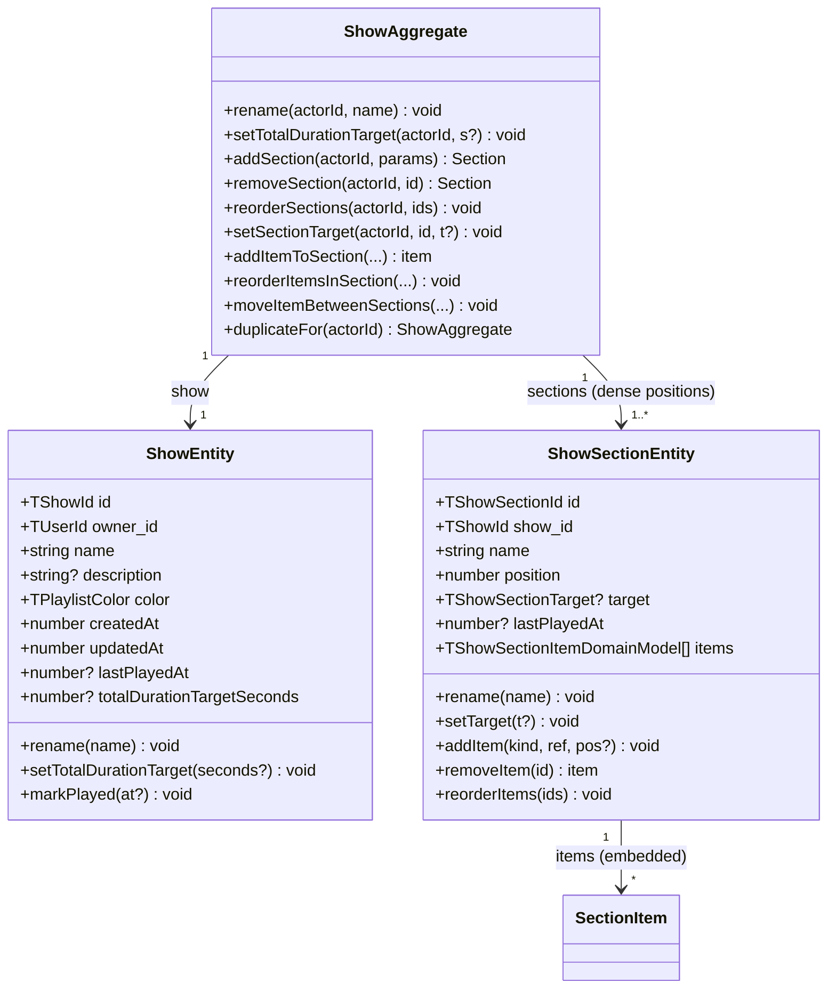

# SH3PHERD — Shows

Artist-owned performance plans. One **show** → one or more ordered
**sections** → a mix of direct **music versions** and whole
**playlists** as items. Targets exist at both the show level (total
duration) and each section level (duration-envelope or track-count)
so the artist can pace themselves. Ratings (mastery / energy / effort
/ quality) aggregate recursively from versions up through sections up
through the show — same contract as playlists.

---

## At a glance

| Surface        | Where                                                                                                                                                                                      |
| -------------- | ------------------------------------------------------------------------------------------------------------------------------------------------------------------------------------------ |
| Backend module | `apps/backend/src/shows/`                                                                                                                                                                  |
| Shared types   | `packages/shared-types/src/shows.ts`                                                                                                                                                       |
| Frontend root  | `apps/frontend-webapp/src/app/features/shows/`                                                                                                                                             |
| Routes         | `/app/shows` (list), `/app/shows/:id` (detail — deep-link / full page). Day-to-day entry is the right-side panel docked via `LayoutService.setRightPanel(ShowDetailSidePanelComponent, …)` |
| Related DnD    | [`apps/frontend-webapp/src/app/core/drag-and-drop/`](../../frontend-webapp/src/app/core/drag-and-drop/)                                                                                    |
| Popover host   | `LayoutService.setPopover(…)` mounts the "new show" form via `MainLayoutComponent` — data is injected through `INJECTION_DATA`                                                             |
| Scope          | `@PlatformScoped()` — a show belongs to a single user (no company context)                                                                                                                 |

---

## Backend

### Domain model

Three concepts, composed under one aggregate root. The show is the
parent, sections are ordered children, and items are embedded inside
sections (plain objects — no dedicated entity).



Invariants:

- `sections.length >= 1` at all times — enforced in the aggregate
  constructor. Removing the last section throws
  `SHOW_SECTION_REMOVE_LAST_FORBIDDEN` (policy).
- `section.position` is dense (0..n-1). The aggregate re-indexes on
  every add / remove / reorder via `reindexSections()`.
- `section.items[].position` is dense (0..m-1). Same guarantee from
  `ShowSectionEntity.reindexItems()`.
- Name is trimmed, non-empty on both entities; throws
  `SHOW_NAME_REQUIRED` / `SHOW_SECTION_NAME_REQUIRED`.
- `totalDurationTargetSeconds` is optional on the domain model. When
  present it must be a positive integer — `setTotalDurationTarget`
  rejects negatives / zero / non-finite.
- Items (`kind: 'version' | 'playlist'`) are plain `TShowSectionItemDomainModel`
  objects. The embedded `ref_id` is only checked for ownership inside
  the command handler — the aggregate itself has no cross-module
  visibility.

### CQRS

Six commands plus six queries (counting the mark-played split).

| Command                           | Responsibility                                                                                                        |
| --------------------------------- | --------------------------------------------------------------------------------------------------------------------- |
| `CreateShowCommand`               | Create a show + seed with 1 default section ("Set 1")                                                                 |
| `UpdateShowInfoCommand`           | Rename / recolor / redescribe / set-or-clear the show-level duration target (`null` clears, `undefined` leaves alone) |
| `DeleteShowCommand`               | Cascade delete: sections then show                                                                                    |
| `DuplicateShowCommand`            | Deep-copy with fresh IDs, name suffixed `(copy)`                                                                      |
| `AddShowSectionCommand`           | Append a section at the end (`position = sections.length`)                                                            |
| `UpdateShowSectionCommand`        | Rename and/or set-or-clear the section target                                                                         |
| `RemoveShowSectionCommand`        | Remove a section (policy forbids last one)                                                                            |
| `ReorderShowSectionsCommand`      | Full-order replacement — payload must cover every id                                                                  |
| `AddShowSectionItemCommand`       | Insert a version or playlist at a position (or end)                                                                   |
| `RemoveShowSectionItemCommand`    | Remove an item + reindex                                                                                              |
| `ReorderShowSectionItemsCommand`  | Full-order replacement inside a section                                                                               |
| `MoveItemBetweenSectionsCommand`  | Cross-section move with optional target position                                                                      |
| `MarkShowPlayedCommand`           | Stamp `lastPlayedAt` on show + every section                                                                          |
| `MarkShowSectionPlayedCommand`    | Stamp `lastPlayedAt` on one section                                                                                   |
| `ConvertSectionToPlaylistCommand` | Create a new playlist from a section's expanded items                                                                 |

| Query                | Returns                                                                    |
| -------------------- | -------------------------------------------------------------------------- |
| `ListUserShowsQuery` | `TShowSummaryViewModel[]` — one row per show with aggregated rating series |
| `GetShowDetailQuery` | `TShowDetailViewModel` — summary fields + `sections[]` with items + series |

Handlers follow the standard pattern
(`sh3-writing-a-controller.md`): load the aggregate via
`ShowAggregateRepository.findById`, mutate, save. Ownership is
guarded inside the aggregate via `ShowPolicy.ensureOwnedBy(actorId,
show)` before any state change.

### Controllers + endpoints

Single controller at `apps/backend/src/shows/api/show.controller.ts`
(`@PlatformScoped()` — shows resolve from `user_id`).

| Method + Path                                   | Command / Query                   | Permission          |
| ----------------------------------------------- | --------------------------------- | ------------------- |
| `GET    /me`                                    | `ListUserShowsQuery`              | `P.Music.Show.Read` |
| `GET    /:id`                                   | `GetShowDetailQuery`              | `P.Music.Show.Read` |
| `POST   /`                                      | `CreateShowCommand`               | `P.Music.Show.Own`  |
| `PATCH  /:id`                                   | `UpdateShowInfoCommand`           | `P.Music.Show.Own`  |
| `DELETE /:id`                                   | `DeleteShowCommand`               | `P.Music.Show.Own`  |
| `POST   /:id/duplicate`                         | `DuplicateShowCommand`            | `P.Music.Show.Own`  |
| `POST   /:id/sections`                          | `AddShowSectionCommand`           | `P.Music.Show.Own`  |
| `PATCH  /:id/sections/:sectionId`               | `UpdateShowSectionCommand`        | `P.Music.Show.Own`  |
| `DELETE /:id/sections/:sectionId`               | `RemoveShowSectionCommand`        | `P.Music.Show.Own`  |
| `PATCH  /:id/sections/reorder`                  | `ReorderShowSectionsCommand`      | `P.Music.Show.Own`  |
| `POST   /:id/sections/:sectionId/items`         | `AddShowSectionItemCommand`       | `P.Music.Show.Own`  |
| `DELETE /:id/sections/:sectionId/items/:itemId` | `RemoveShowSectionItemCommand`    | `P.Music.Show.Own`  |
| `PATCH  /:id/sections/:sectionId/items/reorder` | `ReorderShowSectionItemsCommand`  | `P.Music.Show.Own`  |
| `PATCH  /:id/items/:itemId/move`                | `MoveItemBetweenSectionsCommand`  | `P.Music.Show.Own`  |
| `POST   /:id/played`                            | `MarkShowPlayedCommand`           | `P.Music.Show.Own`  |
| `POST   /:id/sections/:sectionId/played`        | `MarkShowSectionPlayedCommand`    | `P.Music.Show.Own`  |
| `POST   /:id/sections/:sectionId/to-playlist`   | `ConvertSectionToPlaylistCommand` | `P.Music.Show.Own`  |

Every write endpoint takes `@Body('payload', new ZodValidationPipe(S…))`
so the frontend wraps its payloads in `{ payload }`. Responses are
uniformly `TApiResponse<T>` via `apiSuccessDTO` / `buildApiResponseDTO()`.

### View models

```ts
interface TShowRatingSeries {
  trackCount: number;
  totalDurationSeconds: number;
  meanMastery: number | null;
  meanEnergy: number | null;
  meanEffort: number | null;
  meanQuality: number | null;
  masterySeries: (number | null)[];
  energySeries: (number | null)[];
  effortSeries: (number | null)[];
  qualitySeries: (number | null)[];
}

interface TShowSummaryViewModel extends TShowRatingSeries {
  id: TShowId;
  name: string;
  description?: string;
  color: TPlaylistColor;
  createdAt: number;
  updatedAt: number;
  lastPlayedAt?: number;
  sectionCount: number;
  totalDurationTargetSeconds?: number;
}

interface TShowSectionViewModel extends TShowRatingSeries {
  id: TShowSectionId;
  name: string;
  position: number;
  target?: TShowSectionTarget; // { mode: 'duration'; duration_s: number } | { mode: 'track_count'; track_count: number }
  lastPlayedAt?: number;
  items: TShowSectionItemView[];
}

interface TShowDetailViewModel extends TShowSummaryViewModel {
  sections: TShowSectionViewModel[];
}
```

`TShowSectionItemView` is a discriminated union (`kind: 'version' |
'playlist'`) — playlists are NOT expanded in the response (the
frontend renders them as a single block with trackCount). The
`*Series` fields ARE computed on the expanded list, so the
aggregated rating shape reflects every individual track, even inside
nested playlists.

### Rating series aggregation

Helper: `apps/backend/src/shows/application/helpers/computeRatingSeries.ts`.

Given an ordered list of `TMusicVersionDomainModel`:

- `trackCount` = sum of favourite-or-first-track count across versions.
- `totalDurationSeconds` = sum of `favoriteTrack.analysisResult.durationSeconds`
  (falls back to `favoriteTrack.durationSeconds`, then 0).
- `mean*` = arithmetic mean of the rating on the corresponding axis,
  skipping `null` entries. `null` when the list has no rated value on
  that axis.
- `*Series` = one entry per version in the given order, `null` where
  no rating exists on that axis for that track.

The query handlers expand playlists at read time: for each
`kind: 'playlist'` item, the referenced `playlist_tracks` are pulled,
their versions are batched into the lookup, and their expanded list
is spliced in place in section order. The show-level series is the
concatenation of every section's expanded list, **in section order**
— so the sparkline mirrors the actual performance flow.

Because the expansion is per-query (not cached), a change to a
playlist's contents is reflected in every show that references it on
the next `GetShowDetailQuery` / `ListUserShowsQuery`. No invalidation
logic.

### Persistence

Two collections, no cross-collection transactions:

- `shows` — one `TShowDomainModel` per show.
- `show_sections` — one `SectionRecord` per section, with
  `items: TShowSectionItemDomainModel[]` embedded.

`ShowAggregateRepository` is the only entry-point for handlers —
wraps the two underlying repos. Save strategy:

1. **Show doc**: `showRepo.upsertOne(show.toDomain)` — atomic
   `replaceOne({ id }, doc, { upsert: true })`. Inserts when absent,
   replaces wholesale when present.

   > **Historical note.** The original implementation did
   > `insertOne + updateOne` inside a try/catch that expected
   > `isDuplicateKeyError` to fall through. Because no unique index
   > exists on the business `id` field (Mongo only enforces
   > uniqueness on `_id`), the catch never fired — every save on a
   > loaded aggregate silently inserted a second document with the
   > same business `id` and a fresh `_id`, which `ListUserShowsQuery`
   > then returned as duplicate rows. Fixed by moving to `replaceOne`
   >
   > - upsert (commit `c4926caa`).
   >
   > When cleaning up an affected dev DB, keep the most recent copy
   > per `id`:
   >
   > ```js
   > db.shows
   >   .aggregate([
   >     { $sort: { updatedAt: -1 } },
   >     { $group: { _id: '$id', keep: { $first: '$_id' }, all: { $push: '$_id' } } },
   >     { $project: { dupes: { $setDifference: ['$all', ['$keep']] } } },
   >     { $match: { 'dupes.0': { $exists: true } } },
   >   ])
   >   .forEach((r) => db.shows.deleteMany({ _id: { $in: r.dupes } }));
   > ```

2. **New sections**: `sectionRepo.saveMany(newSections)` — batched
   `insertMany`. Section IDs are freshly-generated UUIDs so there's
   no collision risk.
3. **Removed sections**: `sectionRepo.deleteManyByIds(ids)` — single
   `deleteMany({ id: { $in } })`.
4. **Existing sections**: `updateMeta` (name / position / target /
   lastPlayedAt) + `replaceItems` (writes the full items array back)
   per section. Sections rarely exceed a handful per show, so the
   per-section round-trip cost is negligible.

Dirty tracking lives on the aggregate (`newSections`, `removedSections`,
`existingSections`) and is derived from an `_originalSectionIds` set
built in the constructor.

### Quotas

`QuotaService.ensureAllowed(actorId, 'show_count')` fires in
`CreateShowHandler` before anything touches Mongo. `show_count` is
defined in `PLAN_QUOTAS`:

- `artist_free` — 0 (endpoint 403s first on permission)
- `artist_pro` — 10 lifetime
- `artist_max` — unlimited

No quota on section / item count. The
`music:show:*` permission family lives under `P.Music.Show` — same
grammar as `P.Music.Playlist` — and is granted alongside the above
plans. See `sh3-platform-contract.md` for the plan → permissions
mapping.

---

## Frontend

### Routes + shells

Two host components, one body.

- [`ShowDetailComponent`](../../frontend-webapp/src/app/features/shows/show-detail/show-detail.component.ts) —
  the actual UI: header, section list, target blocks, item list, drop
  zones, inline-rename inputs. Standalone, signal-driven,
  `OnPush`. Input: `showId: TShowId | null`.
- [`ShowDetailPageComponent`](../../frontend-webapp/src/app/features/shows/show-detail-page/show-detail-page.component.ts) —
  routed page at `/app/shows/:id`. Reads the id from `paramMap` and
  forwards to `ShowDetailComponent`.
- [`ShowDetailSidePanelComponent`](../../frontend-webapp/src/app/features/shows/show-detail-side-panel/show-detail-side-panel.component.ts) —
  right-side panel mounted via
  `LayoutService.setRightPanel(ShowDetailSidePanelComponent, { showId })`.
  Hosts the same `ShowDetailComponent`, adds a small chrome (icon
  toolbar with "browse music library", "browse playlists", "open
  full page", "close"). Day-to-day entry — lets the user keep the
  show docked while drag-and-dropping tracks from other features.

Both shells feed `showId` down as an `input()` signal so
`ShowDetailComponent` has a single source of truth.

### State

[`ShowsStateService`](../../frontend-webapp/src/app/features/shows/services/shows-state.service.ts) —
signal-backed shell (`providedIn: 'root'`). Holds `summaries`
(for the list page + menu badge), `loadingSummaries`, `detail`
(single active show), `detailLoadingFor`. Exposes `loadSummaries()`,
`loadDetail(id)`, `clearDetail()`, `prependSummary`, `replaceSummary`,
`removeSummary`, `setDetail`.

`loadDetail(id)` stamps `detailLoadingFor: id` so late responses
arriving after a detail swap are ignored (`detailLoadingFor ===
id` guard on the response handler).

[`ShowsMutationService`](../../frontend-webapp/src/app/features/shows/services/shows-mutation.service.ts) —
imperative CRUD. Each method calls the matching API, then
re-loads the detail and/or summaries from the authoritative endpoint
so the rating sparklines stay in sync with the mutation that just
landed. v1 is **optimistic-free**: a show has enough server-side
derivation (expanded versions, aggregated series) that local
re-computation would risk drift. The only optimistic action is
`deleteShow` (`removeSummary` first, reload on error) and
`createShow` (synthetic empty-series row prepended, series fix
themselves on next `loadSummaries`).

### List page — `ShowsPageComponent`

Cards use the same visual grammar as `PlaylistCardComponent`: a
coloured stripe on the left, 4-axis rating grid (MST / NRG / EFF /
QTY) in the footer, each axis tinted with one of the rating-colour
tokens and rendered via the shared
[`RatingSparklineComponent`](../../frontend-webapp/src/app/shared/rating-sparkline/rating-sparkline.component.ts).
Meta chips above the ratings show section count / track count /
total duration.

Actions on the card (duplicate, delete) live in a hover-revealed
cluster of `sh3-button-icon` wrapped in `sh3-inline-confirm` for the
destructive ones. `click` on the card body opens the detail in the
docked side panel; `keydown.enter` / `keydown.space` bind for
keyboard users.

The list itself lives under `user-select: none` so cards read as
interactive tiles rather than selectable text.

### Detail — `ShowDetailComponent`

The header carries:

- Colour stripe + radial accent tint from the show's colour.
- Inline-editable show name — `dblclick` or the pencil icon swaps
  the `<h1>` for an `<input>` bound to a `showNameDraft` signal.
  `Enter` / blur commits via `updateShow({ name })`, `Escape`
  cancels.
- A cluster of `sh3-button-icon`s: rename, mark played, duplicate,
  and delete (wrapped in `sh3-inline-confirm` so the destructive
  action needs a second click).
- A stats strip (sections / tracks / duration / last played) +
  a 4-axis rating row re-using the same sparkline grammar as the
  cards.
- A **show-level target block** — target duration, planned
  duration, fill percentage, and a coloured progress bar. States:
  - `empty` (no items, no target): grey, collapsed bar.
  - `under` (fill < 90%): amber gradient.
  - `near` (90–105%): green gradient.
  - `over` (>105%): red gradient, the block itself gains a red
    tint so the overshoot reads at a glance.
  - The displayed percentage tints to match. Inline minutes input
    (click the target value to edit, Enter / blur commits, Escape
    cancels) — same grammar as the rename.

Each section renders:

- A grab handle (`uiDndDrag` on a `sh3-icon[name="menu"]`) — see
  [DnD reordering](#dnd-section-reordering).
- Inline-editable section name (same `dblclick` pattern).
- A row of `sh3-button-icon`s: rename, mark played, convert to
  playlist, remove (inline-confirm).
- A **per-section target block** mirroring the show-level one.
  Applies the same `under / near / over` colour semantics so the
  pacing feedback stays consistent top to bottom.
- A drop zone (`uiDndDropZone` accepting `'music-track'` and
  `'playlist'`) that covers the section — dropped tracks / playlists
  call `addItem` at end-of-section on the backend.
- An item list — each `<li>` shows a kind icon (music-note vs list),
  title + subtitle, and an inline `sh3-button-icon` remove.
- A footer with the section's track count, last-played timestamp,
  and its own 4-axis rating sparkline grid.

Sections are rendered one-per-@for with **insertion drop zones**
between them (and a tail one after the last) — see next section.

### DnD section reordering

Custom DnD system lives in
[`apps/frontend-webapp/src/app/core/drag-and-drop/`](../../frontend-webapp/src/app/core/drag-and-drop/).
Drag state is a discriminated union in `drag.types.ts` — this module
adds a new variant:

```ts
'show-section': { sectionId: TShowSectionId; name: string };
```

Flow:

1. The user grabs the section's drag handle (grip icon) — the
   `DndDragDirective` waits for a 4 px pointer-move threshold before
   starting a session, so single clicks on the handle never trigger
   a drag.
2. `DragSessionService.start({ type: 'show-section', data })` lights
   up the `.sections--reordering` flag on the section container —
   the normally-collapsed insertion zones between sections expand
   from 0 to 16 px and become pointer-reactive.
3. On hover of an insertion zone, a 2-px accent line shows exactly
   where the section will land. The dragged section itself dims to
   `opacity: 0.45` so the source stays visible but recedes.
4. On drop, the insertion zone calls `onInsertionDrop(targetIndex,
dragState)` — the component builds the new ordered-id list
   locally (adjusting for the from-before-target offset) and
   dispatches `ShowsMutationService.reorderSections(showId, next)`,
   which hits the existing `PATCH /shows/:id/sections/reorder`
   endpoint.

No visual-insertion-indicator pattern pre-existed in the DnD layer
— this module is the first consumer. The infrastructure needed no
changes: each insertion zone is just a thin strip with a
`uiDndDropZone` + `dropZone_id: 'insert:N'`, and the visibility
toggle uses the already-exposed `DragSessionService.current()`
signal.

### New-show popover

[`NewShowPopoverComponent`](../../frontend-webapp/src/app/features/shows/new-show-popover/new-show-popover.component.ts) —
opened via `LayoutService.setPopover(NewShowPopoverComponent)`
from the `ShowsPageComponent` "New show" CTA.

Form fields (signal-backed, committed on submit):

- Name (string, required — submit disabled until non-empty trimmed).
- Total duration target in minutes (optional, default `60`).
  Translated to `totalDurationTargetSeconds = minutes * 60` on
  submit — left `undefined` when empty or non-positive.
- Colour chip (`indigo / emerald / rose / amber / sky / violet`).

Uses `<ui-popover-frame>` (content projection for title / body /
footer) so it shares the chrome with every other popover in the app
(close button, backdrop dismiss, layered shadow).

Predefined internal structure (seeding multiple named sections at
create time — solo / club / rehearsal templates) is **post-MVP** —
see `documentation/todos/TODO-artist-shows.md`.

### Duration target semantics

Two targets, two scopes:

- **Show-level** — `TShowDomainModel.totalDurationTargetSeconds`
  (seconds) OR `TShowDomainModel.totalTrackCountTarget` (songs).
  Mutually exclusive in the UI — the settings popover picks one
  mode and clears the other on submit. Both fields are independently
  persisted on the show doc so the payload shape stays additive.
- **Section-level** — `TShowSectionDomainModel.target`, a
  discriminated union (`{ mode: 'duration'; duration_s: number }`
  or `{ mode: 'track_count'; track_count: number }`). Set from the
  section settings popover; `null` clears.

The section-level sum is independent of the show-level target — a
show can exceed its total target while each section is individually
within pace, or vice versa. Both fill-% bars compute locally against
their own target; there's no cross-check.

Both respect the same state thresholds (`under < 90%`, `near
90–105%`, `over > 105%`) and reuse the same colour ramp.

### Scheduling (`startAt`)

Both `TShowDomainModel` and `TShowSectionDomainModel` carry an
optional `startAt: number` (ms since epoch) — the absolute planned
start time. Independent per section — no auto-cascade from the show
or from the previous section's duration target. An artist with a
rigid 22:00 → 22:30 → 23:15 running order fills those stamps by hand
from the section settings popover, gets a schedule chip in the
corresponding header, and the chip renders date-only when the stamp
lands on exactly 00:00 (treated as "date anchor, no precise time").

Duplicating a show intentionally **drops** `startAt` on both levels
— the clone is a template for re-scheduling, not a re-run of the
same date.

### Axis criteria (`axisCriteria`)

Per-axis target ranges the artist sets to steer a section (or the
whole show). Each criterion is `{ axis: 'mastery' | 'energy' |
'effort' | 'quality', min?: number, max?: number }`, stored as
an optional array on both the show and section domain models
(at most one entry per axis — enforced by a dedupe-on-write in
`setAxisCriteria`).

The UI renders the configured range as a chip next to the axis mean
in every rating group (header + section footer). When the current
`mean*` drifts outside the window, the `rating-group--out-of-range`
modifier tints both the mean number and the chip with the alert
colour — so the artist sees the drift at a glance without reading
the numeric comparison.

Backend Zod refine guarantees `min <= max` when both are set, so
handlers can trust the ordering downstream.

### Settings popovers

Two components consolidate every editable field into a single
panel per scope:

- `ShowSettingsPopoverComponent` (opened from the show header cog)
  — name, description, colour, target (mode + value), scheduled
  start, per-axis criteria.
- `SectionSettingsPopoverComponent` (opened from the section head
  cog) — same shape minus colour (sections inherit from the show).

Both mount via `LayoutService.setPopover()` with a typed data
payload (`{ showId }` / `{ showId, sectionId }`) that resolves the
current view model from `ShowsStateService.detail()` at `ngOnInit`
to pre-fill the form. Submits go through `ShowsMutationService`
which reloads the detail authoritatively so the header view
refreshes as a single coherent update.

Double-click-to-rename + description inline-edit stay as quick
shortcuts on the headers — the popover is the primary entry for
everything else (target mode toggle, schedule, criteria). Mark
played / duplicate / delete remain as visible icon-buttons next
to the cog so the common single-click actions don't hide behind a
settings panel.

### Shared components used

Every visible chrome element reuses a shared primitive — nothing
is hand-rolled in this feature:

| Element                                                  | Component / utility                                                                                           |
| -------------------------------------------------------- | ------------------------------------------------------------------------------------------------------------- |
| Button (New show, Add section, popover footer)           | [`sh3-button`](../../frontend-webapp/src/app/shared/button/button.component.ts)                               |
| Icon button (actions, drag handle, remove, etc.)         | [`sh3-button-icon`](../../frontend-webapp/src/app/shared/button-icon/button-icon.component.ts)                |
| Delete / remove confirmation                             | [`sh3-inline-confirm`](../../frontend-webapp/src/app/shared/inline-confirm/inline-confirm.component.ts)       |
| Section target chip (`track_count` mode)                 | [`sh3-badge`](../../frontend-webapp/src/app/shared/badge/badge.component.ts)                                  |
| Empty states (no shows yet)                              | [`sh3-empty-state`](../../frontend-webapp/src/app/shared/empty-state/empty-state.component.ts)                |
| Loading indicator                                        | [`sh3-loading`](../../frontend-webapp/src/app/shared/loading-state/loading-state.component.ts)                |
| All iconography                                          | [`sh3-icon`](../../frontend-webapp/src/app/shared/icon/icon.component.ts) — registry in `icon.registry.ts`    |
| 4-axis rating sparklines (cards, header, section footer) | [`app-rating-sparkline`](../../frontend-webapp/src/app/shared/rating-sparkline/rating-sparkline.component.ts) |
| Popover chrome (New show)                                | [`ui-popover-frame`](../../frontend-webapp/src/app/shared/ui-frames/popover-frame/popover-frame.component.ts) |
| DnD drag source / drop zone                              | `uiDndDrag` / `uiDndDropZone` directives                                                                      |

Rating colours come from the `--color-rating-low / medium / high /
max` tokens (plus `*-dim` variants for the backgrounds). Panel
surfaces use `--panel-color`, elevated rows use `--surface-raised`,
borders use `--panel-border-color` / `--border-light` / `--border-subtle`.
No raw colour literals in SCSS — every value resolves to a CSS
variable from `apps/frontend-webapp/src/styles/_tokens.css`.

The `.shows-page` and `.show-detail` roots apply `user-select:
none` so the cards read as interactive tiles rather than text; the
inline-edit inputs opt back in via
`.show-detail input { user-select: text }` so rename / target
editing still supports caret + range selection.

---

## Known limitations / future work

Tracked under **Questions ouvertes** in
`documentation/todos/TODO-artist-shows.md`:

- Predefine the show's section structure at create time (templates:
  solo acoustic / club set / rehearsal / blank, editable before
  submit).
- Public read-only share links for a show (JWT-tokenised, same
  pattern as the orgchart export).
- Rehearsal mode — auto-mark-played after N seconds of playback
  via the inline audio player.
- Immutable snapshots on `markShowPlayed` so historical plays
  don't drift when the show mutates later.
- Finer-grained quotas (`section_count_per_show`,
  `items_per_section`) if observed abuse shows up.
- Section-level lint inline rename for the add-section flow (still
  uses `window.prompt` for name + duration).

## Links

- `apps/backend/documentation/sh3-playlists.md` — the sibling
  feature whose grammar the shows feature mirrors (cards, sparklines,
  4-axis ratings, DnD payload for playlist drops).
- `apps/backend/documentation/sh3-platform-contract.md` — dual
  contract model; `@PlatformScoped()` resolver for show ownership.
- `apps/backend/documentation/sh3-quota-service.md` — pattern for
  `ensureAllowed('show_count')` + `recordUsage`.
- `apps/backend/documentation/sh3-writing-a-controller.md` —
  controller / handler / CQRS pattern every command above follows.
- `documentation/todos/TODO-artist-shows.md` — the live roadmap with
  phase tracking and open questions.
