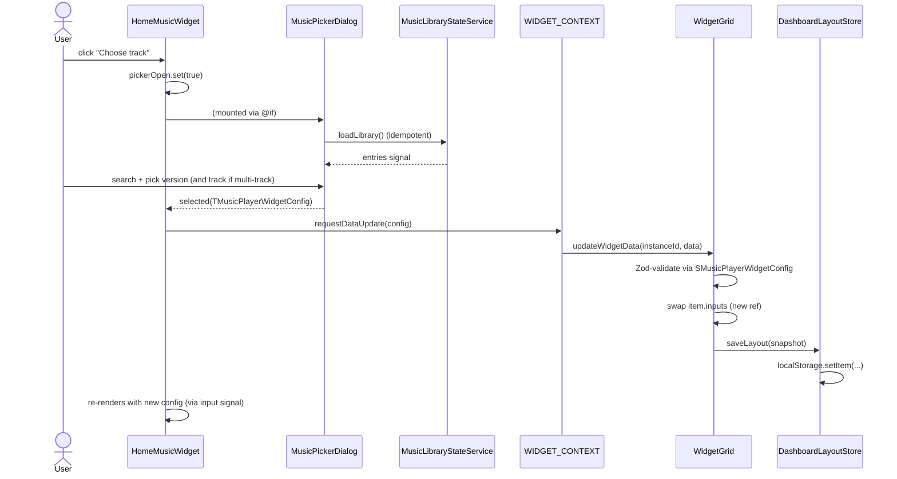

# SH3PHERD — Home Dashboard Widgets

This document covers the **widget system powering the home dashboard**:
the Gridster-backed grid, the catalog of widget types, the right-hand
library panel that inserts them, the typed per-widget configuration in
`shared-types`, and the persistence layer that round-trips everything
through `localStorage`.

Entirely frontend today. The persistence schemas live in
`packages/shared-types` so a future `SaveDashboardLayoutCommand` can
consume them as-is — no parallel DTOs.

---

## Architecture at a glance

```
apps/frontend-webapp/src/app/features/home-dashboard/
├── home/                       Page shell + 2-col layout (grid | panel)
├── widget-grid/                Gridster wrapper, hydrates + persists
├── widget-library-panel/       Right sidepanel with search + sections
├── widget-catalog/             Static registry of widget definitions
├── widget-context.ts           Per-instance injection token
├── services/
│   └── dashboard-layout.store.ts   localStorage load/save + Zod validation
├── home-music-widget/          One widget: plays a pinned track
├── today-date-widget/          One widget: flipping calendar card
├── workspace-contract-widget/  One widget: active contract summary
└── music-picker-dialog/        Modal used by the music widget
```

```
packages/shared-types/src/home-dashboard.types.ts
    ├── SWidgetDefId          ('home-music' | 'workspace-contract' | 'today-date')
    ├── SWidgetPosition       ({ x, y, cols, rows })
    ├── SMusicPlayerWidgetConfig   per-widget typed data
    ├── STodayDateWidgetConfig
    ├── SWorkspaceContractWidgetConfig
    ├── SWidgetInstance       discriminated union on defId
    └── SDashboardLayout      { version, widgets[] }
```

---

## Data flow

```mermaid
flowchart LR
    LS[localStorage<br/>'sh3pherd.home.dashboardLayout']
    Store[DashboardLayoutStore<br/>load/save + Zod validate]
    Grid[WidgetGridComponent<br/>signal&lt;WidgetItem[]&gt;]
    Gridster[angular-gridster2<br/>mutates items in place]
    Outlet[ngComponentOutlet<br/>component + inputs + injector]
    Widget[Any widget component]
    Ctx[WIDGET_CONTEXT<br/>per-instance injector]
    Panel[WidgetLibraryPanel<br/>insert&lt;WidgetDefinition&gt;]

    LS -->|hydrate once| Store -->|loadLayout| Grid
    Grid -->|build item| Outlet --> Widget
    Grid -->|provides| Ctx --> Widget
    Panel -->|addWidget| Grid
    Gridster -->|itemChangeCallback| Grid
    Widget -->|requestDataUpdate| Ctx -->|closure| Grid
    Grid -->|saveLayout| Store --> LS
```

The grid is the single live owner of the on-screen state. The store is
a dumb port — it doesn't hold any signal, just turns `TDashboardLayout`
into a JSON blob and back. Every write path on the grid ends in
`persist()`, which re-serialises the current signal value and hands it
to the store.

---

## Data model (`shared-types`)

Everything durable is defined in
`packages/shared-types/src/home-dashboard.types.ts`:

```ts
// Discriminator
export const WIDGET_DEF_IDS = [
  "home-music",
  "workspace-contract",
  "today-date",
] as const;
export const SWidgetDefId = z.enum(WIDGET_DEF_IDS);

// Gridster-compatible position
export const SWidgetPosition = z.object({
  x:    z.number().int().min(0),
  y:    z.number().int().min(0),
  cols: z.number().int().positive(),
  rows: z.number().int().positive(),
});

// Per-widget data — one schema per type
export const SMusicPlayerWidgetConfig = z.object({
  versionId: SMusicVersionId.optional(),
  trackId:   SVersionTrackId.optional(),
  title:     z.string().optional(),
  subtitle:  z.string().optional(),
});

// Discriminated union on defId — narrows data by type at compile + runtime
export const SWidgetInstance = z.discriminatedUnion("defId", [
  z.object({ id: z.string().min(1), defId: z.literal("home-music"),
             position: SWidgetPosition, data: SMusicPlayerWidgetConfig.optional() }),
  …
]);

export const DASHBOARD_LAYOUT_VERSION = 1;
export const SDashboardLayout = z.object({
  version: z.number().int().positive(),
  widgets: z.array(SWidgetInstance),
});
```

### Why in `shared-types`

1. **Future backend command compatibility** — when the dashboard moves
   off `localStorage`, a `SaveDashboardLayoutCommand` can import
   `SDashboardLayout` directly. No parallel DTOs to keep in sync.
2. **Zod validation at the boundary** — blobs that made it to disk in
   an older schema are rejected by `safeParse` on hydration instead of
   crashing `ngComponentOutlet` later.

### Adding a new widget type

1. In `shared-types/home-dashboard.types.ts`:
   - Add the id to `WIDGET_DEF_IDS`.
   - Add a `S<Name>WidgetConfig` schema (+ exported `T<Name>WidgetConfig`).
   - Add a variant to `SWidgetInstance`'s `z.discriminatedUnion`.
2. Rebuild: `pnpm --filter @sh3pherd/shared-types build`.
3. In `widget-catalog.ts`: append a `WidgetDefinition` pointing at your
   Angular component, with `defaultCols` / `defaultRows` / icon / section.
4. In `widget-grid.component.ts`:
   - Add a branch in `buildWidgetInputs` to map `data` → component inputs.
   - Add a branch in `toInstance` + `mergeInstanceData` to round-trip
     the new config through Zod.
5. In your widget component: `inject(WIDGET_CONTEXT, { optional: true })`
   if you need to persist state updates.

---

## Persistence — `DashboardLayoutStore`

`apps/frontend-webapp/src/app/features/home-dashboard/services/dashboard-layout.store.ts`

A narrow port — two methods, zero live state:

```ts
loadLayout(): TDashboardLayout | null
saveLayout(layout: TDashboardLayout): void
```

- SSR-safe: guarded by `isPlatformBrowser(PLATFORM_ID)`. Server renders
  fall back to the default layout.
- `loadLayout` routes the JSON through `SDashboardLayout.safeParse`
  and drops the blob on `parsed.version !== DASHBOARD_LAYOUT_VERSION`.
  A migration hook lives at this boundary — add a `migrate(prev)`
  helper the day a schema breaks, don't try to guess inline.
- `saveLayout` re-validates before writing — Zod is the only gatekeeper
  between a dirty in-memory state and a persisted blob.
- Quota / private-mode failures are silently swallowed. The dashboard
  is a convenience, not load-bearing — losing a write round isn't worth
  a toast.

Storage key: `sh3pherd.home.dashboardLayout`.

---

## The grid — `WidgetGridComponent`

`apps/frontend-webapp/src/app/features/home-dashboard/widget-grid/`

Owns the live state. `dashboard: signal<WidgetItem[]>` is the runtime
mirror of `TDashboardLayout.widgets[]`, with Gridster-specific fields
attached:

```ts
interface WidgetItem extends GridsterItem {
  instanceId: string; // matches TWidgetInstance.id
  defId: TWidgetDefId; // discriminator
  component: Type<unknown>; // resolved Angular type
  inputs?: Record<string, unknown>; // forwarded to ngComponentOutlet
  injector?: Injector; // carries WIDGET_CONTEXT for this instance
}
```

### Mutation paths

All three paths end in `persist()`:

| Path                            | Trigger                                         |
| ------------------------------- | ----------------------------------------------- |
| `addWidget(def)`                | Library panel click                             |
| `removeWidget(instanceId)`      | (Not yet wired in UI — method ready)            |
| `updateWidgetData(id, data)`    | Widget calls `WIDGET_CONTEXT.requestDataUpdate` |
| `itemChangeCallback` (Gridster) | Drag / resize — Gridster mutates item in place  |

### Why Gridster owns the live item ref

`angular-gridster2` mutates each `WidgetItem`'s `x/y/cols/rows` fields
directly on drag or resize. Rebuilding the array on every mutation
would churn the DOM and re-create Gridster cells. Instead:

- Hydrate once → `WidgetItem[]` in the signal.
- Drag/resize updates happen in place on the same references.
- `itemChangeCallback` just calls `persist()`, which reads the now-mutated
  items back into `TWidgetInstance`s via `toInstance()` and hands the
  snapshot to the store.

For data updates, by contrast, `updateWidgetData` **swaps** the `inputs`
reference of the target item and emits a new array. The new `inputs`
reference is how `ngComponentOutlet` detects a change and re-applies
inputs on the mounted component — mutating in place would not
re-propagate.

---

## Per-instance context — `WIDGET_CONTEXT`

`widget-context.ts`:

```ts
export interface WidgetContext {
  readonly instanceId: string;
  requestDataUpdate(data: unknown): void;
}

export const WIDGET_CONTEXT = new InjectionToken<WidgetContext>('WIDGET_CONTEXT');
```

The grid provides a **child injector per instance** through
`ngComponentOutlet`'s `injector:` binding:

```ts
private makeInstanceInjector(instanceId: string): Injector {
  const ctx: WidgetContext = {
    instanceId,
    requestDataUpdate: (data) => this.updateWidgetData(instanceId, data),
  };
  return Injector.create({
    parent: this.parentInjector,
    providers: [{ provide: WIDGET_CONTEXT, useValue: ctx }],
  });
}
```

Each widget reads its own context:

```ts
private readonly widgetCtx = inject(WIDGET_CONTEXT, { optional: true });

onPickerSelected(cfg: TMusicPlayerWidgetConfig): void {
  this.widgetCtx?.requestDataUpdate(cfg);   // round-trips through grid → store
}
```

`optional: true` lets widgets render outside a grid (tests, Storybook)
without crashing; they just lose persistence for those renders.

---

## The library panel — `WidgetLibraryPanelComponent`

Right-hand sidepanel. Three pieces:

1. **Search bar** — `signal<string>` filtered with `matchesWidgetQuery`
   (case-insensitive match on label, description, keywords).
2. **Sections** (`WIDGET_SECTIONS` — music / workspace / productivity),
   rendered via the shared `SidePanelSectionComponent`. Sections with
   zero matches collapse out.
3. **Cards** — a grid of clickable `WidgetDefinition`s. Click emits
   `insert(def)` to `HomeComponent`, which delegates to
   `widgetGrid.addWidget(def)`.

Purely presentational — no state beyond the query. Inserted widgets
land in the grid's signal and persist immediately.

---

## Music widget — selection flow

`home-music-widget/` renders the pinned track, drives the global
`AudioPlayerService`, and opens a **modal picker** when the user taps
"Choose track" / "Change".



Picker UX rules:

- Single-track versions auto-confirm on version click.
- Multi-track versions expand to show their tracks.
- `Escape` / backdrop click / close button emit `cancelled()`.
- Search matches against title, original artist, and version label.

The widget itself derives its `TPlayableTrack` from the config — empty
state when `versionId`/`trackId` is missing, otherwise builds a
payload for `AudioPlayerService.playTrack`.

---

## Progress contour (SVG)

The widget's "progress line that traces the outline" is an
`<svg rect>` with:

- `stroke-dasharray` = perimeter of the rounded rect
- `stroke-dashoffset` = `perimeter * (1 - progress)`

Perimeter is measured from the live DOM rect on `afterNextRender`,
re-measured on `window:resize` and on config changes (widget may
grow/shrink when transitioning between empty and ready states). The
formula `2·(w + h) − 8r + 2πr` accounts for the rounded corners at
`--radius-md: 10px`.

Progress is sourced from `AudioPlayerService.position / .duration` and
only non-zero when `currentTrack.id === myTrack.id` — so only the
widget whose track is actually playing advances the contour.

---

## Quality gates

- **Typecheck** (pre-push): `pnpm --filter frontend-webapp exec tsc --noEmit`
- **`shared-types` build**: prerequisite before frontend typecheck when
  schemas change. `pnpm --filter @sh3pherd/shared-types build`.
- **No `any` / `as unknown as T`** — `updateWidgetData` validates each
  data payload through its matching Zod schema before mutating the
  signal. Invalid data clears the slot instead of poisoning the blob.

---

## Not done yet

Tracked in
[documentation/todos/widgets/TODO-home-music-widget.md](../../../documentation/todos/widgets/TODO-home-music-widget.md):

- **Remove-widget UI** — `WidgetGridComponent.removeWidget` exists but
  no affordance in the template yet.
- **Backend persistence** — `SaveDashboardLayoutCommand` +
  `GetDashboardLayoutQuery` on the platform-scoped side. The shared
  schema is ready to drop in.
- **Graceful handling of a deleted pinned version** — today the music
  widget keeps its pin even if the version no longer exists; should
  detect + fall back to the empty state.
- **More widgets** — the catalog is the only file to edit for the
  usual cases.
