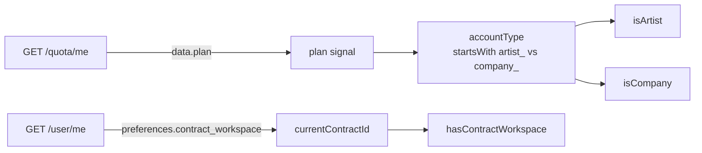
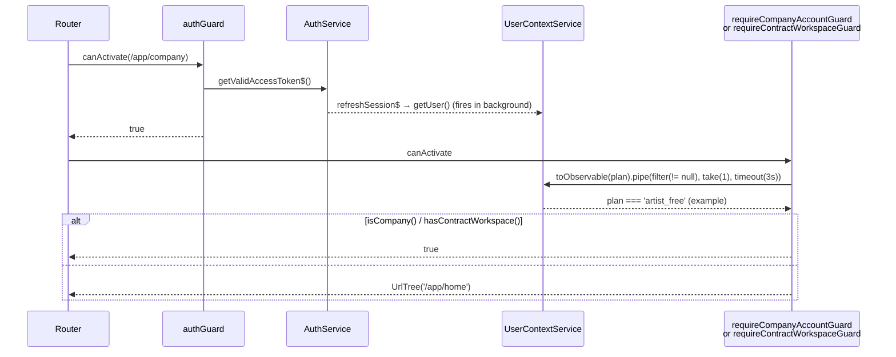

# SH3PHERD Frontend — Account Scope Guards

Route-level enforcement of the dual-contract model on the frontend.
Mirrors the backend's `@PlatformScoped()` / `@ContractScoped()`
decorators: personal (music, playlists) stays visible to artists, while
company-scoped routes (orgchart, programs) are gated by account type
and active workspace.

> Backend counterparts: [`sh3-platform-contract.md`](../../backend/documentation/sh3-platform-contract.md),
> [`sh3-auth-and-context.md`](../../backend/documentation/sh3-auth-and-context.md).

---

## The two guards

| Guard                           | Requires                                             | On mismatch | Used on                                            |
| ------------------------------- | ---------------------------------------------------- | ----------- | -------------------------------------------------- |
| `requireCompanyAccountGuard`    | `UserContextService.isCompany() === true`            | `/app/home` | `/app/company` (+ children via `canActivateChild`) |
| `requireContractWorkspaceGuard` | `UserContextService.hasContractWorkspace() === true` | `/app/home` | `/app/program`                                     |

Both are functional `CanActivateFn` guards in
[`src/guards/account-scope.guards.ts`](../src/guards/account-scope.guards.ts).
They run **after** `authGuard`, which has already triggered
`AuthService.refreshSession$` → `UserContextService.getUser()`, so the
user record and the plan are either loaded or about to be.

---

## Signal pipeline

The guards piggy-back on four `computed` signals exposed by
[`UserContextService`](../src/app/core/services/user-context.service.ts):

| Signal                 | Type                            | Source                                        |
| ---------------------- | ------------------------------- | --------------------------------------------- |
| `plan`                 | `TPlatformRole \| null`         | `GET /quota/me`                               |
| `accountType`          | `'artist' \| 'company' \| null` | prefix of `plan`                              |
| `isArtist`             | `boolean`                       | `accountType === 'artist'`                    |
| `isCompany`            | `boolean`                       | `accountType === 'company'`                   |
| `hasContractWorkspace` | `boolean`                       | derived from `currentContractId` (user prefs) |

`accountType` is **inferred from the plan prefix** — the frontend never
sees the backend's `account_type` field directly. An empty or `null`
plan means "not loaded yet" and is distinct from either account type.



---

## Guard flow



**Key points:**

- The guard observes the `plan` signal via `toObservable` and waits
  until it's non-null. This is the same synchronisation point used by
  both guards — if `plan` is set, `_user` has already been set too
  (`loadPlan` runs in `getUser`'s success handler).
- A 3 s `timeout` caps the wait. On timeout the observable resolves
  with `null` and the guard falls through to the current signal value
  (which is still null). In the fail-open state both `isCompany()` and
  `hasContractWorkspace()` return `false` → user is redirected to
  `/app/home`. This is intentionally restrictive: a broken `/quota/me`
  should not let a suspect user through a company-scoped route.
- The guards short-circuit to `true` on SSR (no cookies → let the
  client re-evaluate after hydration), matching `authGuard`.

---

## Defence in depth: menu + guards + backend

The segregation is enforced on three layers, each redundant against
failures of the others:

1. **Menu filter** — [`AppMenuComponent.navItems`](../src/app/core/components/menus/appMenu/app-menu.component.ts)
   hides the `Company` entry for artists and the `Program` entry when
   no workspace is selected. Cosmetic only.
2. **Route guards** — described here. A direct URL
   (`http://…/app/company`) cannot bypass them.
3. **Backend** — `@PlatformScoped` / `@ContractScoped` + permission
   expansion. Even a compromised frontend cannot call company endpoints
   without the right plan / contract context.

Don't rely on any single layer — menus lie, guards can be bypassed by
a bug, and the frontend is always the wrong place to enforce trust.
The backend is authoritative; the frontend is fast.

---

## Adding a new scoped route

1. **Pick the right signal.** Is this feature personal (then `isCompany`),
   or does it need an active workspace (`hasContractWorkspace`)? If
   both — nest the guards (`canActivate: [requireCompanyAccountGuard,
requireContractWorkspaceGuard]`).
2. **Wire on the route.** Prefer `canActivate` on the parent route when
   every child should share the scope; add `canActivateChild` to also
   cover lazy-loaded children.
3. **Hide the menu entry too.** Extend the filter in
   `AppMenuComponent.navItems` so the UI matches the guard. A gated
   route with a visible entry is a UX trap.
4. **Verify on the backend.** The corresponding controller must use
   `@PlatformScoped()` / `@ContractScoped()` + `@RequirePermission(...)`
   so a crafted request cannot skip the check.

### Example

```ts
// routes
{
  path: 'analytics',
  canActivate: [requireCompanyAccountGuard],
  canActivateChild: [requireCompanyAccountGuard],
  loadComponent: () =>
    import('../features/analytics/analytics-page.component')
      .then(m => m.AnalyticsPageComponent),
}

// menu
if (item.id === 'analytics' && isArtist) return false;
```

---

## Fallback route

Both guards redirect to `/app/home` on mismatch. The constant
`FALLBACK_ROUTE` lives at the top of `account-scope.guards.ts` — if a
better "home for a forbidden navigation" is added later (e.g. a
scope-aware landing page), update it in one place.

---

## File locations

| Concern                                                                          | File                                                                                                                            |
| -------------------------------------------------------------------------------- | ------------------------------------------------------------------------------------------------------------------------------- |
| Guards                                                                           | [`src/guards/account-scope.guards.ts`](../src/guards/account-scope.guards.ts)                                                   |
| Auth guard (runs first)                                                          | [`src/guards/auth.guard.ts`](../src/guards/auth.guard.ts)                                                                       |
| Signals (`plan`, `accountType`, `isArtist`, `isCompany`, `hasContractWorkspace`) | [`src/app/core/services/user-context.service.ts`](../src/app/core/services/user-context.service.ts)                             |
| Menu filter                                                                      | [`src/app/core/components/menus/appMenu/app-menu.component.ts`](../src/app/core/components/menus/appMenu/app-menu.component.ts) |
| Route wiring                                                                     | [`src/app/routing/app.routes.ts`](../src/app/routing/app.routes.ts)                                                             |

---

## Related docs

- [`sh3-platform-contract.md`](../../backend/documentation/sh3-platform-contract.md) — backend dual-contract model, `TPlatformRole`, role templates
- [`sh3-auth-and-context.md`](../../backend/documentation/sh3-auth-and-context.md) — request pipeline, `@PlatformScoped` / `@ContractScoped`
- [`sh3-error-handling.md`](sh3-error-handling.md) — how 401/403 responses surface on the frontend
- [`documentation/todos/TODO-plans-artist-company.md`](../../../documentation/todos/TODO-plans-artist-company.md) — plan feature matrix
