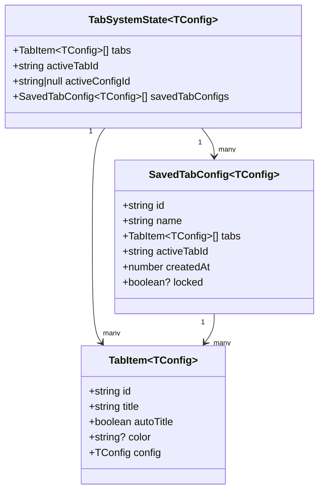
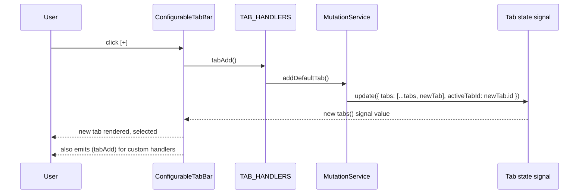
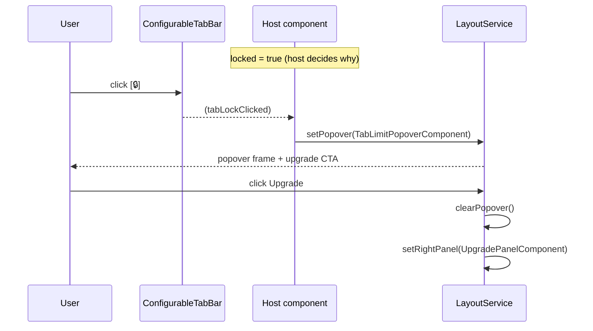
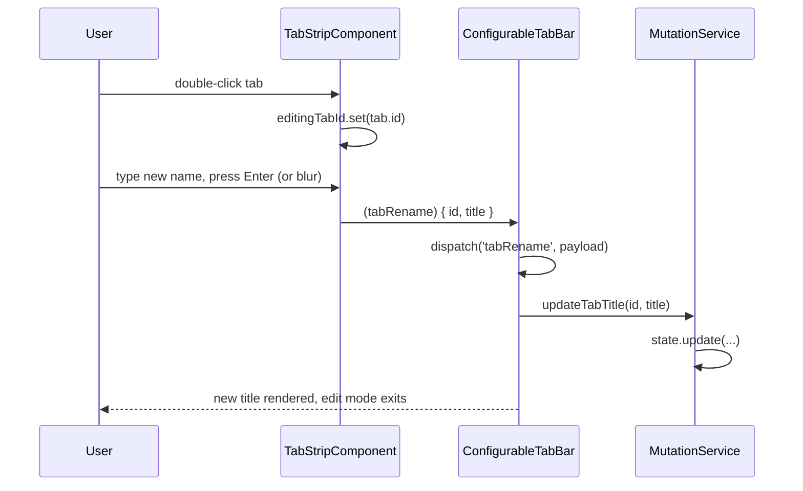
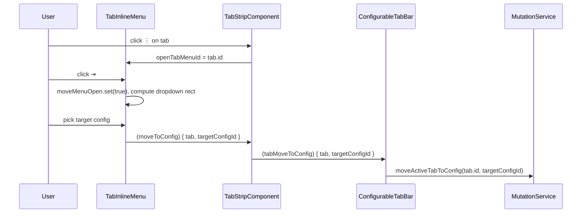
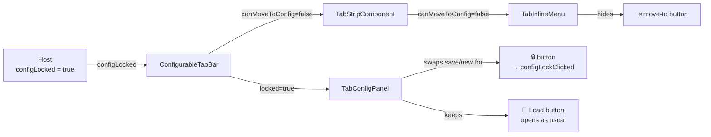
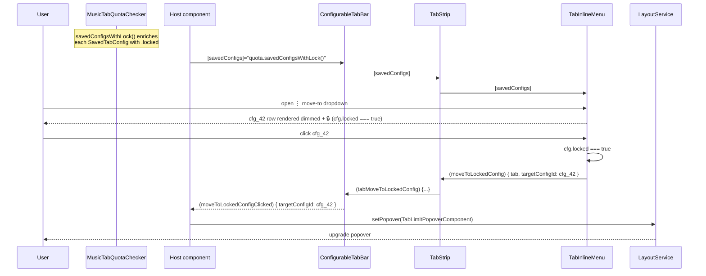
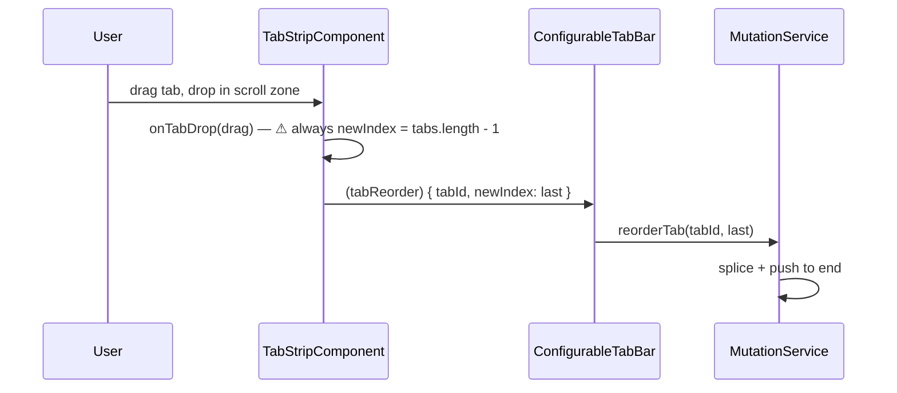
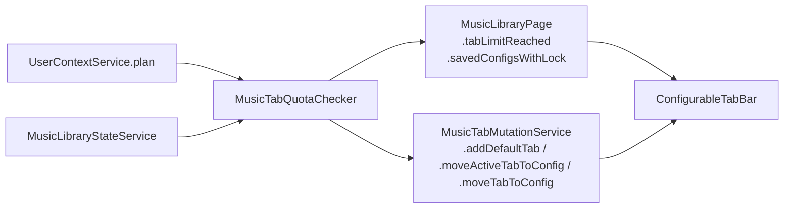

# Configurable Tab Bar

A reusable, generic tab bar with save/recall named configs, DnD reorder,
color coding, inline rename, per-tab ⋮ menu, and a host-controlled lock
system for plan/quota gating.

The bar is **agnostic of any business concept** — it knows nothing about
plans, quotas, upgrade flows, or popovers. All gating is expressed as
plain boolean inputs + click outputs that the host wires to whatever
domain logic and UI affordances fit.

---

## At a glance

| What | Where |
|------|-------|
| Entry point | [`ConfigurableTabBarComponent`](./configurable-tab-bar.component.ts) |
| Public API | [`index.ts`](./index.ts) (re-exports) |
| Types | [`configurable-tab-bar.types.ts`](./configurable-tab-bar.types.ts) |
| Mutation service base class | [`tab-mutation.service.ts`](./tab-mutation.service.ts) |
| Handler wiring | [`tab-event.helpers.ts`](./tab-event.helpers.ts) |
| Sub-components | [`tab-strip/`](./tab-strip/), [`tab-inline-menu/`](./tab-inline-menu/), [`tab-config-panel/`](./tab-config-panel/) |
| Outstanding work | [`TODO.md`](./TODO.md) |

Only consumer today: [`music-library-page`](../../features/musicLibrary/music-library-page/).

---

## Component tree

```mermaid
flowchart TB
  Host[Host component<br/>e.g. MusicLibraryPage]

  subgraph Bar[ConfigurableTabBarComponent — orchestrator]
    Strip[TabStripComponent]
    AddBtn[[sh3-button-icon<br/>plus / lock]]
    Trailing[(<br/>ng-content<br/>tabBarTrailing<br/>)]
    Panel[TabConfigPanelComponent]
    Color[(input[type=color]<br/>hidden, shared)]
  end

  Strip --> Menu[TabInlineMenuComponent<br/>per tab, when ⋮ open]

  Host -- inputs --> Bar
  Host -- outputs --> Host
  Bar -. TAB_HANDLERS .-> MutationService[TabMutationService<br/>subclass in host]
```

### Responsibility split

| Component | Owns | Never owns |
|-----------|------|-----------|
| `ConfigurableTabBarComponent` | Public API surface, `TAB_HANDLERS` dispatch, shared color picker `<input>`, add/lock button, projection slots | Any domain logic (plans, quotas, popovers) |
| `TabStripComponent` | The `@for` loop, DnD wiring, inline rename state, ⋮ toggle | Mutations (bubbled up) |
| `TabInlineMenuComponent` | Color / move-to-config / close affordances per tab, move-dropdown position | Saved config data (received as input) |
| `TabConfigPanelComponent` | Save/new/load buttons + floating panels, locked variant, config edit state, built-in toasts | Tabs (only configs) |

---

## Public API

### Inputs

| Name | Type | Default | Purpose |
|------|------|---------|---------|
| `tabs` | `TabItem<unknown>[]` | *required* | Open tabs rendered in the strip |
| `activeTabId` | `string` | *required* | Currently selected tab |
| `activeConfigId` | `string \| null` | `null` | Non-null when the active tab set mirrors a saved config — toggles Save↔New button |
| `savedConfigs` | `SavedTabConfig<unknown>[]` | `[]` | Named snapshots the user has saved |
| `showToasts` | `boolean` | `true` | Enable built-in toasts on save / new / load / delete |
| `tabLocked` | `boolean` | `false` | **Tab resource.** Swap `+` button for a `lock` and route clicks to `tabLockClicked` instead of `tabAdd`. |
| `configLocked` | `boolean` | `false` | **Config resource.** Swap the save / new-config button for a `lock` and route clicks to `configLockClicked`. Load + per-config edit surface stay open so existing configs remain accessible. Also hides the per-tab "move to config" action. |

Per-config lock is **not a separate input** — it travels on the `SavedTabConfig` data itself via the optional `locked?: boolean` field. See "State model" below and the `moveToLockedConfigClicked` output.

### Outputs

| Name | Payload | Fires when |
|------|---------|------------|
| `tabSelect` | `string` | User clicks a tab (id) |
| `tabAdd` | `void` | User clicks `+` (only unlocked) |
| `tabClose` | `string` | User clicks × inside the ⋮ menu |
| `tabRename` | `{ id; title }` | User commits an inline rename |
| `tabReorder` | `{ tabId; newIndex }` | DnD drop (⚠ currently always drops at end — see [TODO.md](./TODO.md)) |
| `tabColorChange` | `{ id; color }` | User picks a colour in the hidden picker |
| `tabMoveToConfig` | `{ tab; targetConfigId }` | User picks a target in the ⋮ move-to dropdown |
| `configSave` | `string` | User submits the save form (name) |
| `configNew` | `void` | User clicks "new blank configuration" |
| `configLoad` | `SavedTabConfig<unknown>` | User picks a config in the load menu |
| `configDelete` | `string` | User deletes a saved config (id) |
| `configRename` | `{ configId; name }` | User commits a config rename |
| `configTabRemove` | `{ configId; tabId }` | User removes a tab from a config in the load dropdown |
| `configTabRename` | `{ configId; tabId; title }` | User commits a tab rename inside the load dropdown |
| `configTabMove` | `{ sourceConfigId; targetConfigId; tabId }` | User moves a tab between configs in the load dropdown |
| `tabLockClicked` | `void` | User clicks the lock affordance (replaces the `+` button when `tabLocked`) |
| `configLockClicked` | `void` | User clicks the lock affordance (replaces the config panel when `configLocked`) |
| `moveToLockedConfigClicked` | `{ targetConfigId }` | User picks a `SavedTabConfig` whose `locked` flag is `true` in either move-to dropdown |

### Content projection slots

| Slot | Where it renders | Example |
|------|------------------|---------|
| `[tabBarTrailing]` | Between the add button and the config panel | Search input, view toggle, custom inline stats |

---

## Wiring via `TAB_HANDLERS`

Most mutation outputs follow an identical pattern — "receive event, call the
matching method on a mutation service". Rather than binding each output
manually, the bar can inject a `TabHandlers` implementation and dispatch
every mutation through it.

### Provide it in the host

```ts
@Component({
  providers: [provideTabHandlers(MusicTabMutationService)],
})
export class MusicLibraryPageComponent { … }
```

### Subclass `TabMutationService`

```ts
@Injectable({ providedIn: 'root' })
export class MusicTabMutationService extends TabMutationService<MusicTabConfig> {
  // implement the abstract state signal…
}
```

`provideTabHandlers` wires every `TabHandlers` method to the corresponding
`TabMutationService` method:

```mermaid
flowchart LR
  Bar[ConfigurableTabBar] -- dispatch -->|calls handler| Handlers[TabHandlers]
  Bar -- also emits -->|(output)| HostOutputs[Host (output) bindings]
  Handlers -->|delegates to| Service[MutationService subclass]
```

Individual `(output)` bindings still work side-by-side with the handler map —
if a host binds `(tabRename)="onSomething()"` on top of `provideTabHandlers`,
both fire for every event.

### Why `tabLockClicked` / `configLockClicked` stay out of `TabHandlers`

They aren't mutations — they're UI-level signals ("user hit the wall,
decide what to do"). Routing them through the handler map would couple the
mutation service to navigation/popover concerns it has no business with.
They're plain outputs that the host wires by hand.

---

## State model



- `TabItem.config` carries whatever domain data the host needs per tab —
  music search filters, a query string, an editor mode, etc. Opaque to the
  bar.
- `activeConfigId !== null` means the currently-open set of tabs is the
  active view of a saved config. Mutations are mirrored into the saved
  config so the "forgot to save" problem is avoided (see the rationale in
  `TODO-music-features.md`).
- `SavedTabConfig.locked?` is **UI metadata, not persisted state** — it's
  an optional flag the host enriches each config with before binding. The
  bar reads `cfg.locked` directly in every move-to dropdown, so there's
  no separate lookup table or input threaded through the component tree.
  When absent it's treated as `false` (unlocked). The storage layer
  should strip it before saving to the backend; the host's quota checker
  recomputes it on every render.

---

## User flows

### 1. Add a tab (unlocked)



### 2. Try to add a tab when locked



The bar never imports the popover or the upgrade panel — those are host
concerns. The bar just says "user hit the lock, over to you".

### 3. Inline rename a tab



### 4. Save + load a config

```mermaid
sequenceDiagram
  participant U as User
  participant Panel as TabConfigPanel
  participant Bar as ConfigurableTabBar
  participant S as MutationService

  rect rgb(35, 40, 55)
    note right of U: Save
    U->>Panel: click 💾 → toggleSaveForm()
    U->>Panel: type name, Enter
    Panel->>Bar: (configSave) "My config"
    Bar->>S: saveTabConfig("My config")
    S->>S: push SavedTabConfig, set activeConfigId
    Panel->>Panel: toast("Config saved")
  end

  rect rgb(30, 40, 45)
    note right of U: Load (later)
    U->>Panel: click 📂 → toggleLoadMenu()
    U->>Panel: click a config row
    Panel->>Bar: (configLoad) config
    Bar->>S: applyTabConfig(config)
    S->>S: replace tabs with config.tabs
    Panel->>Panel: toast("Config applied")
  end
```



### 5. Move active tab to another config



### 6. Save/recall locked — full gating



This is the downgrade case. A user on Pro saves configs, then downgrades
to Free:

- The `TabConfigPanel` collapses to a single 🔒 — user can't save, load,
  rename, delete or reorganise configs from here.
- The per-tab ⋮ menu still opens, still lets the user colour/rename/close
  tabs, **but the move-to-config button is hidden** so the user can't
  shovel tabs into the frozen configs either.
- Existing configs aren't deleted — they stay in persistence, invisible
  via this UI until the user re-upgrades. Consistent with the platform's
  "freeze, never delete" quota policy (see
  `apps/backend/documentation/sh3-platform-contract.md`).

### 7. Move tab into a config that's already at quota



Belt-and-suspenders: even if a tab reaches the mutation service somehow
(future keyboard shortcut, race condition, custom host binding that
ignores the `.locked` flag), `MusicTabMutationService.moveActiveTabToConfig`
and `moveTabToConfig` both call `quota.canMoveToConfig(id)` and no-op when
the target config is full. The bar never bypasses quota silently.

### 8. Drag to reorder (current behaviour)



The drop-at-end behaviour is a known bug — the underlying
`dnd-drop-zone.directive.ts` only emits zone-level drops (no index within
the zone). Fixing it is deferred, see [TODO.md § Deferred](./TODO.md).

---

## Lock contract — summary

The bar exposes three uniform lock surfaces — one per resource type:

| Resource | Where the lock state comes from | Output | Visual swap |
|----------|---------------------------------|--------|-------------|
| **Tab** | `[tabLocked]` input | `tabLockClicked` | `+` → `lock` icon |
| **Config** | `[configLocked]` input | `configLockClicked` | Save / new-config button → `lock` icon (load stays open) |
| **Per-config** (tabs-in-config) | `SavedTabConfig.locked` on each config item | `moveToLockedConfigClicked` | Matching row(s) in every move-to dropdown → dimmed + `lock` glyph |

The first two are binary "the whole bar is in state X" switches, so they
live as inputs on the orchestrator. The third is per-item, so it rides
on the data rather than on a separate input — this keeps the component
tree free of an extra prop to drill through three levels.

**Invariants:**

- When `configLocked` is true, `canMoveToConfig` on `TabStripComponent`
  is automatically set to `false` by the orchestrator. The host doesn't
  need to duplicate the gate.
- Both move-to surfaces (the per-tab ⋮ menu and the expanded config panel
  submenu) read `cfg.locked` directly from the same `savedConfigs` input,
  so the host enriches configs once and every downstream read stays in sync.
- The bar never modifies state as a result of a lock click — it only
  notifies the host, which decides what to do (popover, tooltip, right
  panel, nothing, …).
- Flipping a lock input doesn't unmount anything — the panel and the add
  button stay in the DOM, just re-render in a different variant. State
  (e.g. `showLoadMenu`, `moveMenuOpen`) is reset by the variant change.
- The inline menu's move-to button is gated by `canMoveToConfig`, the close
  button by `canClose`, and neither propagates into `TabHandlers` — they're
  purely local UI decisions.

**The checker pattern — single source of quota truth.** Hosts that gate
on a quota should concentrate the "can this operation go through?"
questions in one class rather than scattering them across components and
services. The music library does this via `MusicTabQuotaChecker`:



Every `can*` answer flows from the same source, so the UI lock and the
service-level gates can never disagree.

**Defense in depth — mutation service gates.** The UI lock is the
primary feedback path, but `MusicTabMutationService` also calls
`quota.canAddTab` / `quota.canMoveToConfig` in the overrides of
`addDefaultTab`, `moveActiveTabToConfig` and `moveTabToConfig`. This
covers:

- The async race during initial plan load (before `UserContextService.plan()`
  resolves, the UI lock hasn't kicked in yet — the checker's `null →
  most-restrictive` fallback protects the service).
- Any future code path that reaches the service without going through
  the bar (keyboard shortcuts, imports, tests).
- Custom host bindings that forget to wire one of the lock inputs.

---

## Downgrade / upgrade matrix

| Plan state | `tabLocked` | `configLocked` | `cfg.locked` on each saved config | Effect |
|------------|-------------|----------------|-----------------------------------|--------|
| Free (first visit) | false until 3 tabs | **true** (0 configs quota) | n/a (no configs ever) | Add works up to 3 tabs. Save / new-config is locked. Load stays open but empty. Per-tab move-to hidden. |
| Free (hit tab limit) | **true** | **true** | n/a | Both global locks active. Clicking either surfaces the host's popover. |
| Pro (nominal, 0-4 configs) | false until 10 tabs | false (up to 5 configs) | true for configs with `tabs.length ≥ 10` | Full bar. A config that fills up (10 tabs) auto-locks as a move-to target. |
| Pro at config cap (5/5) | false until 10 tabs | **true** (can't add more configs) | based on per-config tab count | Save / new-config swap to a lock; existing 5 configs still loadable / renamable / deletable from the load menu. |
| Pro → Free downgrade with saved configs | false until 3 tabs | **true** (0 configs quota) | based on per-config tab count | Save locked, load still shows the old configs (read-only management). Per-tab move-to hidden. Re-upgrade re-opens save. |
| Plan signal not loaded yet | false | **true** (0 configs quota) | `false` on all configs | `MusicTabQuotaChecker` treats null plan as most-restrictive (free → 3 tabs / 0 configs), so service gates block adds before the UI lock catches up. |

The bar does not own the plan check. The host computes each boolean from
whatever source of truth it wants — `UserContextService`, a route data
resolver, a feature flag, etc.

---

## File map

```
configurable-tab-bar/
├── README.md                             ← this file
├── TODO.md                               ← outstanding component work
├── index.ts                              ← public API re-exports
├── configurable-tab-bar.component.{ts,html,scss}
├── configurable-tab-bar.types.ts         ← TabItem, SavedTabConfig, TabSystemState, TabStateSignal
├── tab-event.helpers.ts                  ← TabHandlers, TAB_HANDLERS, provideTabHandlers
├── tab-mutation.service.ts               ← abstract base for host's MutationService subclass
├── tab-strip/
│   └── tab-strip.component.{ts,html,scss}
├── tab-inline-menu/
│   └── tab-inline-menu.component.{ts,html,scss}
└── tab-config-panel/
    └── tab-config-panel.component.{ts,html,scss}
```

Sub-components are **not** re-exported from `index.ts` — they're internal
to the bar. Only the orchestrator, the handler helpers, the mutation
service base, and the types are public.

---

## Minimal host example

### The checker — single source of quota truth

```ts
// music-tab-quota-checker.service.ts
@Injectable({ providedIn: 'root' })
export class MusicTabQuotaChecker {
  readonly maxTabs = computed(() => maxTabsForPlan(this.userCtx.plan()));

  canAddTab(): boolean {
    return this.maxTabs() === -1 || this.state.tabState().tabs.length < this.maxTabs();
  }
  isConfigFull(id: string): boolean {
    const max = this.maxTabs();
    const cfg = this.state.tabState().savedTabConfigs?.find(c => c.id === id);
    return max !== -1 && !!cfg && cfg.tabs.length >= max;
  }
  canMoveToConfig(id: string): boolean { return !this.isConfigFull(id); }

  readonly savedConfigsWithLock = computed(() =>
    (this.state.tabState().savedTabConfigs ?? [])
      .map(c => ({ ...c, locked: this.maxTabs() !== -1 && c.tabs.length >= this.maxTabs() }))
  );
}
```

### The mutation service — delegates to the checker

```ts
// music-tab-mutation.service.ts
export class MusicTabMutationService extends TabMutationService<MusicTabConfig> {
  private quota = inject(MusicTabQuotaChecker);

  override addDefaultTab(): void {
    if (!this.quota.canAddTab()) return;
    super.addDefaultTab();
  }
  override moveActiveTabToConfig(tabId: string, targetConfigId: string): void {
    if (!this.quota.canMoveToConfig(targetConfigId)) return;
    super.moveActiveTabToConfig(tabId, targetConfigId);
  }
  override moveTabToConfig(s: string, t: string, tabId: string): void {
    if (!this.quota.canMoveToConfig(t)) return;
    super.moveTabToConfig(s, t, tabId);
  }
}
```

### The page — binds + routes lock clicks

```ts
// music-library-page.component.ts
protected quota = inject(MusicTabQuotaChecker);
readonly tabLocked = computed(() => !this.quota.canAddTab());
readonly configLocked = computed(() => this.userCtx.plan() === 'artist_free');

openTabQuotaPopover(): void    { this.layout.setPopover(TabLimitPopoverComponent); }
openConfigQuotaPopover(): void { this.layout.setPopover(SaveRecallLockedPopoverComponent); }
openConfigFullPopover(_e: { targetConfigId: string }): void {
  this.layout.setPopover(TabLimitPopoverComponent);
}
```

```html
<sh3-configurable-tab-bar
  [tabs]="selector.tabs()"
  [activeTabId]="selector.activeTabId()"
  [activeConfigId]="selector.activeConfigId()"
  [savedConfigs]="quota.savedConfigsWithLock()"
  [tabLocked]="tabLocked()"
  [configLocked]="configLocked()"
  (tabLockClicked)="openTabQuotaPopover()"
  (configLockClicked)="openConfigQuotaPopover()"
  (moveToLockedConfigClicked)="openConfigFullPopover($event)">

  <div tabBarTrailing>
    <!-- domain-specific search input, view toggle, whatever -->
  </div>
</sh3-configurable-tab-bar>
```

---

## Related docs

- [`TODO.md`](./TODO.md) — deferred / backlog items for this component
- [`documentation/todos/TODO-configurable-tab-bar.md`](../../../../../../documentation/todos/TODO-configurable-tab-bar.md) — status overview that delegates to this folder
- [`documentation/todos/TODO-music-features.md`](../../../../../../documentation/todos/TODO-music-features.md) — the only consumer's roadmap
- [`apps/backend/documentation/sh3-platform-contract.md`](../../../../../../apps/backend/documentation/sh3-platform-contract.md) — downgrade / freeze policy the lock contract lines up with
