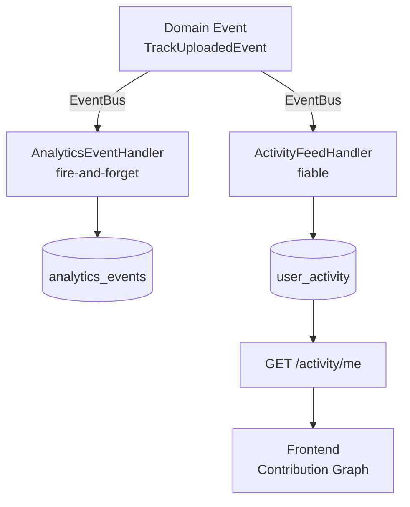

# User Activity Feed

> **Status** : Planification  
> **Date** : 2026-04-14  
> **Dépend de** : Event Store (Phase 1 done), Domain Events infrastructure

---

## Concept

Un activity feed par user, affiché comme un graphe de contribution (carrés colorés par jour) et/ou une timeline d'actions récentes. Chaque action métier (créer un morceau, mastering, nouvelle version, playlist…) génère une entrée dans le feed.

**Ce n'est PAS l'analytics event store** — les deux sont alimentés par les mêmes domain events, mais avec des projections différentes :

| | Analytics (`analytics_events`) | Activity Feed (`user_activity`) |
|---|---|---|
| **But** | Dashboard admin, métriques business | Feed user, contribution graph |
| **Fiabilité** | Fire-and-forget (erreurs silencées) | Garanti (l'action DOIT apparaître) |
| **Données** | Dénormalisées (`metadata: Record`) | Enrichies (nom du track, couleur) |
| **Rétention** | Archivage possible après 2 ans | Permanent (tant que le user existe) |
| **Lecture** | Agrégations admin (rare) | Query user + date range (fréquent) |

---

## Architecture



### Un event, deux projections

```typescript
// Même TrackUploadedEvent, deux handlers distincts

@EventsHandler(TrackUploadedEvent)
export class TrackUploadedAnalyticsHandler {
  // → analytics_events (fire-and-forget, pour dashboards admin)
}

@EventsHandler(TrackUploadedEvent)
export class TrackUploadedActivityHandler {
  // → user_activity (fiable, enrichi avec le nom du track)
}
```

---

## Collection `user_activity`

```typescript
interface TUserActivity {
  id: string;                      // activity_xxx
  user_id: TUserId;
  action: TActivityAction;
  entity_type: string;             // 'reference' | 'version' | 'track' | 'playlist' | ...
  entity_id: string;               // ID de l'entité concernée
  label: string;                   // "Added 'Bohemian Rhapsody'" — texte lisible
  metadata?: Record<string, unknown>; // données additionnelles optionnelles
  timestamp: Date;
}
```

### Actions trackées

```typescript
type TActivityAction =
  // Music
  | 'reference_created'
  | 'version_created'
  | 'track_uploaded'
  | 'track_mastered'
  | 'track_ai_mastered'
  | 'track_pitch_shifted'
  | 'repertoire_entry_created'
  | 'playlist_created'
  | 'playlist_track_added'
  // Account
  | 'plan_changed'
  | 'credit_pack_purchased'
  ;
```

---

## Contribution Graph (carrés)

### Query pour le graph

```javascript
// Nombre d'actions par jour sur les 365 derniers jours
db.user_activity.aggregate([
  { $match: { user_id: 'user_xxx', timestamp: { $gte: ISODate('2025-04-14') } } },
  { $group: {
      _id: { $dateToString: { format: '%Y-%m-%d', date: '$timestamp' } },
      count: { $sum: 1 }
  }},
  { $sort: { _id: 1 } }
])
```

### Rendu frontend

```
GET /activity/me/graph?days=365
→ { data: { "2026-04-14": 5, "2026-04-13": 2, "2026-04-10": 8, ... } }
```

Chaque carré = un jour, intensité de couleur basée sur le count :
- 0 actions → gris foncé (vide)
- 1-2 → vert pâle
- 3-5 → vert moyen
- 6+ → vert intense

### Timeline récente

```
GET /activity/me?limit=20
→ { data: [
    { action: 'track_uploaded', label: "Uploaded 'demo_v3.wav'", timestamp: ... },
    { action: 'reference_created', label: "Added 'Bohemian Rhapsody'", timestamp: ... },
    ...
  ]}
```

---

## Indexes

```javascript
// Query par user + date (contribution graph + timeline)
db.user_activity.createIndex({ user_id: 1, timestamp: -1 });

// Optionnel : par action type si on filtre
db.user_activity.createIndex({ user_id: 1, action: 1, timestamp: -1 });
```

---

## Implémentation

### Phase 1 — Backend
- [ ] `TUserActivity` type dans shared-types
- [ ] `TActivityAction` const array (même pattern que `ANALYTICS_EVENT_TYPES`)
- [ ] `UserActivityMongoRepo` — insert + query par user + aggregation par jour
- [ ] `UserActivityService` — `record(userId, action, entityType, entityId, label)`
- [ ] Event handlers (un par domain event existant) :
  - [ ] `TrackUploadedEvent` → record activity
  - [ ] `PlanChangedEvent` → record activity
  - [ ] Futurs events au fur et à mesure
- [ ] `GET /activity/me` — timeline paginée
- [ ] `GET /activity/me/graph` — aggregation par jour

### Phase 2 — Frontend
- [ ] `ActivityGraphComponent` — carrés SVG/CSS grid, intensité par count
- [ ] `ActivityTimelineComponent` — liste d'actions récentes avec icônes
- [ ] Intégration dans le profil user (nouvel onglet ou section)

### Phase 3 — Enrichissement
- [ ] Labels dynamiques (résolution du nom du track/playlist via lookup)
- [ ] Actions de suppression (track supprimé, playlist supprimée)
- [ ] Filtrage par type d'action dans le frontend
