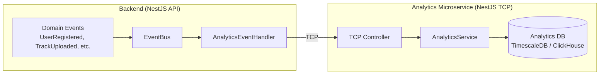

# Analytics Microservice — TODO

> Status : Backlog — à implémenter après le mailer et Auth0

## Context

Les événements métier (inscription, login, upload, mastering, etc.) doivent être trackés pour des dashboards admin, du monitoring business, et des métriques produit. Ces stats doivent vivre dans un micro-service séparé pour ne pas impacter les performances de l'API principale.

## Architecture

## Design

- **Transport** : NestJS TCP (même pattern que `audio-processor`)
- **Fire-and-forget** : le handler backend publie et n'attend pas de réponse — si l'analytics est down, aucun impact sur l'API
- **Idempotent** : chaque event a un `eventId` unique pour dédupliquer les retries
- **Micro-service NestJS** : dans `apps/analytics/` du monorepo

## Events à tracker

### Auth
| Event | Données | Priorité |
|-------|---------|----------|
| `UserRegistered` | userId, email, plan, timestamp | Haute |
| `UserLoggedIn` | userId, IP, user-agent, timestamp | Haute |
| `LoginFailed` | email, reason (invalid_credentials, locked), timestamp | Haute |
| `PasswordChanged` | userId, timestamp | Moyenne |
| `PasswordReset` | userId, timestamp | Moyenne |
| `AccountLocked` | userId, failedAttempts, timestamp | Haute |

### Music
| Event | Données | Priorité |
|-------|---------|----------|
| `TrackUploaded` | userId, versionId, fileSize, timestamp | Haute |
| `TrackMastered` | userId, versionId, masterType (standard/ai), timestamp | Haute |
| `RepertoireEntryCreated` | userId, referenceId, timestamp | Moyenne |
| `CrossLibrarySearched` | companyId, memberCount, resultCount, timestamp | Moyenne |

### Platform
| Event | Données | Priorité |
|-------|---------|----------|
| `PlanUpgraded` | userId, fromPlan, toPlan, timestamp | Haute |
| `QuotaExceeded` | userId, resource, current, limit, timestamp | Haute |

## Implémentation

### Phase 1 — Infrastructure
- [ ] Créer `apps/analytics/` (NestJS micro-service TCP)
- [ ] Choisir la DB analytics (TimescaleDB pour time-series, ou MongoDB si on veut rester simple au début)
- [ ] Configurer le transport TCP dans `app.module.ts` (comme `AUDIO_PROCESSOR`)
- [ ] Pattern de message : `{ pattern: 'analytics.track', data: { eventType, payload, timestamp, eventId } }`

### Phase 2 — Backend event forwarding
- [ ] Créer `src/analytics/AnalyticsEventForwarder.ts` — handler générique qui écoute les domain events et les publie via TCP
- [ ] Brancher sur `UserRegisteredEvent` (existe déjà)
- [ ] Ajouter les events manquants (`UserLoggedInEvent`, `LoginFailedEvent`, etc.)

### Phase 3 — Storage & Queries
- [ ] Schema de stockage : `{ event_type, payload (JSON), user_id, timestamp, event_id }`
- [ ] Index sur `event_type + timestamp` pour les requêtes de dashboard
- [ ] Agrégations : inscriptions/jour, logins/jour, uploads/semaine, quota usage

### Phase 4 — Dashboard admin
- [ ] Endpoint `GET /admin/analytics/summary` — métriques clés
- [ ] Frontend : page admin avec graphiques (Chart.js ou D3)

## Questions ouvertes

- MongoDB suffit-il pour commencer ou faut-il directement une DB time-series ?
- Faut-il un message broker (RabbitMQ) entre le backend et l'analytics, ou le TCP direct suffit ?
- Rétention des données : combien de temps garder le détail vs les agrégations ?
