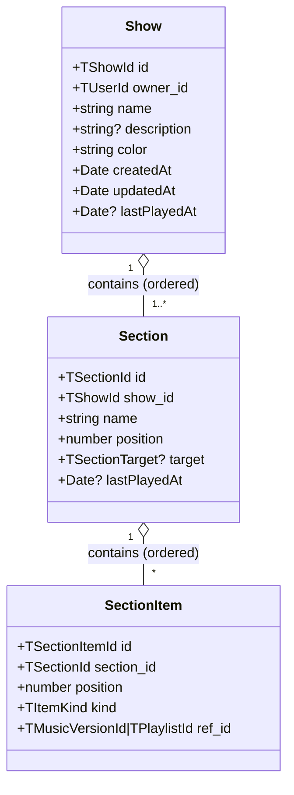

# Artist Shows — Feature TODO

> **Status** : MVP shipped (Phases 1–8 done). Premium UX pass shipped (sparkline stats, inline rename, per-section + whole-show duration targets + fill %, DnD section reordering with insertion indicator, new-show popover). Tests + doc polishing still to come (Phase 9 partial — technical doc landed in `apps/backend/documentation/sh3-shows.md`; E2E tests + frontend doc TBD).
> **Date** : 2026-04-20
> **Dépend de** : Plans artist/company (done), QuotaService (done), Playlist V2 (rating series live), account-scope guards (done)

---

## Context

Pour les artistes, un **Show** est un plan de performance personnel. Indépendant de toute company, du module `Program` existant (timeline company, inchangé), et de toute notion d'event booking. Objectif : préparer un live (solo ou répétition), enchaîner des playlists + tracks, visualiser les courbes mastery/energy/effort comme sur une playlist, marquer comme joué pour alimenter les stats de pratique.

|                  | Program (company)                                | Show (artist)                                  |
| ---------------- | ------------------------------------------------ | ---------------------------------------------- |
| Module           | `features/programs/` (frontend only aujourd'hui) | nouveau `features/shows/`                      |
| Scope backend    | `@ContractScoped()`                              | `@PlatformScoped()`                            |
| Plans            | `company_*`                                      | `artist_pro`, `artist_max`                     |
| Shape            | timeline multi-rooms, slots, artistes bookés     | show → sections → items (versions + playlists) |
| Utilisateur type | manager, booker                                  | artiste                                        |

**Show ≠ Program.** Ne pas toucher le module Program, même nom de concept mais métier différent. Les deux pourront plus tard se rencontrer (une participation à un event pourrait instancier un show) — hors scope ici.

---

## Modèle



Types shared-types :

```ts
type TShowId = `show_${string}`;
type TSectionId = `showSection_${string}`;
type TSectionItemId = `showSectionItem_${string}`;

type TItemKind = "version" | "playlist";

type TSectionTarget =
  | { mode: "duration"; duration_s: number }
  | { mode: "track_count"; track_count: number };
// null/undefined target = no target, purely indicatif

type TShowDomainModel = {
  id: TShowId;
  owner_id: TUserId;
  name: string;
  description?: string;
  color: TRatingColor; // réutilise le palette existant des playlists
  createdAt: Date;
  updatedAt: Date;
  lastPlayedAt?: Date;
};

type TSectionDomainModel = {
  id: TSectionId;
  show_id: TShowId;
  name: string;
  position: number;
  target?: TSectionTarget;
  lastPlayedAt?: Date;
};

type TSectionItemDomainModel = {
  id: TSectionItemId;
  section_id: TSectionId;
  position: number;
  kind: TItemKind;
  ref_id: TMusicVersionId | TPlaylistId;
};
```

**Invariants** :

- Un show a toujours ≥ 1 section (création d'un show → crée 1 section "Set 1" par défaut).
- UI "single mode" = 1 section, headers cachés. "Divided" = 2+. Pas de flag sur l'entité.
- Les items référencent uniquement des versions/playlists appartenant à `owner_id` (vérifié dans le handler). Pas de cross-user pour le MVP.
- `Section.position` et `SectionItem.position` sont denses dans leur parent (reordering recompacte).

---

## View model (API → Frontend)

Similaire à `TPlaylistSummaryViewModel` mais enrichi d'une hiérarchie :

```ts
type TShowSummaryViewModel = {
  id: TShowId;
  name: string;
  description?: string;
  color: TRatingColor;
  createdAt: number;
  updatedAt: number;
  lastPlayedAt?: number;
  sectionCount: number;
  trackCount: number; // expansion totale (playlists développées)
  totalDurationSeconds: number;

  // Courbes agrégées sur toute la liste de versions (même logique que playlist)
  meanMastery: number;
  meanEnergy: number;
  meanEffort: number;
  meanQuality: number;
  masterySeries: number[];
  energySeries: number[];
  effortSeries: number[];
  qualitySeries: number[];
};

type TShowDetailViewModel = TShowSummaryViewModel & {
  sections: TSectionViewModel[];
};

type TSectionViewModel = {
  id: TSectionId;
  name: string;
  position: number;
  target?: TSectionTarget;
  lastPlayedAt?: number;
  items: TSectionItemViewModel[];

  // Courbes par section (même shape que playlist) — calculées sur les versions expandées
  trackCount: number;
  totalDurationSeconds: number;
  meanMastery: number;
  meanEnergy: number;
  meanEffort: number;
  meanQuality: number;
  masterySeries: number[];
  energySeries: number[];
  effortSeries: number[];
  qualitySeries: number[];
};

type TSectionItemViewModel =
  | {
      kind: "version";
      id: TSectionItemId;
      position: number;
      version: TVersionView;
    }
  | {
      kind: "playlist";
      id: TSectionItemId;
      position: number;
      playlist: {
        id: TPlaylistId;
        name: string;
        color: TRatingColor;
        trackCount: number;
      };
    };
```

Les playlists ne sont **pas** expandées dans la réponse — le frontend affiche l'item comme un "bloc playlist" avec count + mini-sparkline. Les séries agrégées (`*Series`) du show/section sont calculées côté backend par expansion récursive (une playlist = N versions denses en mastery/energy/effort).

---

## Permissions & plans

### Nouvelle famille

```ts
P.Music.Show = {
  Read: "music:show:read",
  Write: "music:show:write",
  Delete: "music:show:delete",
  Own: "music:show:own",
};
```

### Allocation aux plans

| Plan          | Show permissions               | Notes                                                                              |
| ------------- | ------------------------------ | ---------------------------------------------------------------------------------- |
| `artist_free` | —                              | Feature non disponible. 403 `REQUIRES_UPGRADE` côté API, modal upgrade côté front. |
| `artist_pro`  | `music:show:own`               | CRUD sur ses propres shows uniquement. Même pattern que `music:playlist:own`.      |
| `artist_max`  | `music:show:*`                 | CRUD complet (lecture + écriture). Reste scoped au user via `@PlatformScoped`.     |
| `company_*`   | `music:show:*` (via `music:*`) | Hérité si/quand `company_pro` obtient `music:*`. À valider avec la matrice plans.  |

### Quotas

| Ressource                    | artist_pro | artist_max | Notes                                       |
| ---------------------------- | ---------- | ---------- | ------------------------------------------- |
| `show_count` (lifetime)      | 10         | ∞          | Simple cap. Credit pack possible plus tard. |
| items/section, sections/show | ∞ partout  | ∞          | Pas de quota MVP.                           |

Ajouter `show_count` à `PLAN_QUOTAS` dans `QuotaLimits.ts`, et l'`ensureAllowed` dans le `CreateShowHandler`.

---

## Backend — modules & fichiers à créer

```
apps/backend/src/shows/
├── domain/
│   ├── ShowEntity.ts               — rename, changeColor, updateDescription, touch (updatedAt)
│   ├── SectionEntity.ts            — rename, setTarget, move
│   ├── SectionItemEntity.ts        — change position (via aggregate)
│   ├── ShowAggregate.ts            — show + sections + items. addSection, removeSection,
│                                    reorderSections, addItem, removeItem, reorderItems,
│                                    markPlayed, markSectionPlayed, duplicate, ensureOwnedBy
│   └── ShowPolicy.ts               — structural invariants (≥1 section, ownership of refs)
├── infra/
│   ├── ShowMongoRepository.ts      — save aggregate (diff + removed), findById, findByOwner
│   └── ShowAggregateRepository.ts  — load aggregate by id or by owner+id
├── application/
│   ├── commands/
│   │   ├── CreateShowCommand.ts              → Quota(show_count) + create default section
│   │   ├── UpdateShowInfoCommand.ts          → name, description, color
│   │   ├── DeleteShowCommand.ts              → cascade sections + items
│   │   ├── DuplicateShowCommand.ts           → deep copy avec nouveaux IDs, "Copy of ..."
│   │   ├── AddSectionCommand.ts
│   │   ├── UpdateSectionCommand.ts           → name, target
│   │   ├── RemoveSectionCommand.ts           → refuse si c'est la dernière section
│   │   ├── ReorderSectionsCommand.ts
│   │   ├── AddSectionItemCommand.ts          → { sectionId, kind, ref_id } + valide ownership
│   │   ├── RemoveSectionItemCommand.ts
│   │   ├── ReorderSectionItemsCommand.ts
│   │   ├── MarkShowPlayedCommand.ts          → émet track_played pour chaque item (expansion
│                                              playlist), set lastPlayedAt sur show et sections
│   │   ├── MarkSectionPlayedCommand.ts       → idem sur une section seulement
│   │   └── ConvertSectionToPlaylistCommand.ts → expand section → new TPlaylistEntity
│   └── queries/
│       ├── GetShowByIdQuery.ts               → TShowDetailViewModel
│       ├── ListShowsByOwnerQuery.ts          → TShowSummaryViewModel[]
│       └── computeSectionSeries()            → helper pur, shared avec playlist computations
├── api/
│   └── show.controller.ts          — @PlatformScoped + @RequirePermission(P.Music.Show.*)
├── dto/
│   └── show.dto.ts                 — createZodDto(SShowDetailViewModel), etc.
├── api/codes/
│   └── show.codes.ts
└── shows.module.ts
```

### Endpoints (tous `@PlatformScoped()`)

| Method   | Route                                          | Permission                      | Body                                    | Returns                     |
| -------- | ---------------------------------------------- | ------------------------------- | --------------------------------------- | --------------------------- |
| `GET`    | `/shows/me`                                    | `Show.Read`                     | —                                       | `TShowSummaryViewModel[]`   |
| `GET`    | `/shows/:id`                                   | `Show.Read`                     | —                                       | `TShowDetailViewModel`      |
| `POST`   | `/shows`                                       | `Show.Write`                    | `{ name, description?, color }`         | `TShowDetailViewModel`      |
| `PATCH`  | `/shows/:id`                                   | `Show.Write`                    | `Partial<{ name, description, color }>` | `TShowDetailViewModel`      |
| `DELETE` | `/shows/:id`                                   | `Show.Delete`                   | —                                       | `204`                       |
| `POST`   | `/shows/:id/duplicate`                         | `Show.Write`                    | —                                       | `TShowDetailViewModel`      |
| `POST`   | `/shows/:id/sections`                          | `Show.Write`                    | `{ name, target? }`                     | `TShowDetailViewModel`      |
| `PATCH`  | `/shows/:id/sections/:sectionId`               | `Show.Write`                    | `Partial<{ name, target }>`             | `TShowDetailViewModel`      |
| `DELETE` | `/shows/:id/sections/:sectionId`               | `Show.Write`                    | —                                       | `TShowDetailViewModel`      |
| `PATCH`  | `/shows/:id/sections/reorder`                  | `Show.Write`                    | `{ ordered_ids: TSectionId[] }`         | `TShowDetailViewModel`      |
| `POST`   | `/shows/:id/sections/:sectionId/items`         | `Show.Write`                    | `{ kind, ref_id, position? }`           | `TShowDetailViewModel`      |
| `DELETE` | `/shows/:id/sections/:sectionId/items/:itemId` | `Show.Write`                    | —                                       | `TShowDetailViewModel`      |
| `PATCH`  | `/shows/:id/sections/:sectionId/items/reorder` | `Show.Write`                    | `{ ordered_ids: TSectionItemId[] }`     | `TShowDetailViewModel`      |
| `POST`   | `/shows/:id/played`                            | `Show.Write`                    | `{ playedAt?: ISO }`                    | `TShowDetailViewModel`      |
| `POST`   | `/shows/:id/sections/:sectionId/played`        | `Show.Write`                    | `{ playedAt?: ISO }`                    | `TShowDetailViewModel`      |
| `POST`   | `/shows/:id/sections/:sectionId/to-playlist`   | `Show.Write` + `Playlist.Write` | `{ name?, color? }`                     | `TPlaylistSummaryViewModel` |

---

## Analytics — `track_played`

### Event

Ajouter `track_played` à `ANALYTICS_EVENT_TYPES` (shared-types) :

```ts
{
  type: 'track_played',
  user_id: TUserId,
  timestamp: Date,
  metadata: {
    version_id: TMusicVersionId,
    track_id: TVersionTrackId,          // la favorite track de la version au moment du play
    source: 'show' | 'section' | 'manual' | 'playlist',
    source_id?: TShowId | TSectionId | TPlaylistId,
    duration_seconds_estimate: number,  // durée de la track, pas le temps réellement joué (MVP)
  }
}
```

### Commands qui émettent

- `MarkShowPlayedHandler` → pour chaque section → pour chaque item (expand playlist) → 1 `track_played` par version favorite. `source = 'show'`, `source_id = show_id`. Met aussi `lastPlayedAt` sur le show ET toutes les sections.
- `MarkSectionPlayedHandler` → même logique sur une section, `source = 'section'`, `source_id = section_id`.

### Dédoublonnage

MVP : pas de dédoublonnage. Si une track apparaît 3 fois (2 playlists qui la contiennent + 1 item version), on émet 3 events. C'est correct : ça reflète la réalité de combien de fois la track sera jouée pendant le show.

### Play-stats projection

Hors scope MVP. `TODO-music-features.md` prévoit `music_plays` + `TrackPlayedEvent` pour les stats. Quand ce sera implémenté, les handlers analytics lisent `track_played` et alimentent la projection — aucun changement côté Show.

---

## Frontend — modules & fichiers

```
apps/frontend-webapp/src/app/features/shows/
├── shows-page/                     — liste des shows, grid de cards (réutilise card pattern des playlists)
├── show-detail-page/               — détail d'un show : header + sections + items + courbes
│   ├── section-list/               — renders sections ordered
│   ├── section-card/               — header + items + mini-sparkline + mark-played button
│   ├── item-row/                   — item view (version ou playlist bloc)
│   └── section-target-chip/        — chip "45 min" / "10 songs"
├── side-panels/
│   └── show-library-side-panel/    — panel de sélection versions/playlists à dropper
├── services/
│   ├── shows.service.ts            — HTTP (ScopedHttpClient, pas de withContract)
│   ├── shows.store.ts              — signal store (liste + détail courant)
│   └── show-mutations.service.ts   — mutations + optimistic updates
├── dnd/
│   └── show-dnd.service.ts         — DnD session réutilisant le pattern playlist
└── show-types.ts                   — types view-model spécifiques frontend
```

### UX clés

- **Créer un show** : modal minimal (name + color) → POST /shows → redirect vers detail.
- **Single vs divided** : show avec 1 section n'affiche pas de headers de section. Clicker "+ Section" crée la 2e et révèle les headers.
- **Drop d'une playlist** : ajoute 1 item `kind: 'playlist'` (pas d'expansion). Affichage bloc avec couleur + count.
- **Drop d'une version (track card)** : ajoute 1 item `kind: 'version'`.
- **Convertir section → playlist** : bouton sur section card → modal (nom de la playlist) → POST /to-playlist → toast + lien vers la playlist créée.
- **Dupliquer show** : bouton sur show card + show header → POST /duplicate → toast + redirect vers la copie.
- **Mark played** : deux boutons. "Section played" sur chaque section header. "Show played" global dans le header du show (marque tout en bloc).
- **Courbes** : mêmes composants `rating-sparkline` que playlist, alimentés par les `*Series` du view model de la section (et une courbe agrégée sur le header du show).

### Menu + route

- Nouvelle route : `/app/shows` (liste), `/app/shows/:id` (détail).
- Guard : `canActivate: [requireArtistPlanGuard({ minTier: 'pro' })]` OU extension du menu filter en plus de `isArtist` pour aussi exiger `pro+`. Ajouter un signal `canUseShows = computed(() => ['artist_pro','artist_max','company_*'].includes(plan()))`. Guard associé à créer dans `account-scope.guards.ts`.
- Entrée menu : `Shows` (icône à choisir, probablement une variante de `play` ou `list`) entre `Playlists` et `Contracts`. Cachée si `!canUseShows`.

---

## Phases d'implémentation

### Phase 1 — Modèle & shared-types (~1 jour) ✅

- [x] Types + Zod schemas `TShow*`, `TSection*`, `TSectionItem*`, `TSectionTarget` dans `packages/shared-types/src/shows.ts`
- [x] Types view model `TShow{Summary,Detail,Section,SectionItem}ViewModel`
- [x] `TShowDomainModel.totalDurationTargetSeconds` (post-MVP target au niveau show, ajouté avec le popover "New show")
- [ ] Extension de `ANALYTICS_EVENT_TYPES` avec `track_played` + metadata schema (Phase 7 — à faire)
- [x] Extension de `P.Music.Show.*` dans `permissions.types.ts`
- [x] Allocation plans dans `PLATFORM_ROLE_TEMPLATES` : `artist_pro` → `music:show:own`, `artist_max` → `music:show:*`
- [x] `show_count` dans `PLAN_QUOTAS`

### Phase 2 — Backend domain + aggregate (~1.5 jours) ✅

- [x] `ShowEntity`, `ShowSectionEntity`, `ShowAggregate`, `ShowPolicy` (items sont des plain objects embeddés dans la section, pas d'entity dédiée)
- [x] Invariants : ≥1 section, positions denses, ownership des refs
- [x] `ShowEntity.setTotalDurationTarget(seconds?)` + `ShowAggregate.setTotalDurationTarget(actorId, s?)` (ajouté avec le popover)
- [x] Unit tests aggregate (rename, add/remove section, add/remove item, reorder, mark played, duplicate)

### Phase 3 — Backend infra + CQRS (~1.5 jours) ✅

- [x] `ShowMongoRepository` + `ShowSectionMongoRepository` + `ShowAggregateRepository` (save diff + removed, load aggregate)
- [x] Save utilise maintenant `replaceOne` + upsert (fix `c4926caa` — le pattern `insertOne` + catch dupliquait un doc par mutation faute d'index unique sur `id`). Détails dans `apps/backend/documentation/sh3-shows.md#persistence`.
- [x] Command handlers (tous `@PlatformScoped`, quota check sur Create)
- [x] Query handlers : `GetShowDetail`, `ListUserShows` (expansion playlist pour calcul séries)
- [x] Helper pur `computeRatingSeries(versions)` (dédupliqué avec Playlist plus tard — pour l'instant dupliqué, assumé)
- [x] Unit tests handlers — couvrent quota, ownership, invariants

### Phase 4 — Backend API + Swagger (~0.5 jour) ✅

- [x] `show.controller.ts` (17 endpoints, tous `@RequirePermission`)
- [x] DTOs `@ApiModel` (`ShowPayload`, `ShowSummaryPayload`, `ShowDetailPayload`, `ShowSectionViewPayload`, `ShowSectionItemVersionView`, `ShowSectionItemPlaylistView`, `ShowSectionTargetPayload`) — incluent `totalDurationTargetSeconds`
- [x] Codes success dans `show.codes.ts`
- [x] Swagger complet (ApiOperation / ApiBody / ApiResponse) — le 403 est auto-généré par `@RequirePermission`

### Phase 5 — Frontend data layer (~1 jour) ✅

- [x] Types frontend réutilisent shared-types au max
- [x] `ShowsApiService` (HTTP) + `ShowsStateService` (signals, liste + currentDetail)
- [x] `ShowsMutationService` (v1 optimistic-free volontairement — série de ratings dérivée serveur, re-fetch sur chaque mutation). Les seules actions optimistes sont `deleteShow` + `createShow`.
- [ ] Unit tests store + mutations (à faire)

### Phase 6 — Frontend UI (~3 jours) ✅

- [x] `shows-page` — premium cards (stripe couleur + 4-axis rating grid + sparkline partagée) + "+ New show" (popover dédié) + duplicate + delete avec `sh3-inline-confirm`
- [x] `show-detail-page` (routed) + `show-detail-side-panel` (dockable) — les deux hostent `ShowDetailComponent` (un seul corps partagé)
- [x] Inline rename : show name + section name (dblclick ou pencil → `<input>`, Enter commit, Escape cancel)
- [x] DnD : drop playlist card → item playlist ; drop track card → item version ; reorder sections avec indicateur d'insertion visuel (zones thin qui s'expandent pendant un drag de type `show-section`)
- [ ] Reorder items intra-section, déplacement item entre sections (endpoints backend prêts — UI à faire)
- [x] Sparkline partagée (`app-rating-sparkline` dans `shared/`) : show header + par section + cards
- [x] New-show popover — nom, total duration target (min), colour chip. Monté via `LayoutService.setPopover`.
- [x] Show-level + section-level duration targets avec barre de fill % tintée (`under` / `near` / `over`) et édition inline des minutes.
- [x] `user-select: none` sur les racines feature (les inputs opt back in pour le rename / target editing).
- [ ] Menu + guard `requireShowsPlanGuard` (à faire)

### Phase 7 — Mark played + analytics (~0.5 jour) 🔄

- [x] Bouton "Mark show played" + "Mark section played" (icon-buttons dans le header / section head)
- [ ] Handlers backend émettent `track_played` events (batch insert via `AnalyticsEventService.trackBatch`) — **à faire**
- [x] `lastPlayedAt` chips sur les cards/headers/sections

### Phase 8 — Convert section → playlist (~0.5 jour) ✅

- [x] Backend `ConvertSectionToPlaylistCommand` (expand items, dedupe, create playlist)
- [x] Frontend trigger (icon-button `playlist-add` dans la section head) — utilise encore `window.prompt` pour le nom de la playlist, à inliner plus tard

### Phase 9 — E2E + docs (~0.5 jour) 🔄

- [ ] E2E tests backend : create show → add section → add mixed items → duplicate → mark played (events émis)
- [x] Technical doc `apps/backend/documentation/sh3-shows.md` — architecture, séries, convert flow, targets, DnD reorder, upsert persistence note
- [x] Update CLAUDE.md index + `apps/backend/documentation/README.md`
- [ ] Frontend doc `apps/frontend-webapp/documentation/sh3-shows.md` (store pattern, DnD, curves) — plus fin, à faire si utile

**Total : ~10 jours** (estimation initiale). Implémenté en ~9 jours + 2 jours de pass premium UX / bug-fix (sparklines, inline rename, targets + fill %, DnD reorder, popover, upsert fix).

---

## Questions ouvertes (non-bloquantes pour démarrer)

- **Partage / lien public** : exporter un show en read-only (lien tokenisé) pour le soumettre à un manager / un collègue. Pattern de l'orgchart export (JWT single-use) réutilisable. Post-MVP.
- **Rehearsal mode** : un mode UI qui joue chaque track en mode playlist consécutif + marque automatiquement comme joué au bout de X secondes d'écoute. Alimente mieux les play-stats que le bouton manuel. Post-MVP.
- **Snapshots** : chaque `Mark played` génère un snapshot immuable du contenu du show à ce moment, pour qu'un changement ultérieur du show ne fausse pas l'historique des plays. MVP : on stocke juste `version_id` dans l'event, c'est suffisant — le détail historique du show lui-même peut dériver.
- **Durée réelle vs estimée** : MVP on utilise `track.durationSeconds`. Une v2 pourrait logger l'horodatage réel (start/stop) via le player bar — couplerait Show avec AudioPlayer, gros changement, à différer.
- **Quotas finer-grained** : `section_count_per_show` ou `items_per_section` si on observe des abus. Pas d'urgence.
- **Prédéfinir la structure du show au create** : étendre le popover "New show" pour permettre à l'artiste de seeder un set de sections (ex : `["Warm-up 10 min", "Main set 45 min", "Encore 5 min"]`) en une seule action plutôt que créer le show puis ajouter chaque section à la main. Piste : un sélecteur de template (solo acoustic / club set / rehearsal / blank) + édition libre avant création. Côté backend, `ShowAggregate.create` accepte déjà `defaultSectionName` — on l'étendrait pour accepter un tableau de `{ name, target?: TShowSectionTarget }` avec un cap sur la quantité pour éviter d'abuser du path de création. Post-MVP — la version actuelle ouvre juste un popover `name + total_duration_target`.

---

## Liens

- `apps/backend/documentation/sh3-platform-contract.md` — dual contract model, `@PlatformScoped`
- `apps/backend/documentation/sh3-quota-service.md` — pattern `ensureAllowed` + `PLAN_QUOTAS`
- `apps/backend/documentation/sh3-analytics-events.md` — event store, `AnalyticsEventService`
- `apps/frontend-webapp/documentation/sh3-account-scope-guards.md` — guards plan-based
- `documentation/todos/TODO-plans-artist-company.md` — matrice complète des plans
- `documentation/todos/TODO-music-features.md` — prévoit la collection `music_plays` pour les stats
