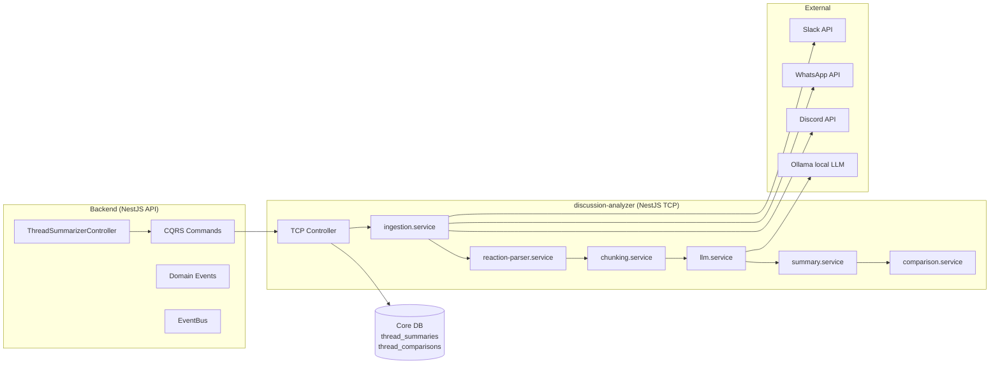

# Thread Summarizer — Intelligent Discussion Analysis

> **Status** : Planification / Backlog
> **Date** : 2026-04-16
> **Dépend de** : Integrations Module (Slack OAuth ✅), AnalyticsModule (✅), Company context (@ContractScoped)

---

## Concept

Micro-service d'analyse de discussions (Slack, WhatsApp, Discord) qui génère des résumés structurés en utilisant un LLM local (Ollama). Pour chaque thread, le service identifie :

- problèmes
- frictions
- décisions
- actions
- évolution dans le temps (comparaison entre résumés)

Les réactions emoji (👍, 👎, ⚠️, 😡…) deviennent des métadonnées analytiques (acknowledgment, friction passive, alerte) et sont injectées dans le prompt LLM pour enrichir l'analyse.

### Feature company, scope `@ContractScoped`

La feature est rattachée à la **company** via le module `integrations/` existant (Slack channels déjà liés aux org nodes). Les threads analysés sont ceux des channels connectés à la company. Permissions futures : `P.Company.Threads.Read` / `P.Company.Threads.Write` (à ajouter dans `P` dans `packages/shared-types/src/permissions.types.ts`).

### Positionnement plan

| Plan | Accès |
|---|---|
| company_free | ❌ |
| company_pro | ✅ (quota mensuel) |
| company_business | ✅ illimité |

Nouvelle ressource quota : `thread_summary` (voir `sh3-quota-service.md` pour ajouter une ressource).

---

## Architecture globale



### Pattern

- **Transport NestJS TCP** — même pattern que `audio-processor` et l'analytics micro-service proposé dans [TODO-analytics-microservice.md](TODO-analytics-microservice.md)
- **Fire-and-forget** pour les jobs récurrents (cron), synchrone pour les requêtes on-demand
- **Idempotent** via `thread_id + last_summarized_at` — les nouveaux résumés ne traitent que les messages postérieurs

---

## Modèle de données

### Collection `thread_summaries`

```typescript
interface TThreadSummaryDomainModel {
  id: string;                        // threadSummary_xxx
  company_id: TCompanyId;
  platform: 'slack' | 'whatsapp' | 'discord';
  thread_id: string;                 // ID natif de la plateforme
  channel_id: string;                // channel / conversation parente
  content: {
    problems: string[];
    frictions: string[];
    agreements: string[];
    decisions: string[];
    actions: Array<{ owner?: string; description: string; due?: string }>;
    summary: string;                 // résumé narratif court
  };
  signals: {
    friction_score: number;          // 0-1, voir calcul ci-dessous
    alignment_score: number;         // 0-1
    message_count: number;
    reaction_count: number;
  };
  messages_from: Date;               // début de la fenêtre analysée
  messages_to: Date;                 // fin de la fenêtre analysée
  created_at: Date;
  prompt_version: string;            // versioning du prompt utilisé
}
```

### Collection `thread_comparisons`

```typescript
interface TThreadComparisonDomainModel {
  id: string;                        // threadComparison_xxx
  company_id: TCompanyId;
  thread_id: string;
  previous_summary_id: string;
  current_summary_id: string;
  diff: {
    new_problems: string[];
    resolved_issues: string[];
    new_decisions: string[];
    progress: string[];
    regressions: string[];
    friction_trend: 'increasing' | 'stable' | 'decreasing';
    alignment_trend: 'increasing' | 'stable' | 'decreasing';
    new_conflicts: string[];
    resolved_conflicts: string[];
  };
  created_at: Date;
}
```

### Collection `thread_summary_config` (scoped company)

Par company : prompt override, tailles de chunks, fréquence de résumé, niveau de détail. Fallback sur les valeurs globales par défaut.

---

## Pipeline de traitement

### 3.1 Ingestion

1. Identifier un thread (via `thread_id` natif de la plateforme)
2. Récupérer les messages via l'adapter plateforme (`SlackAdapter`, `WhatsAppAdapter`, `DiscordAdapter`)
3. Fields par message : `id`, `text`, `author`, `timestamp`, `reactions[]`
4. Tri chronologique

### 3.2 Gestion du résumé existant

- Si **aucun résumé** → traite tous les messages
- Si **résumé existant** → filtre les messages `timestamp > previous.messages_to`

### 3.3 Préprocessing

- Nettoyage : suppression du bruit (emoji décoratifs non réactifs, formatage Slack, mentions pures `<@U123>` remplacées par noms lisibles)
- Optionnel : suppression small talk (règle simple : messages < 15 chars + aucune réaction)

### 3.4 Transformation des réactions en texte

Avant envoi au LLM, les réactions sont transformées en texte exploitable (énorme gain en tokens + meilleure compréhension) :

```
Message: "On déploie ce soir"
Reactions:
- 5 users agree
- 2 users disagree
- 1 user is frustrated
```

Mapping par défaut :

```typescript
const REACTION_MAP = {
  acknowledgment: ['👍', '✅', '👌'],
  friction:       ['👎', '😡', '🤨'],
  alert:          ['⚠️', '❗'],
  noise:          ['😂', '🎉', '🔥'],
};
```

### 3.5 Chunking

Découper les messages enrichis en blocs de 500–1000 tokens (configurable par company).

### 3.6 Analyse LLM (Ollama)

- Modèle recommandé : `llama3` ou `mistral` (local, via Ollama)
- Prompt par défaut (configurable, versionné) :

```
Analyze this discussion.

Each message may include reactions:
- agreements (positive reactions)
- disagreements (negative reactions)
- alerts (warning reactions)

Identify:
- problems
- frictions (including reactions)
- agreements (including reactions)
- decisions
- actions (with owner if mentioned)

Focus on technical and operational impact.
Return strict JSON matching the provided schema.
```

Le prompt doit être :
- modifiable par company (stocké dans `thread_summary_config`)
- versionné (`prompt_version` persisté sur chaque résumé pour la reproductibilité)
- typé (schéma JSON strict, rejet si le LLM produit du JSON invalide → retry 1× puis échec)

### 3.7 Résumé global

Fusion des résumés de chunks (dé-duplication des problèmes/actions par similarité textuelle simple) → un résumé consolidé par thread.

---

## Scoring des réactions

### Friction score

```typescript
frictionScore = (negativeReactions + disagreementMessages) / totalMessages;
```

### Alignment score

```typescript
alignmentScore = positiveReactions / totalMessages;
```

Valeurs normalisées `[0, 1]`. Persistées sur `thread_summaries.signals` pour les dashboards et l'alerting.

**Bonnes pratiques** :
- Limiter le poids des réactions (signal secondaire, jamais primaire)
- Agréger par message (pas par réaction individuelle)
- Éviter la surinterprétation : un 👎 seul n'implique pas conflit

---

## Comparaison temporelle

Entrée : `previous_summary_id` + `current_summary_id` → LLM compare.

**Prompt** :

```
Compare these two summaries.

Identify:
- new problems
- resolved issues
- new decisions
- progress made
- regressions
- friction/alignment trend

Return structured JSON.
```

**Output** persisté dans `thread_comparisons` (voir modèle ci-dessus).

---

## Microservice `discussion-analyzer`

### Emplacement

```
apps/discussion-analyzer/          (NEW — NestJS TCP micro-service)
├── src/
│   ├── adapters/
│   │   ├── slack.adapter.ts
│   │   ├── whatsapp.adapter.ts
│   │   └── discord.adapter.ts
│   ├── services/
│   │   ├── ingestion.service.ts
│   │   ├── reaction-parser.service.ts
│   │   ├── chunking.service.ts
│   │   ├── llm.service.ts         (Ollama client)
│   │   ├── summary.service.ts
│   │   └── comparison.service.ts
│   ├── controllers/
│   │   └── analyzer.controller.ts (TCP message patterns)
│   └── main.ts
├── Dockerfile
├── package.json
└── tsconfig.json
```

### Message patterns TCP

```typescript
export const DiscussionAnalyzerPatterns = {
  SUMMARIZE_THREAD:  'summarize_thread',
  COMPARE_SUMMARIES: 'compare_summaries',
  RE_SUMMARIZE:      're_summarize',         // force full re-analysis
} as const;
```

### Ollama

- Déployé via `docker-compose` ou installé sur l'host
- Endpoint HTTP local (`http://localhost:11434/api/generate`)
- Modèle préchargé : `ollama pull llama3` / `ollama pull mistral`
- Pas de GPU requis pour les modèles 7B en CPU (latence ~5-20 s par chunk)

---

## API endpoints (backend)

### Contract-scoped, permission `P.Company.Threads.*`

| Method | Route | Permission | Description |
|---|---|---|---|
| `POST` | `/companies/:id/threads/summarize` | `Threads.Write` | Déclencher un résumé on-demand (body: `platform`, `thread_id`) |
| `GET`  | `/companies/:id/threads/:threadId/summaries` | `Threads.Read` | Liste paginée des résumés d'un thread |
| `GET`  | `/companies/:id/threads/:threadId/comparisons` | `Threads.Read` | Liste des comparaisons |
| `POST` | `/companies/:id/threads/:threadId/compare` | `Threads.Write` | Générer un diff entre deux résumés |
| `GET`  | `/companies/:id/threads/config` | `Threads.Read` | Config courante (prompt, chunk size, fréquence) |
| `PATCH`| `/companies/:id/threads/config` | `Threads.Write` | Override de config par company |

Suivre strictement [sh3-writing-a-controller.md](../../apps/backend/documentation/sh3-writing-a-controller.md) : Zod-derived DTOs, `@ApiModel`, `apiSuccessDTO`, `buildApiResponseDTO`, `TApiResponse<T>`.

---

## Quota & Analytics

### Nouvelle ressource quota (`PLAN_QUOTAS` dans `QuotaLimits.ts`)

```typescript
{ resource: 'thread_summary', period: 'monthly', limit: 0 },    // company_free
{ resource: 'thread_summary', period: 'monthly', limit: 50 },   // company_pro
{ resource: 'thread_summary', period: 'monthly', limit: -1 },   // company_business
```

Appel `quotaService.ensureAllowed(...)` dans le handler `SummarizeThreadCommand` avant dispatch TCP, `recordUsage()` après succès.

### Nouveaux analytics events (voir `sh3-analytics-events.md`)

| Event type | Metadata |
|---|---|
| `thread_summarized` | `{ platform, thread_id, message_count, friction_score, alignment_score }` |
| `thread_compared` | `{ platform, thread_id, friction_trend, alignment_trend }` |
| `thread_summary_failed` | `{ platform, thread_id, reason }` |

---

## Implémentation — phases

### Phase 0 — Foundations (shared-types + permissions)
- [ ] `TThreadSummaryDomainModel` + Zod schema dans `@sh3pherd/shared-types/threads/`
- [ ] `TThreadComparisonDomainModel` + Zod schema
- [ ] `TThreadSummaryConfig` + Zod schema
- [ ] `REACTION_MAP` catalogue dans shared-types
- [ ] Ajouter `P.Company.Threads.{ Read, Write }` dans `permissions.types.ts`
- [ ] Accorder les permissions aux rôles (owner/admin) dans `ROLE_TEMPLATES`
- [ ] Ajouter `'thread_summary'` à `TQuotaResource`

### Phase 1 — Microservice `discussion-analyzer`
- [ ] Scaffold `apps/discussion-analyzer/` (copier la structure d'`audio-processor`)
- [ ] `SlackAdapter` — `conversations.replies` + `reactions.get` via le bot token stocké dans `integration_credentials`
- [ ] `reaction-parser.service` — transformation emoji → texte exploitable
- [ ] `chunking.service` — découpage configurable
- [ ] `llm.service` — client Ollama (HTTP), retry sur JSON invalide, timeout configurable
- [ ] `summary.service` — orchestration chunks → résumé consolidé
- [ ] `comparison.service` — diff entre deux résumés
- [ ] TCP controller avec 3 message patterns
- [ ] Unit tests : reaction-parser, chunking, llm mock, summary fusion, comparison

### Phase 2 — Backend integration
- [ ] Module `threads/` dans `apps/backend/src/`
  - [ ] `ThreadSummarizerController` (6 endpoints)
  - [ ] `SummarizeThreadCommand` + handler (quota check + TCP dispatch)
  - [ ] `CompareSummariesCommand` + handler
  - [ ] `GetThreadSummariesQuery` + `GetThreadComparisonsQuery`
  - [ ] `GetThreadConfigQuery` / `UpdateThreadConfigCommand`
- [ ] `ThreadSummaryMongoRepository` (append-only sur `thread_summaries`)
- [ ] `ThreadComparisonMongoRepository`
- [ ] `ThreadSummaryConfigMongoRepository`
- [ ] Domain events : `ThreadSummarizedEvent`, `ThreadComparedEvent`
- [ ] Event handlers → `AnalyticsEventService.track()`
- [ ] Swagger décorateurs complets (voir [sh3-swagger-usage.md](../../apps/backend/documentation/sh3-swagger-usage.md))
- [ ] Unit tests handlers
- [ ] E2E test : seed company + Slack integration → déclencher résumé → vérifier persistance

### Phase 3 — Frontend
- [ ] Service Angular `ThreadSummarizerService` (via `ScopedHttpClient.withContract()`)
- [ ] Store signal-based `ThreadSummarizerStore`
- [ ] Nouvel onglet "Threads" dans company-detail ou node-detail
- [ ] Liste des threads liés aux channels du node (réutilisation des channels existants)
- [ ] Card de résumé : problems / frictions / decisions / actions + badges friction/alignment
- [ ] Vue timeline : historique des résumés d'un thread
- [ ] Vue diff : comparaison entre deux résumés
- [ ] Bouton "Summarize now" (on-demand, consomme 1 crédit quota)
- [ ] Config panel (prompt override, chunk size, fréquence) dans Company Settings

### Phase 4 — Automation
- [ ] Cron job backend : parcourt les threads actifs des companies `company_pro`+, relance un résumé toutes les N heures (configurable)
- [ ] Auto-comparaison au moment du nouveau résumé (diff avec le précédent)
- [ ] Notifications Slack (réutiliser `SlackApiService`) quand `friction_trend === 'increasing'` ou `new_conflicts.length > 0`

### Phase 5 — Providers additionnels
- [ ] `WhatsAppAdapter` (WhatsApp Business Cloud API)
- [ ] `DiscordAdapter` (Discord Bot API)
- [ ] UI : sélecteur de plateforme par thread

### Phase 6 — Évolutions
- [ ] Scoring d'urgence (au-delà de friction/alignment)
- [ ] Alerting configurable (seuils par company)
- [ ] Dashboard temps réel (SSE ou polling)
- [ ] Intégration Notion / Jira (exporter les `actions[]` comme tickets)
- [ ] Génération automatique de tickets depuis les actions identifiées

---

## Cas d'usage

| Contexte | Use case | Bénéfice |
|---|---|---|
| Projet tech | Suivi des décisions, détection de blocages | Réduit le temps de standup |
| Événementiel | Gestion des urgences, suivi logistique | Détection des tensions équipe |
| Documentation auto | Génération de notes de réunion / retros | Zéro effort humain |
| Adoption d'une décision | Mesurer via `alignment_score` | Validation silencieuse |
| Désaccords silencieux | Détecter via `friction_score` + 👎 passives | Résolution précoce |

---

## Bonnes pratiques

- **Toujours chunker** — jamais envoyer un thread complet au LLM
- **Prompts simples** — un prompt qui fait 3 choses = un prompt qui en fait 0
- **Forcer JSON** — schéma strict, retry si invalide, échec explicite sinon
- **Éviter les contextes longs** — préférer plusieurs résumés agrégés à un mega-prompt
- **Réactions = signal secondaire** — jamais la source principale d'une décision
- **Agrégation par message** — pas par réaction individuelle
- **Versionner les prompts** — persister `prompt_version` sur chaque résumé pour reproduire
- **Fire-and-forget sur les cron** — une analyse qui échoue ne casse pas le suivant
- **Idempotence** — même thread + même cutoff timestamp = même résultat

---

## Questions ouvertes

- Ollama en local ou hébergé (cloud GPU) dès le départ ? Impact latence/coût.
- Rétention des résumés : permanent ? TTL configurable par company ?
- Que faire quand un message est édité/supprimé après résumé ? (Slack autorise les edits)
- Opt-in / opt-out utilisateur individuel (RGPD — "je ne veux pas être analysé") ?
- Anonymisation des auteurs dans le prompt LLM (éviter le biais par nom) ?
- Gestion des channels privés : le bot Slack doit être invité explicitement
- Mutualisation avec le micro-service analytics (TODO-analytics-microservice.md) : un seul micro-service ou deux ?

---

## Décisions d'architecture

- **Micro-service séparé** pour isoler le CPU/RAM du LLM du backend API principal (même logique que `audio-processor`)
- **Ollama local** plutôt qu'API externe (Claude/GPT) pour : maîtrise des coûts, confidentialité des discussions d'entreprise, indépendance réseau
- **MongoDB même instance** pour les collections `thread_summaries` / `thread_comparisons` — zéro latence, pas de 2PC. Migration vers store dédié si volume > 1M résumés/mois
- **Slack en priorité** — OAuth + API déjà en place dans `integrations/`. WhatsApp/Discord en phase 5
- **Pas de ré-implémentation du ReactionParser dans le backend** — il vit dans le micro-service pour éviter la double maintenance

---

## Related docs

- [sh3-integrations.md](../../apps/backend/documentation/sh3-integrations.md) — module integrations (Slack OAuth, channel CRUD)
- [sh3-quota-service.md](../../apps/backend/documentation/sh3-quota-service.md) — ajout d'une ressource quota
- [sh3-analytics-events.md](../../apps/backend/documentation/sh3-analytics-events.md) — append-only event store
- [sh3-writing-a-controller.md](../../apps/backend/documentation/sh3-writing-a-controller.md) — conventions controller + Swagger
- [sh3-platform-contract.md](../../apps/backend/documentation/sh3-platform-contract.md) — dual contract model (company vs platform)
- [TODO-analytics-microservice.md](TODO-analytics-microservice.md) — pattern de référence pour un micro-service NestJS TCP
- [TODO-integrations.md](TODO-integrations.md) — roadmap Slack / WhatsApp / Discord / Teams
- [TODO-plans-artist-company.md](TODO-plans-artist-company.md) — plans company (gating de la feature)
